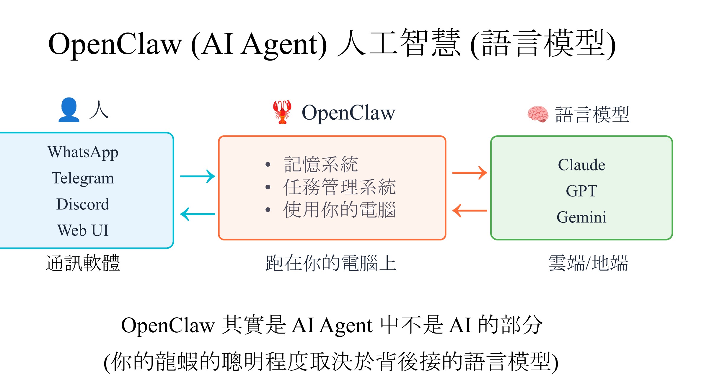
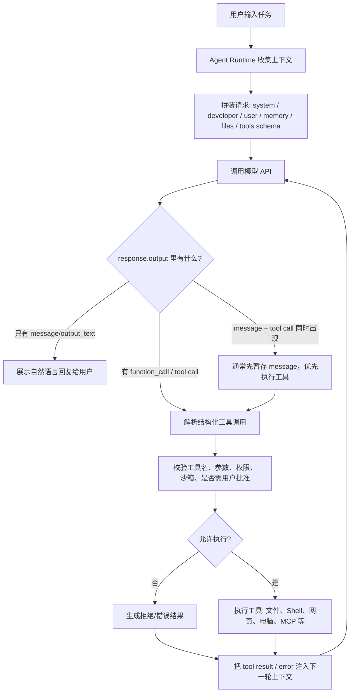

# Agent 到底是什么（原始课堂记录）

## 场景

- 时间：2026-06-13
- 类型：课程
- 来源：李宏毅机器学习 2026 第一节：Agent 是什么
- 已整理为正式来源笔记：[[2026-06-13-Agent到底是什么]]

## 随手记录

本节主题不是“Agent 发展史”，而是“Agent 是什么”。发展史只是开场背景：讲一个东西之前，先回顾它从哪里来，再进入它现在的结构。

### 开场背景：Agent 发展简史

老师先提到 Agent 发展的历史：

- 2023 年：AutoGPT。
- 2024-2025 年：Claude Code、Gemini CLI、Codex CLI 等 coding agent / terminal agent 开始成为主流开发者工具。

这里的 `Cloud Code` 更可能是 `Claude Code`，也就是 Anthropic 的 agentic coding CLI；Google 另有一个历史更早的 Cloud Code 插件产品，但它不是这里讨论的 LLM coding agent 主线。

#### AutoGPT 是什么

AutoGPT 是 2023 年 3 月出现的开源 autonomous agent。它的核心想法是：用户给一个大目标，系统自己把目标拆成子任务，然后循环执行、搜索网页、读写文件、调用工具、把结果继续喂回模型。

它重要不是因为真的好用，而是因为它第一次让很多人直观看到：

- LLM 可以不只是聊天，而是作为 agent loop 的大脑。
- 一个 agent 需要 planning、memory、tool use、reflection。
- 纯“自动循环”很容易卡住、幻觉、烧 API 费用、跑偏。

所以 AutoGPT 更像一个历史信号：它把 Agent 从论文/实验室概念推到了大众开发者视野。

### OpenClaw 作为人和语言模型之间的介质



这页 PPT 的核心不是说 OpenClaw 自己就是更强的 AI，而是说：

```text
人 / 通讯软件 -> OpenClaw -> 语言模型
```

OpenClaw 更像中间层：

- 左边连接人使用的聊天渠道：WhatsApp、Telegram、Discord、Web UI。
- 中间跑在自己的电脑上，提供记忆系统、任务管理系统、使用电脑的能力。
- 右边连接语言模型：Claude、GPT、Gemini，可以在云端或本地。

我的理解：OpenClaw 其实是 AI Agent 里“不太 AI”的部分。它的价值不是模型智能本身，而是把人的意图、聊天渠道、电脑环境、记忆和任务管理组织起来，让背后的语言模型更容易被使用。

这也解释了为什么同一个 Agent 系统里，“聪明程度”主要取决于背后接的语言模型，而 OpenClaw 更像操作系统 / 网关 / 中介层。

助手待讨论反馈（未确认）：OpenClaw 严格来说首先是一个软件工程系统，是把聊天渠道、记忆、任务管理、电脑操作、权限和语言模型调用拼装起来的脚手架 / orchestration layer。它不直接提供基础智能，基础智能主要来自背后的语言模型；但它仍然属于 Agent 系统的重要组成部分，因为它决定模型能看到什么上下文、能调用什么工具、能怎样和人交互，以及任务能否被稳定执行。

待和用户确认：说 OpenClaw “不是 AI”是一个有用直觉，但可能不够严谨。可讨论的更准确表达是：它不是模型智能的主要来源，而是把模型智能工程化、产品化、日常化的中间层。

详细讨论过程见：[[2026-06-13-openclaw中介层讨论日志]]

### 发散联想 / Branch Notes

- 触发：讨论“语言模型是否只是预测下一个 token”。
  联想：人脑有没有可能也是一种预测系统？
  当前保留问题：人脑也许在持续预测下一刻的感知、意义、行动后果和世界状态，但这不等同于语言模型的“下一个 token 预测”。未来可以结合 predictive coding / predictive processing、LLM token prediction、具身认知再细谈。

### OpenClaw 脚手架：System Prompt

继续回到龙虾 Agent / OpenClaw 的结构。前面已经把它理解成一个 AI 软件系统、工程脚手架或中介层；现在开始拆这个脚手架具体由什么组成。

用户当前理解：第一层可以先看它的 `System Prompt`。System Prompt 会加载 Agent 的基本上下文和行为边界，包括：

1. `Soul`、`Identity`、`User`、`Memory` 等基本信息。
2. 行为准则，例如 `AGENTS.md`。
3. 它可以使用哪些 `Skill`。
4. 之前的记忆应该怎么检索、怎么使用。

助手待讨论反馈（未确认）：这个理解方向是对的。`System Prompt` 可以看成 Agent 启动一个回合时的“上下文装配层”：它把身份、用户、记忆、规则、技能、检索方式等信息组织成模型能理解的指令。但它还不是整个脚手架本身；完整脚手架还包括消息渠道、profile/workspace、模型路由、工具执行、权限控制、任务状态、记忆存储和结果回写。

### Agent 当前回合上下文包：摘要示例

相比只说 `System Prompt`，更有参考价值的理解是：模型每一轮真正看到的是一个被拼装出来的“上下文包”。这个上下文包可能包含系统规则、开发者规则、项目规则、用户对话、长期记忆摘要、当前环境、已读取文件、工具结果和当前任务目标。

摘要示例：

```text
[System]
角色、安全边界、工具规则、联网规则、不能泄露隐藏系统指令全文。

[Developer / Codex 工作规则]
作为 Codex 工作：先读仓库再修改；保护用户已有改动；用 apply_patch 编辑；
学习场景中先捕捉、再理解、再整理；公开内容自称 Codex。

[Project: AGENTS.md]
当前仓库是长期学习与认知迭代库。
00-inbox 存原始记录；10-sources 存来源笔记；20-concepts 存概念卡；
50-systems 存方法论；60-cognition 存认知迭代。
用户观点先作为假设，确认后再沉淀；发散联想放到 Branch Notes。

[Memory 摘要]
用户偏好具体、实用、当前状态的回答。
用户私下叫助手“小扣”，但公开笔记中用 Codex。
用户正在学习李宏毅 2026 机器学习 / AI Agent 内容。

[Current Environment]
cwd = /Users/gaoronghui/Documents/agent_learning
date = 2026-06-13
timezone = Asia/Shanghai
当前任务：协助记录并理解“Agent 是什么”这一节课。

[Conversation So Far]
用户正在拆 OpenClaw / 龙虾 Agent 的脚手架。
已经讨论：OpenClaw 是人和语言模型之间的中介层；
System Prompt 负责装配身份、规则、记忆、技能和检索方式；
但 System Prompt 不等于完整 Agent Runtime。

[Files Recently Read]
AGENTS.md
50-systems/长期学习工作流.md
00-inbox/2026-06-13-agent到底是什么原始课堂记录.md
00-inbox/2026-06-13-openclaw中介层讨论日志.md

[Tool Results]
搜索、命令输出、文件读取、图片识别等工具结果。

[Current Response Goal]
回答用户当前问题，同时按学习笔记规范记录重要内容。
```

关键理解：上下文不是记忆本身，而是本轮模型实际能看到和使用的信息包。记忆、文件、网页和工具都可能存在，但只有被检索、读取、整理并注入进来，才真正成为当前上下文。

### 上下文拼接不等于模型真的记住

用户当前理解：正常和 AI 对话时，系统其实做了一些上下文拼接。模型并不是真的在参数里记住了你之前说过什么，而是把之前的对话、摘要、记忆检索结果、当前环境和工具结果等内容拼成一个新的上下文包，再交给大模型继续生成。

更严谨的表达：

- 本轮回答主要依赖“当前上下文包”，而不是模型权重被即时更新。
- 对话历史看起来像被记住，通常是因为前文被原样带入、被摘要带入，或被检索后重新注入。
- 长期记忆如果存在，也通常是外部系统保存的资料；只有在本轮被检索并放进上下文后，模型才真正能使用。
- 所以“记住”在产品体验上成立，但从模型机制上看，更像“运行时把相关信息重新提供给模型”。

这能解释一个重要现象：如果前文没有被带入、摘要丢失了细节、记忆没有被检索到，模型就可能“忘记”或误解之前说过的内容。

### Agent 如何行动：工具使用

前面讨论的是 Agent 当前回合能看到什么，也就是上下文。接下来要看 Agent 如何行动：它怎么做事情、怎么使用电脑。

用户当前理解：Agent 行动的核心方法是使用工具。工具的信息会包含在 `System Prompt` 或当前上下文包里，让模型知道自己有哪些可用动作、每个动作怎么调用、参数是什么、什么时候适合使用。

更严谨的表达：

- 工具说明会被放进模型当前可见的上下文，例如工具名称、用途、参数 schema、使用限制和返回格式。
- 模型本身通常不直接“操作电脑”；它是在上下文中选择或生成一个工具调用意图。
- 真正执行工具调用的是 Agent Runtime / 工具运行时，例如读取文件、执行命令、打开网页、编辑文件、发送消息。
- 工具执行结果会再被放回下一轮上下文，模型根据结果继续判断下一步。

可以把一次工具使用理解成：

```text
上下文包说明有哪些工具
-> 模型决定要调用哪个工具以及参数
-> Runtime 检查权限并执行工具
-> 工具返回结果
-> 结果注入下一轮上下文
-> 模型继续推理或给用户回复
```

关键边界：`System Prompt` 或上下文包负责“告诉模型有哪些工具以及怎么用”；真正的电脑操作、权限控制和结果回传由运行时系统负责。

### 工具调用是怎么被识别和执行的

用户问题：Agent 的回复具体是怎么使用工具的？是模型回复里有特殊标识符，系统识别到后就执行，还是通过其他手段？

当前理解：

不同系统实现不完全一样，但大致有两类。

第一类是现代 API 原生工具调用。系统在请求模型时，不只是塞一段文字版工具说明，还会把工具以结构化 schema 传给模型。模型返回时，也不一定返回普通文本，而是返回一个结构化的 `tool_call` / `function_call` / `tool_use` 对象，里面包含工具名和参数。应用或 Agent Runtime 收到这个结构化对象后，再执行对应工具。

流程像这样：

```text
请求模型：
  messages/context + tools schema

模型返回：
  tool_call {
    name: "read_file",
    arguments: { "path": "AGENTS.md" }
  }

Runtime：
  校验工具名和参数
  检查权限 / 沙箱 / 是否需要用户确认
  执行 read_file
  把结果作为 tool result 放回下一轮上下文
```

第二类是文本协议 / 标记解析。系统要求模型按某种文本格式输出，例如：

```text
<tool name="read_file">
{"path":"AGENTS.md"}
</tool>
```

或：

```text
Action: read_file
Action Input: {"path":"AGENTS.md"}
```

然后 Runtime 用解析器识别这段特殊格式，再执行工具。这种方式更像早期 ReAct / prompt engineering 风格，优点是简单、通用，缺点是更容易格式错误、被普通文本混淆，安全性和稳定性通常不如 API 原生结构化工具调用。

所以更严谨的回答是：不是“Agent 本身”直接执行，也通常不是靠模型随便写一句话就能操作电脑。模型负责在受约束的输出通道里提出工具调用；系统 / OpenClaw / Agent Runtime 负责识别、校验、执行和回传结果。

核心边界：

- `System Prompt` / 上下文：告诉模型有哪些工具、什么时候用、参数怎么写。
- 模型输出：选择工具并给出参数，可能是结构化 tool call，也可能是约定文本格式。
- Runtime：真正识别和执行工具调用，并处理权限、安全、错误和结果回写。

进一步澄清：说“结构化 JSON”并不是说 JSON 不是文字。JSON 在传输层当然也是文本 / 字节。区别在于：

- 普通文本标记：模型把 `Action: read_file ...` 写在自然语言回复里，Runtime 需要从一段文本中解析出动作。
- API 原生 tool call：模型回复被 API 表示成一个有类型的消息对象，例如 `type=function_call`、`name=read_file`、`arguments={...}`。Runtime 不需要从普通回答里猜，而是读取专门的字段。

所以用户的理解在抽象上是对的：工具调用本质上仍然是模型输出的一段可解析内容。更精确的区别是：现代 API 把这段内容放在“工具调用通道 / 结构化字段”里，而不是混在普通自然语言回答里。

这带来几个好处：

- 更容易校验工具名和参数。
- 更容易区分“模型在解释”还是“模型真的请求调用工具”。
- 更容易做权限控制、日志记录、失败重试和结果回写。
- 更不容易因为普通文本里出现类似格式就误触发工具。

### OpenAI Responses API 返回结构示例

以 OpenAI 当前推荐的 Responses API 为例，向 `gpt-5.5` 这类模型发起请求后，返回的不是单纯一段文本，而是一个 `response` 对象。常见顶层字段包括：

```text
id
object = "response"
created_at
status
completed_at
error
incomplete_details
instructions
max_output_tokens
model
output
parallel_tool_calls
previous_response_id
reasoning
store
temperature
text
tool_choice
tools
top_p
truncation
usage
metadata
```

其中最关键的是 `output`。普通自然语言回复和工具调用都在 `output` 数组里，但类型不同。

普通文本输出大致是：

```json
{
  "type": "message",
  "role": "assistant",
  "content": [
    {
      "type": "output_text",
      "text": "Hi there! How can I assist you today?",
      "annotations": []
    }
  ]
}
```

工具调用输出大致是：

```json
{
  "type": "function_call",
  "id": "fc_xxx",
  "call_id": "call_xxx",
  "name": "get_current_weather",
  "arguments": "{\"location\":\"Boston, MA\",\"unit\":\"celsius\"}",
  "status": "completed"
}
```

所以用户重新理解后的说法基本正确：请求时把上下文和 tools schema 发给模型；API 返回一个对象；自然语言回复是 `output` 里的 `message/output_text`；工具调用是 `output` 里的 `function_call`，包含 `name` 和 JSON 编码的 `arguments`。Runtime 看到 `function_call` 后，再执行对应工具，并把工具结果作为 `function_call_output` 放回下一轮请求。

补充：不同 API 形状略有差异。Chat Completions API 里常见的是 `choices[0].message.tool_calls`；Responses API 里常见的是 `response.output[]` 中的 `type=function_call` item。

### 工具调用和自然语言能否同时返回

用户问题：工具调用和普通自然语言信息回复能不能同时进行？还是一次只能做一个？`output` 里的 `type` 除了 `message`、`function_call`、`code_interpreter_call`，还有哪些？

当前理解：

- 在 Responses API 里，一次 response 的 `output` 是数组，所以可以包含多个 output item。
- 一个 response 里可能出现 `reasoning`、`message`、`function_call`、内置工具调用等多个 item。
- 但 Agent 工程里通常不把“带有待执行工具调用的 response”当成最终回答，而是先执行工具，再把工具结果送回模型，等模型产出最终 `message/output_text`。
- 所以不是绝对“一次只能做一个”，而是工程流程通常分成：先 tool call，再 tool output，再 final message。

常见 `output item type` 示例：

| Type | 简单含义 |
| --- | --- |
| `message` | 模型给用户的消息；真正展示给人的自然语言通常在这里。 |
| `reasoning` | 推理模型的推理摘要或推理占位信息；通常不是最终给用户看的正文。 |
| `function_call` | 调用开发者定义的函数工具，例如 `get_weather`、`send_email`。 |
| `custom_tool_call` | 自定义工具调用；输入可以更自由，不一定严格是 JSON schema。 |
| `file_search_call` | 文件搜索工具调用，用于在上传文件、知识库或向量库里检索内容。 |
| `web_search_call` | 网页搜索工具调用，用于搜索网页、打开页面或在页面里查找内容。 |
| `computer_call` | 电脑操作工具调用，通常用于图形界面的点击、输入、截图、滚动等。 |
| `computer_call_output` | 电脑操作后的结果，例如截图、界面状态或执行反馈。 |
| `code_interpreter_call` | 代码解释器调用，通常是在沙箱里跑代码、计算、分析数据或生成图表。 |
| `image_generation_call` | 图片生成工具调用。 |
| `local_shell_call` | 本地 shell 命令调用，例如在用户电脑上执行命令。 |
| `local_shell_call_output` | 本地 shell 命令执行结果，例如 stdout、stderr、退出状态。 |
| `shell_call` | 托管环境里的 shell 调用，通常不是用户本机，而是在云端或沙箱容器里执行。 |
| `shell_call_output` | 托管 shell 的执行结果。 |
| `mcp_list_tools` | 列出某个 MCP 服务器提供了哪些工具。 |
| `mcp_approval_request` | MCP 工具调用前需要人工批准时发出的批准请求。 |
| `mcp_approval_response` | 对 MCP 批准请求的回复，例如同意或拒绝。 |
| `mcp_call` | 调用 MCP 服务器上的某个工具，例如 GitHub、Google Drive、数据库连接器等。 |
| `compaction` | 上下文压缩结果，把较长历史压缩成可继续使用的摘要或状态。 |

`message` 内部还有 content item type，例如：

| Type | 简单含义 |
| --- | --- |
| `output_text` | `message` 里的普通文本内容。 |
| `refusal` | 模型拒绝回答或拒绝执行某事的内容。 |

`code_interpreter_call` 的 outputs 内部还可能有：

| Type | 简单含义 |
| --- | --- |
| `logs` | 代码运行时打印出的日志，例如 `print()` 输出或错误信息。 |
| `image` | 代码解释器或工具生成的图片输出，例如图表。 |

注意：这些 type 不是每个模型、每个账号、每种 API 调用都会出现。它们取决于开启了哪些工具、是否 streaming、是否使用 reasoning model、是否使用 MCP / shell / computer use / image generation 等能力。

工程处理规则可以简单写成：

```text
遍历 response.output：
  如果是 message/output_text -> 可以展示给用户，通常作为解释或最终回答
  如果是 function_call/custom_tool_call/shell_call 等 -> Runtime 执行工具
  如果是 file_search_call/web_search_call/code_interpreter_call -> 读取工具状态和结果
  如果是 reasoning -> 保留给后续上下文或展示摘要，不当成用户最终文本
  如果有待执行工具 -> 先执行并回传结果，再请求模型继续生成最终回答
```

### Agent 与 API 交互的执行流程

一个典型 Agent loop 可以分成两条路径：不需要工具时直接回答；需要工具时进入工具执行循环。



更细一点看，一次工具调用并不是模型直接操作电脑，而是 Runtime 在中间做了很多工作：

| 阶段 | 谁负责 | 做什么 | 产物 |
| --- | --- | --- | --- |
| 1. 收集上下文 | Runtime | 收集系统规则、项目规则、对话历史、记忆、文件、工具列表 | 当前上下文包 |
| 2. 调用模型 | Runtime -> API | 把上下文和 tools schema 发给模型 | API 请求 |
| 3. 决定下一步 | 模型 | 判断直接回答还是调用工具 | `message` 或 `function_call` |
| 4. 识别工具调用 | Runtime | 遍历 `response.output`，找到 tool call item | 工具名和参数 |
| 5. 安全检查 | Runtime | 校验 schema、权限、沙箱、用户批准、风险等级 | 允许 / 拒绝 |
| 6. 执行工具 | Runtime / Tool Server | 真正读文件、跑命令、搜网页、操作 GUI、调用 MCP | 工具执行结果 |
| 7. 回写结果 | Runtime -> API | 把结果作为 tool output 放回下一轮上下文 | 新一轮模型请求 |
| 8. 生成最终回复 | 模型 | 基于工具结果总结、继续调用工具或回复用户 | `message/output_text` |

关键理解：Agent loop 是 `模型决策 + Runtime 执行 + 结果回写` 的循环。模型负责“选择下一步”，Runtime 负责“把下一步变成真实动作”。

### OpenClaw 心跳机制

课程继续进入 OpenClaw / 龙虾的心跳机制。

用户当前理解：心跳机制应该和“Agent 是否还活着”“系统是否定期检查状态”有关。它可能类似很多软件系统里的 heartbeat / ping：定期发一个信号，确认服务、连接或任务没有断掉。

助手反馈：这个直觉是对的，但在 OpenClaw 里需要分两层理解。

第一层是通用工程含义：heartbeat 常常表示“周期性探测”。系统定期发一个轻量信号，用来判断进程、连接、节点、设备或服务是否仍然在线。如果一段时间没有收到心跳，就可以认为对方可能掉线、卡死或网络异常。

第二层是 OpenClaw 的 Agent 运行含义：OpenClaw 的 heartbeat 不只是网络层 ping，而是一个“周期性主会话 Agent turn”。也就是说，Gateway 会按配置间隔唤醒 Agent，让模型在主 session 的上下文中检查是否有需要处理或提醒的事情。

可以先这样理解：

```text
普通 heartbeat：
定期 ping -> 判断系统/连接是否还活着

OpenClaw heartbeat：
定期唤醒 Agent 主 session
-> 读取 HEARTBEAT.md 或相关上下文
-> 检查 inbox / calendar / notifications / commitments / standing orders
-> 如果没事，返回 HEARTBEAT_OK 并静默
-> 如果有事，通知用户或触发后续动作
```

OpenClaw 文档里的关键点：

| 机制 | 当前理解 |
| --- | --- |
| 默认间隔 | 通常每 30 分钟一次；某些 Anthropic OAuth/token 模式下默认 1 小时。 |
| 运行位置 | 在 main session 中运行，是一次周期性的 agent turn。 |
| 是否创建 task record | 不创建。后台 task ledger 用来记录 detached work，heartbeat 本身不是 task。 |
| 默认目标 | `target: "none"`，也就是可以运行但不一定外部通知。 |
| 没事时怎么处理 | 回复 `HEARTBEAT_OK`，OpenClaw 会把这种无事确认视为 ack，通常不打扰用户。 |
| 有事时怎么处理 | 可以通知用户，或通过结构化 `heartbeat_respond` 表达 `notify: true/false`。 |
| 和 cron 的关系 | cron 适合精确时间和独立任务；heartbeat 适合近似周期、上下文相关的检查。 |
| 忙碌时行为 | cron 工作活跃或排队时 heartbeat 会延后；也可以配置 `skipWhenBusy` 避免和 subagent/nested work 抢资源。 |
| 可配置文件 | 可以用 `HEARTBEAT.md` 写一个很小的检查清单或 due-only `tasks:` block。 |

心跳机制在 Agent 系统里的意义不是“让模型一直思考”，而是让长期运行的 Agent 有一个低频、可控、可静默的自检入口。它解决的问题包括：

| 问题 | 心跳如何帮助 |
| --- | --- |
| Agent 长期在线但没人发消息 | 定期唤醒主 session，检查是否有需要注意的事。 |
| 后台任务完成但没有合适时机通知 | heartbeat 可以汇总完成状态并提醒。 |
| 用户提到过一个模糊 follow-up | inferred commitment 可以通过 heartbeat 到期检查。 |
| 需要周期性检查 inbox / calendar / notifications | heartbeat 把这些检查合并到一个上下文相关的 turn 里。 |
| 不想被无意义打扰 | 没事时 `HEARTBEAT_OK` 静默丢弃。 |

和 cron 的核心区别：

| 维度 | Heartbeat | Cron |
| --- | --- | --- |
| 时间精度 | 近似周期，例如每 30 分钟检查一次。 | 精确时间，例如每天 9 点发日报。 |
| 上下文 | 更偏主 session，上下文感更强。 | 可以隔离运行，更像独立后台任务。 |
| 记录 | heartbeat 本身不创建 task record。 | cron 运行会创建 task record。 |
| 适合 | 检查、提醒、轻量监控、follow-up。 | 定时报表、精确提醒、独立作业。 |
| 用户体验 | 无事静默，有事提醒。 | 到点执行并按配置交付。 |

更严格的边界：heartbeat 不是模型参数记忆，也不是训练；它是 Runtime / Gateway 层的调度机制。它按时间触发一次模型调用，把当前相关上下文、`HEARTBEAT.md`、未完成事项或系统事件放进这次 turn，让模型判断是否需要行动。

可以把它放进 OpenClaw 脚手架里：

```text
Gateway 长期运行
-> 定时器触发 heartbeat
-> Runtime 拼装 heartbeat 上下文
-> 模型执行一次轻量 agent turn
-> 无事：HEARTBEAT_OK 静默
-> 有事：通知 / 检查 / 执行 / 排队
```

当前暂定结论：心跳机制是 OpenClaw 从“一次性聊天工具”变成“长期在线 Agent”的关键部件之一。它让 Agent 不只被用户消息触发，也能在受控频率下主动检查环境和未完成事项。

### OpenClaw Hooks

用户问题：Hooks 是现在龙虾已经有的吗？

当前确认：有。本机当前 `openclaw hooks --help` 显示版本为 `OpenClaw 2026.5.12`，已经提供 `openclaw hooks list/check/enable/disable/info` 等命令；`openclaw hooks list` 能列出 5 个 ready 的 bundled hooks。

当前可用的 bundled hooks：

| Hook | 作用 |
| --- | --- |
| `boot-md` | Gateway 启动时运行工作区里的 `BOOT.md`。 |
| `bootstrap-extra-files` | 在 agent bootstrap 阶段注入额外工作区文件。 |
| `command-logger` | 把 slash command 事件记录到集中日志。 |
| `compaction-notifier` | session compaction 开始/结束时发送可见提醒。 |
| `session-memory` | 在 `/new` 或 `/reset` 时把 session 上下文保存到 `<workspace>/memory/`。 |

需要区分三类容易混在一起的“hook”：

| 类型 | 触发方式 | 用途 | 例子 |
| --- | --- | --- | --- |
| Internal hooks / Gateway hooks | Gateway 内部事件触发。 | 处理命令、session、message、gateway 生命周期。 | `/new`、`/reset`、compaction、gateway startup。 |
| Plugin hooks | 插件 SDK 里的 typed hooks。 | 更深地介入 agent/tool/message/prompt 生命周期。 | `before_tool_call`、`before_prompt_build`、`before_agent_finalize`。 |
| Webhooks | 外部 HTTP 请求触发 OpenClaw。 | 让第三方系统从外部唤醒或调用 OpenClaw。 | `POST /hooks/wake`、`POST /hooks/agent`。 |

Internal hooks 的事件例子：

| Event | 什么时候触发 |
| --- | --- |
| `command:new` | 用户发 `/new`。 |
| `command:reset` | 用户发 `/reset`。 |
| `command:stop` | 用户发 `/stop`。 |
| `session:compact:before` / `after` | 会话压缩前后。 |
| `agent:bootstrap` | workspace bootstrap files 注入前。 |
| `gateway:startup` / `shutdown` | Gateway 启动或关闭。 |
| `message:received` | 收到外部通道消息。 |
| `message:sent` | 消息已发出。 |

Hooks 在 Agent 系统里的意义：它让 OpenClaw 不只是“用户消息 -> 模型回答”的线性流程，而是在关键生命周期点插入自定义逻辑。

可以这样放进龙虾脚手架：

```text
Gateway / Runtime 发生事件
-> hook 被触发
-> hook 读取事件上下文
-> 可记录日志、改 bootstrap 文件、保存记忆、发提示、执行脚本
-> 继续原来的 agent 流程
```

和 heartbeat / cron 的区别：

| 机制 | 触发原因 | 适合 |
| --- | --- | --- |
| Heartbeat | 时间间隔到了，周期性唤醒主 session。 | 例行检查、无事静默、有事提醒。 |
| Cron | 精确时间到了。 | 定时报表、精确提醒、独立后台任务。 |
| Hooks | 某个事件发生了。 | 生命周期自动化、日志、记忆保存、消息处理、prompt/工具拦截。 |

当前暂定结论：OpenClaw 现在已经有 hooks，而且不止一种层级。Internal hooks 处理 Gateway 和 session 生命周期；Plugin hooks 可以更深入地介入 prompt、tool、message、agent finalization 等流程；Webhooks 则是外部系统触发 OpenClaw 的入口。

## 关键时间点

| 时间 | 事件 | 初步判断 |
| --- | --- | --- |
| 2015-12-11 | OpenAI 宣布成立 | 早期目标是通用 AI 与安全，强调非营利与开放研究。 |
| 2016-06 | OpenAI Gym 论文提交 | 早期 agent 主要是强化学习：agent 在环境里行动、拿 reward、学习策略。 |
| 2018 | GPT-1 | 从 RL agent 逐渐转向通用语言模型能力。 |
| 2018-06 | OpenAI Five | 强化学习 agent 在复杂游戏环境中的代表。 |
| 2019-02 | GPT-2 | 大语言模型开始显现 zero-shot / 通用文本能力。 |
| 2020-06-11 | OpenAI API / GPT-3 API | LLM 能力开始通过 API 产品化，开发者可以把模型接进应用。 |
| 2021-07 | OpenAI Codex 论文 | 代码模型出现，后续影响 GitHub Copilot 和 coding agent。 |
| 2022-01-27 | InstructGPT | RLHF / 指令跟随让模型更像可用助手。 |
| 2022-11-30 | ChatGPT | 聊天式 LLM 爆发，普通用户开始理解“会对话的模型”。 |
| 2023-03-14 | GPT-4 | 推理、代码、多模态能力明显增强，为 AutoGPT 这类 agent 提供底座。 |
| 2023-03-30 | AutoGPT 发布 | 第一波大众意义上的 autonomous agent 热潮。 |
| 2023-04 | AutoGPT 爆火 | GitHub 和社交媒体快速传播，100k stars 出现在 4 月下旬。 |
| 2025-02-24 | Claude Code research preview | Anthropic 发布 agentic coding CLI，开发者可在终端把工程任务委托给 Claude。 |
| 2025-04-16 | Codex CLI 发布 | OpenAI 发布本地终端 coding agent。 |
| 2025-05-16 | Codex cloud research preview | OpenAI 发布云端软件工程 agent，可并行处理任务。 |
| 2025-05-22 | Claude Code GA | Claude 4 发布时 Claude Code general availability，是更大范围流行的重要节点。 |
| 2025-06-25 | Gemini CLI 发布 | Google 发布开源 terminal agent，免费额度很大，迅速进入开发者视野。 |

## 关键判断

- Agent 的早期含义偏强化学习：在环境里行动并最大化 reward。
- 2023 年 AutoGPT 之后，Agent 在大众语境里变成：LLM + planning + memory + tools + loop。
- 2025 年 coding agent 爆发的核心不是“模型会写代码”本身，而是模型开始能读仓库、改文件、跑命令、跑测试、提 PR、在终端或云沙箱里完成多步工程任务。
- OpenClaw 这类系统要和语言模型分开理解：语言模型提供智能，OpenClaw 提供入口、记忆、任务管理、电脑操作和消息路由。
- System Prompt 是理解 OpenClaw 脚手架的一个入口：它负责把身份、用户信息、记忆、规则、技能和检索方式装配成模型当前回合可使用的上下文。
- 比 System Prompt 更完整的理解是“当前回合上下文包”：模型实际看到的是系统规则、项目规则、用户对话、记忆摘要、环境信息、已读取文件、工具结果和任务目标的组合。
- 普通对话中的“记住你之前说的话”，很多时候不是模型参数被更新，而是运行时把历史、摘要或检索到的记忆重新拼进本轮上下文。
- Agent 行动的关键机制是工具使用：工具说明进入上下文，模型选择工具调用，运行时负责真正执行，并把结果回写到下一轮上下文。
- 工具调用的识别有两类常见实现：现代 API 返回结构化 `tool_call`；简易或早期 Agent 框架可能让模型输出特殊文本标记，再由 Runtime 解析执行。
- 工具调用和自然语言消息不是绝对互斥；Responses API 的 `output` 是数组，可以混合多个 item。但 Agent 通常先处理工具调用，等工具结果回写后再生成最终自然语言回答。
- Agent loop 可以理解成 `模型决策 -> Runtime 执行 -> 工具结果回写 -> 模型继续决策/最终回答`。
- OpenClaw 的 heartbeat 不是单纯网络 ping，而是周期性主会话 Agent turn：定期唤醒 Agent 检查是否有值得提醒或执行的事项；无事时通过 `HEARTBEAT_OK` 静默。
- Heartbeat 和 cron 的区别在于：heartbeat 适合上下文相关、近似周期、无事静默的检查；cron 适合精确时间、独立执行、可审计的定时任务。
- OpenClaw 当前已经有 hooks。Hooks 是事件驱动自动化机制，和 heartbeat/cron 的区别在于：heartbeat/cron 由时间触发，hooks 由 Gateway、session、message、agent/tool 生命周期事件触发。
- OpenClaw 的 hooks 至少要区分三类：Internal hooks、Plugin hooks、Webhooks。它们分别对应内部生命周期脚本、插件 typed extension points、外部 HTTP 触发入口。

## 没听懂的问题

- AutoGPT 的 agent loop 和今天 Codex / Claude Code 的 agent loop 差别在哪里？
- 为什么 2023 年 AutoGPT 爆火但没有成为日常生产工具，而 2025 年 coding agent 真正开始可用？
- Agent 的关键进步来自模型能力、工具接口、上下文工程，还是人类监督方式？
- 如果 OpenClaw 本身不是智能来源，那它的设计质量应该如何评估？看入口数量、记忆质量、任务管理、权限控制，还是和模型协同的稳定性？
- System Prompt 和完整 Agent Runtime 的边界在哪里？哪些内容只是“告诉模型”，哪些内容是真正由软件系统执行和保证的？
- 记忆检索是写在 System Prompt 里的规则，还是运行时系统先检索后再注入上下文？不同 Agent 框架可能有什么差别？
- Agent 的上下文包由谁负责拼装？哪些部分是静态规则，哪些部分是运行时动态检索，哪些部分来自工具执行结果？
- AI 产品里的“记忆”可以分成哪些层次：上下文窗口、对话摘要、外部长期记忆、项目文件、模型权重中的预训练知识？
- 工具调用的权限边界在哪里？模型可以提出调用工具，但 Runtime 是否应该检查权限、沙箱、用户确认和失败重试？
- OpenClaw 具体采用哪种工具调用协议：API 原生结构化 tool call，还是自己定义的文本协议 / JSON 协议？
- Heartbeat 的上下文包具体包含哪些内容？什么时候会读取 `HEARTBEAT.md`，什么时候会带入完整主 session？
- Heartbeat 如何和 inferred commitments、standing orders、background tasks 协同？
- Heartbeat 是否会带来 token 成本和打扰风险？什么时候应该配置 `lightContext`、`isolatedSession` 或 `activeHours`？
- Internal hooks 和 Plugin hooks 的边界在哪里？什么时候该写一个普通 hook，什么时候必须写 plugin hook？
- Hooks 能修改 prompt、工具调用或消息流到什么程度？哪些能力只是观察，哪些能力可以阻断或改写？
- Webhooks 和 Hooks 名字接近，但一个是外部 HTTP 入口，一个是内部事件机制，后续需要避免混淆。

## 值得验证的想法

- 做一张 Agent 发展时间线：RL agent -> LLM chatbot -> AutoGPT autonomous loop -> coding agent。
- 对比 AutoGPT、Claude Code、Codex CLI、Gemini CLI 的最小架构：输入、上下文、工具、执行环境、监督方式、输出。
- 后续可以提炼概念卡：`Agent 中介层` 或 `OpenClaw 不是模型而是介质`。
- 后续拆解 OpenClaw 脚手架时，可以按层次记录：System Prompt、Memory、Skills、Tool Runtime、Gateway、Task Manager、Permission、Model Adapter。
- 后续可以提炼概念卡：`Agent 当前回合上下文包`，用来解释 System Prompt、Memory、Tools 和 Runtime 的关系。
- 后续可以提炼概念卡：`上下文拼接不等于模型记忆`。
- 后续可以提炼概念卡：`工具调用是 Agent 行动的接口`。
- 后续可以提炼概念卡：`结构化工具调用 vs 文本标记解析`。
- 后续可以提炼概念卡：`Heartbeat 是长期运行 Agent 的周期性自检入口`。
- 后续可以提炼概念卡：`Hooks 是 Agent Runtime 的事件驱动扩展点`。
- 已提炼概念卡：[[Agent执行循环]]
- 已建立 draft 概念卡：[[OpenClaw是什么]]
- 已建立 draft 概念卡：[[Sub-agent与Session Span]]
- 已建立 draft 概念卡：[[Skill是什么]]
- 经营分析 Skill 架构先暂存，后续下周一/二继续：[[2026-06-13-经营分析Skill架构讨论日志]]
- RAG 将作为后续专题单独学习，当前已暂存：[[2026-06-14-RAG专题预留]]
- 下一主题：OpenClaw 的记忆机制，包括龙虾如何管理记忆、如何搜索记忆、记忆如何进入当前回合上下文：[[OpenClaw记忆机制]]
