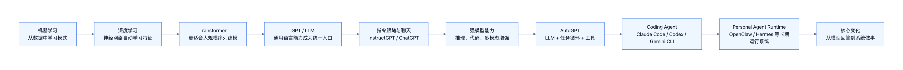

# Agent 到底是什么：整理草稿

## 本次处理目标

现在先不要急着重写最终教案。当前更重要的是把第一节课相关材料拆清楚：

1. 哪些是第一节课必须保留的主线。
2. 哪些是前面已经学过、但主教案里还没有讲顺的内容。
3. 哪些只是支撑材料，暂时不要混进正文。
4. 图片为什么看不到，以及主教案该采用哪种嵌入方式。

正式主教案是：[[2026-06-13-Agent到底是什么]]。

## 图片问题排查

当前图片文件本身没有丢，主要图片都在：

| 用途 | 文件 |
| --- | --- |
| AI 历史时间线 | `assets/concepts/agent-what-is/ai-history-timeline.png` |
| Agent 中介层 | `assets/concepts/agent-what-is/agent-mediator.png` |
| Agent 组成 | `assets/concepts/agent-what-is/agent-components.png` |
| 当前回合上下文包 | `assets/concepts/agent-what-is/context-package.png` |
| Agent 执行循环 | `assets/concepts/agent-execution-loop-white.png` |
| 记忆进入上下文 | `assets/concepts/agent-what-is/memory-to-context.png` |
| 记忆搜索总览 | `assets/concepts/memory-search-overview.png` |
| 触发机制 | `assets/concepts/agent-what-is/agent-triggers.png` |
| Agent 类型对照 | `assets/concepts/agent-what-is/agent-types.png` |

当前结论：Obsidian 里可以正常看到图片，Codex 里看不到。因此正式笔记应该优先保持 Obsidian / GitHub / vault 可迁移的相对路径，例如：

```markdown

```

Codex 需要查看图片时，不应通过修改笔记正文解决，而应在对话里用绝对路径图片标签或图片查看工具单独打开。

需要区分两种“看不到”：

| 场景 | 可能原因 | 处理 |
| --- | --- | --- |
| 在 Codex App 里看不到 | Codex 对 Markdown 文件里的本地图片渲染有限 | 不改正式笔记；需要查看时由 Codex 单独打开绝对路径图片 |
| 在 Obsidian 图谱里看不到附件节点 | `.obsidian/graph.json` 中 `showAttachments=false` | 这是图谱设置，不代表正文图片丢失 |
| 在 Obsidian 正文阅读里看不到 | 可能是编辑模式、缓存或链接格式差异 | 先用绝对路径验证；必要时再改成 Obsidian `![[...]]` |

## 当前主教案的问题

现在的主教案信息很全，但有三个问题：

1. **定义、定位、组成、运行机制的边界还不够清楚。**
   读者会看到很多模块，但不一定马上知道它们分别回答什么问题。

2. **Skill 讲得不够像一个独立知识点。**
   Skill 不是普通工具，它更像 Agent 的 SOP / 工作流能力包。工具回答“能做什么动作”，Skill 回答“如何把一组动作组织成稳定流程”。

3. **OpenClaw 作为例子容易喧宾夺主。**
   OpenClaw 应该贯穿作为教学例子，但主标题和主线应该始终讲抽象的 Agent。

## 第一节课不能遗漏的前置内容

### 1. 课程背景

来源于 `00-inbox/2026-06-13-李宏毅机器学习2026课程预习.md`。

这门课不是传统“从监督学习开始”的机器学习课，而是把 AI Agent、Context Engineering、Agent interaction、KV Cache、Self-Correction、Self-Improving 等现代 LLM 系统问题放在前面。

这意味着第一节课不是单纯介绍一个工具，而是在讲：

```text
AI 从模型能力
走向 Agent 系统能力
```

### 2. 历史背景

必须保留，但要服务于主题。

| 阶段 | 要讲的重点 |
| --- | --- |
| 机器学习 / 深度学习 | AI 从数据中学习模式，能力相对任务化。 |
| Transformer / GPT | 语言模型成为通用自然语言接口。 |
| ChatGPT | 模型开始以对话方式承接用户目标。 |
| AutoGPT | 大众第一次看到 LLM 可以进入自动任务循环。 |
| Claude Code / Codex / Gemini CLI | Agent 进入真实开发工作流。 |
| OpenClaw / Hermes | Agent Runtime 开始强调长期在线、多渠道、记忆和自动化。 |

历史部分的结论应该是：

> Agent 不是突然出现的“新模型”，而是模型能力、工具接口、上下文工程、执行环境和权限系统发展到一定阶段后的系统产物。

### 3. 用户当时的直觉

这段要保留，因为它很有记忆点：

> OpenClaw 是 AI Agent 里“不太 AI”的部分。它不是模型智能本身，而是把人的意图、聊天渠道、电脑环境、记忆和任务管理组织起来，让背后的语言模型更容易被使用。

更严谨的表达：

> OpenClaw 不是模型智能的主要来源，而是把模型智能工程化、产品化、日常化的中介层。

这一段适合放在“Agent 的定位”，而不是放在“OpenClaw 是什么”。

## 建议重写后的教案主线

### 0. 开场：一句话回答题目

先回答，不要先铺太长背景。

> Agent 是围绕大模型建立的软件运行系统。它把人的目标转成模型可处理的上下文，把模型的决策转成工具行动，并维护记忆、权限、任务状态和长期运行机制。

对比：

| 不是 | 而是 |
| --- | --- |
| 一个更聪明的模型 | 一个把模型接进现实世界的软件系统 |
| 单次聊天 | 多轮任务循环 |
| 模型自己操作电脑 | Runtime 执行模型提出的工具调用 |
| 模型参数立刻记住 | 外部记忆被保存、检索、注入上下文 |

### 1. 背景：为什么 Agent 出现

这一节只回答一个问题：

> 为什么从 ChatGPT 之后，大家开始需要 Agent？

核心逻辑：

```text
模型会回答
-> 模型会理解目标
-> 模型会写计划和工具参数
-> 系统可以让模型调用工具
-> 需要 Runtime 管理上下文、工具、状态和权限
-> Agent 成为必要的工程层
```

### 2. Agent 的定位：站在人和模型之间

这一节是第一节课最重要的概念。

```text
人 / 渠道 / 目标
-> Agent Runtime
-> 大模型 / 工具 / 记忆 / 外部系统
```

关键判断：

| 部分 | 作用 |
| --- | --- |
| 人 | 提目标、约束和反馈 |
| Agent Runtime | 组织上下文、调模型、执行工具、管理状态 |
| 大模型 | 理解、推理、生成、选择工具 |
| 工具 / 外部系统 | 让 Agent 对现实世界产生影响 |

OpenClaw 在这里出现一次即可：它是这个抽象结构的教学例子。

### 3. Agent 的组成：按层次讲，而不是平铺

建议把组成改成分层结构：

| 层 | 解决的问题 | 包含什么 |
| --- | --- | --- |
| 交互层 | 人从哪里进入 Agent | 渠道 / Channel、CLI、Web UI、Webhook |
| 协调层 | 谁组织完整流程 | Agent Runtime、session、task state |
| 智能层 | 谁负责理解和决策 | GPT、Claude、Gemini |
| 上下文层 | 模型本轮看到了什么 | system prompt、rules、history、files、tool results |
| 行动层 | Agent 如何做事 | file、shell、web、computer、MCP、message |
| Skill 层 | 如何复用复杂流程 | `SKILL.md`、reference、scripts、assets |
| 记忆层 | 如何保存和找回长期信息 | memory files、BM25、vector search、hybrid search |
| 时间层 | 如何被主动触发 | Heartbeat、Cron、Hooks、Webhooks |
| 安全层 | 如何防止出事 | sandbox、approval、tool policy、credential isolation |

这样讲比原来的大表更清楚，因为每一层都对应一个问题。

### 4. Agent 如何运行

这一章可以沿用 PDF 的逻辑，但要补上 Skill。

#### 4.1 Agent 如何知道自己是谁

对应：上下文包。

要讲清楚：

- 模型本身不知道自己是谁。
- Agent 每次调用模型时，会把身份、规则、用户信息、历史摘要、文件、记忆、工具定义拼成上下文。
- 大模型看起来记得，很多时候是上下文被重新拼进来了。

核心句：

> 大模型不是自己记得过去，而是 Agent 把过去重新带到它面前。

#### 4.2 Agent 如何使用工具

对应：工具调用和执行循环。

重点：

- 模型不直接操作电脑。
- 模型输出 tool call。
- Runtime 校验工具名、参数、权限和沙箱。
- Runtime 执行工具。
- 工具结果回写到下一轮上下文。

#### 4.3 Agent 如何使用 Skill

这是当前主教案需要补强的部分。

Skill 应该这样讲：

| 概念 | 直觉 |
| --- | --- |
| Tool | 一个动作能力，例如读文件、跑命令、发消息。 |
| Skill | 一套可复用工作流程，例如做视频、做调研、写报告、整理笔记。 |
| Prompt | 当前回合告诉模型怎么做。 |
| Memory | 过去沉淀的信息。 |

Skill 的价值：

- 不用每次把完整 SOP 塞进 system prompt。
- 只在相关任务触发时读取。
- 可以包含说明、脚本、模板、参考资料和资源文件。
- 让 Agent 从“会调用工具”变成“会执行一类任务”。

#### 4.4 Agent 如何记忆

对应：记忆搜索和 RAG 的前置概念。

要讲清楚：

```text
记忆文件
-> 切 chunk
-> FTS/BM25 + vector search
-> hybrid merge
-> top chunks 注入当前上下文
-> 模型基于上下文回答
```

边界：

- 这里先讲 Agent Memory。
- RAG 作为后续专题，不在本节展开。

#### 4.5 Agent 如何定时工作

对应：Heartbeat、Cron、Hooks、Webhooks。

| 机制 | 核心区别 |
| --- | --- |
| Heartbeat | 周期性唤醒主 session，无事静默。 |
| Cron | 精确定时执行独立任务。 |
| Hooks | 内部事件触发。 |
| Webhooks | 外部系统 HTTP 触发。 |

#### 4.6 Agent 如何长时间执行

对应：context compression / compaction / session。

要讲：

- 上下文窗口有限。
- 长任务需要压缩历史。
- 压缩可以延续任务，但也可能丢细节。
- 长期执行必须有权限和安全边界。

### 5. 当前有哪些 Agent

产品对比应该放后面，因为它是用来帮助理解类型，不是课程主线本身。

| 系统 | 代表类型 | 要记住的判断 |
| --- | --- | --- |
| AutoGPT | 早期 autonomous agent | 证明了 agent loop，但生产稳定性弱。 |
| Claude Code | coding agent | 进入终端/IDE 的代码工作流。 |
| Codex | 软件工程 agent | 面向仓库、任务、测试、PR、云端/本地工程闭环。 |
| Gemini CLI | terminal agent | 把 Gemini 接入开发者终端。 |
| OpenClaw | personal agent runtime | 多渠道、长期在线、记忆、自动化。 |
| Hermes | self-hosted runtime | profile、skills、memory、gateway/cron。 |

## 当前主教案应如何修改

建议不是推翻，而是做结构调整：

1. 开头保留一句话定义，但更短、更有力。
2. 背景部分压缩，不要让历史占太多篇幅。
3. “Agent 是什么”和“Agent 的定位”合并讲透。
4. “Agent 的组成”改成分层表。
5. “运行机制”按六问展开：身份、工具、Skill、记忆、定时、长时间执行。
6. 产品对比放到最后。
7. OpenClaw 只作为贯穿例子，不做大标题。

## 暂时不混入主教案的内容

| 内容 | 放哪里 | 原因 |
| --- | --- | --- |
| RAG 最新策略大全 | `00-inbox/2026-06-14-RAG专题预留.md` | 后续专题，不属于第一节课主线 |
| 经营分析 AI 知识库 | `30-projects/` | 是应用旁支，不要干扰课程主线 |
| OpenClaw config 详细字段 | `20-concepts/OpenClaw是什么.md` | 主教案只需要示例，不需要展开 config |
| 具体 Responses API 样本 | `20-concepts/Agent执行循环.md` | 主教案可引用，但不必塞完整 API |
| 中文 FTS/BM25 细节 | `20-concepts/关键词检索-FTS倒排索引与BM25.md` | 主教案只讲记忆搜索流程 |

## 需要确认的问题

1. 主教案是否优先服务 Obsidian，还是 Codex App 本地预览？
   - 已确认：Obsidian 可以正常看到图片，因此正式笔记优先服务 Obsidian / vault / GitHub。
   - Codex App 看不到图片属于预览限制，不作为修改正式笔记路径的理由。

2. 第一节课是否要把 Skill 单独作为一个大段？
   - 建议：要。
   - 理由：PDF 里 Skill 是独立主题，且它解释了 Agent 如何从“会用工具”升级为“会执行工作流”。

3. 第二节课开始前是否要先做一次第一阶段总复盘？
   - 建议：要，但等主教案结构整理完后再做。

## 下一步建议

先做两个动作：

1. 确认图片现在是否能显示。
2. 按本草稿把主教案 `2026-06-13-Agent到底是什么.md` 重排结构。
