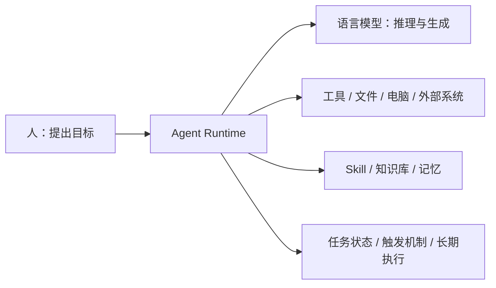
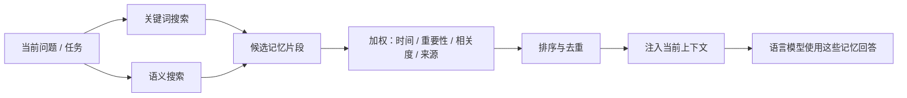

# Agent 到底是什么：分享文档逻辑草稿

## 当前问题

现在主文档的问题不是信息少，而是知识分享的主线有点散：

- 过早进入 Agent 架构表，读者还没建立“为什么需要 Agent”。
- OpenClaw 作为案例有时变成了主角，容易让人误以为这篇分享是在讲 OpenClaw 产品。
- Skill、知识库、Memory、Heartbeat、Context Compression 都重要，但需要按课程问题顺序出现。
- 我们加入的课外补充有价值，但要放在“补充理解”而不是打断主线。

## 官方课程边界

第一节是 `AI Agent - 1`，核心材料是“解剖小龙虾：以 OpenClaw 为例介绍 AI Agent 的运作原理”。

第一节应该回答：

> Agent 到底是什么？为什么它不只是一个语言模型？

第二节 `AI Agent - 2` 已经进入 Context Engineering、Agent 之间互动、Agent 对工作的影响。因此第一节只轻量提到这些方向，不提前展开。

## 新分享文档的一句话主线

> 语言模型只会在一次调用里根据 prompt 生成 response；Agent 是包在语言模型外面的一套运行系统，让模型获得身份、工具、知识、记忆、触发和长期执行能力。

这句话比“Agent = LLM + tools + memory”更适合教学，因为它先讲清楚缺口，再讲补齐方式。

## 建议结构

### 0. 开场：这篇分享到底解决什么问题

目标：让读者先抓住问题。

讲法：

- 过去 AI 主要“动口不动手”。
- 现在我们希望 AI 不只是回答，而是真的完成任务。
- 于是问题变成：一个只会接 prompt、吐 response 的语言模型，怎么变成能做事的 Agent？

核心图：

### 1. 背景：AI 从“会说”到“会做”

目标：解释 Agent 为什么在这个时间点变重要。

主线：

1. 机器学习时代：模型主要做预测和分类。
2. 深度学习和 Transformer：模型能处理更复杂的感知和语言任务。
3. GPT / ChatGPT 时代：模型开始像人一样对话。
4. AutoGPT 时代：大家第一次看到“让模型循环调用工具、自己推进任务”的想象。
5. Coding Agent / OpenClaw 时代：Agent 进入真实工作流，不只是 demo。

注意：

- AutoGPT 要保留，但重点是对比：它让大家看到 agent loop，但生产可用还需要 runtime、权限、工具稳定性和监督方式。
- 不要在这里讲太多产品细节。

### 2. 先把语言模型讲清楚：核心是文字接龙

目标：这是第一节最关键的认知地基。

讲法：

- LLM 真正在做的是文字接龙。
- 一次调用就是：外界给 prompt，模型返回 response。
- 模型输入输出有 context window 限制。
- 语言模型本身不是一个持续存在的主体，不会天然知道自己是谁、主人是谁、过去做过什么。
- 多轮对话看起来连续，是因为 Agent / 应用层把历史和规则重新塞回了 prompt。

这里要保留用户的直觉：

> “它不是自己记住了，是 Agent 帮它拼了上下文。”

### 3. Agent 的定位：人和语言模型之间的运行系统

目标：回答“Agent 到底是什么”。

定义建议：

> Agent 是包在语言模型外面的一套运行系统。它接收人的目标，组织上下文，调用模型，执行工具，维护记忆和任务状态，并通过多轮循环把任务推进到完成。

定位：

- 模型负责“想”和“生成”。
- Agent Runtime 负责“接入世界、组织材料、执行动作、保存状态、控制风险”。
- OpenClaw 是这篇分享的分析案例，不是这篇分享的主体。

### 4. Agent 如何知道自己是谁

对应 PDF 主线。

要讲：

- SOUL.md / IDENTITY.md / USER.md / MEMORY.md 这类文件。
- System Prompt 不只是几句人格设定，而是当前回合上下文包的一部分。
- 每次调用语言模型时，Agent 会把身份、目标、规则、工具说明、可用 skill、记忆检索规则等放进去。

关键认知：

> Agent 的“自我”不是模型权重里的灵魂，而是每次调用前被拼进上下文的身份和规则。

### 5. Agent 如何使用工具

对应 PDF 主线。

要讲：

- 模型不能直接操作电脑。
- 模型输出 tool call。
- Runtime 校验权限、执行工具、拿到 tool result。
- 工具结果再进入下一轮上下文。

工具类型：

| 工具类型 | 例子 | 作用 |
| --- | --- | --- |
| 文件工具 | read / write / edit | 读写文件 |
| Shell 工具 | exec | 操作电脑、运行命令 |
| Web 工具 | search / browser | 查资料、访问网页 |
| 生成工具 | TTS / image / video | 生成非文本产物 |
| 外部系统工具 | API / MCP / Webhook | 连接业务系统 |

安全点：

- `exec` 强大，但危险。
- 模型层面的“不要做坏事”不够，Runtime 层面的权限、沙箱、审批更可靠。

### 6. Agent 如何获取知识：Skill 和知识库

这一部分的核心问题是：

> Agent 不是只靠模型参数里的知识回答问题，它还会通过 Skill 和知识库按需获取外部知识。

这里可以把知识分成三类：

| 知识类型 | 形式 | 解决的问题 |
| --- | --- | --- |
| 模型内知识 | 模型训练时学到的通用知识 | 常识、语言能力、一般推理 |
| 流程知识 | Skill / SOP / 工作流说明 | 这类任务应该按什么步骤做 |
| 外部资料知识 | 文档、网页、知识库、数据库、项目文件 | 当前任务需要的事实、上下文和证据 |

Skill：

- Skill 可以理解成“程序化的经验”或“工作的 SOP”。
- 它不是单个工具，而是一套完成任务的方法说明、脚本、模板、参考资料和资源。
- Skill 告诉 Agent：遇到某类任务时，应该先读什么、按什么顺序做、调用哪些工具、产出什么格式。
- Skill 按需读取，不需要一开始全部塞进上下文。

知识库：

- 知识库提供的是事实、证据、文档和领域知识。
- 可以是文件夹、Markdown、PDF、网页、数据库、向量库、业务知识库等。
- Agent 通常不会把整个知识库塞给模型，而是先检索、筛选，再把相关片段注入当前上下文。
- 后续 RAG 专题会详细讲，这里只讲“知识如何进入上下文”。

关键认知：

> Skill 更像“我该怎么做”，知识库更像“我需要知道什么”。两者都不是模型天然拥有的，而是 Agent 在运行时按需拿进来的。

### 7. Agent 如何记忆

对应 PDF 主线。

要讲：

- 记忆通常不是模型参数变了。
- 记忆是外部文件或数据库，比如 `MEMORY.md`、`memory/*.md`、session summary、daily notes。
- 写入记忆本身也是一个动作：模型要通过工具修改文件。
- 跨 session 回忆要靠检索：memory_search / memory_get / RAG。
- 检索结果只有被放进当前上下文，模型才真正能用。

记忆可以拆成几类：

| 记忆类型 | 形式 | 作用 |
| --- | --- | --- |
| 短期记忆 | 当前对话历史、当前任务状态、未压缩上下文 | 保持本轮任务连续 |
| 长期记忆 | `MEMORY.md`、长期偏好、重要事实、稳定决策 | 跨 session 保持连续 |
| 每日日志 | `memory/YYYY-MM-DD.md`、daily notes、事件流水 | 记录发生过什么，方便后续回顾和提取长期记忆 |
| 摘要记忆 | session summary、compaction summary | 在上下文变长后保留关键信息 |

记忆搜索可以讲成一个流程：

这里要强调：

- 关键词搜索适合找明确名字、路径、日期、术语。
- 语义搜索适合找意思相近但表述不同的内容。
- 加权不是玄学，通常会综合相关度、时间、新旧程度、重要性、来源可信度。
- 最终进入上下文的只是少量被选中的记忆片段，不是整个记忆库。

关键认知：

> “说我记住了”不等于真的记住；没有写入外部存储，就只是一次回答里的承诺。

### 8. Agent 什么时候会被触发

对应 PDF Heartbeat，但标题改成更通用的问题：Agent 什么时候会开始运行？

要讲：

- 用户发消息不是唯一触发方式。
- Heartbeat 是定时戳醒 Agent。
- Agent 醒来后读取 HEARTBEAT.md 或任务规则。
- 有事就处理，没事就静默或返回 OK。

触发方式：

| 触发方式 | 含义 | 适合场景 |
| --- | --- | --- |
| 用户消息 | 人主动发起任务 | 对话、问答、写代码、整理笔记 |
| Heartbeat | 周期性唤醒 Agent 检查是否有事 | 长期陪伴、follow-up、轻量巡检 |
| Cron | 按固定时间执行任务 | 日报、周报、定时同步、提醒 |
| Hooks | 系统内部事件触发 | session start、compaction、工具前后、gateway startup |
| Webhooks | 外部系统通过 HTTP 触发 | GitHub、飞书、QQ、业务系统通知 |

边界：

- Heartbeat 不是网络心跳。
- Cron 更像精确定时任务。
- Hooks 是内部事件触发。
- Webhook 是外部系统主动叫醒 Agent。

### 9. Agent 如何长时间执行

对应 PDF Context Compression。

要讲：

- 长期运行会遇到 context window 不够。
- 解决方式不是无限塞上下文，而是压缩、裁剪、摘要、清空旧上下文。
- Compaction 把历史对话压成 summary，再继续运行。

关键认知：

> 长时间执行不是模型真的拥有无限记忆，而是 Agent 在不断管理上下文容量。

### 10. 回到定义：Agent 是什么

最后收束。

建议用一句话总结：

> Agent 不是一个更聪明的模型，而是一个让语言模型能进入真实世界做事的运行系统。

再用一张表复盘：

| 问题 | 语言模型本身 | Agent 补上的系统能力 |
| --- | --- | --- |
| 我是谁 | 不天然知道 | 身份文件 + system prompt |
| 我能做什么 | 只能生成文本 | 工具系统 |
| 我怎么获取知识 | 只靠模型内知识 | Skill / 知识库 / 检索 |
| 我怎么记住 | 不会自动长期记忆 | 外部记忆 + 检索 |
| 我什么时候运行 | 不会自己醒来 | 用户消息 / Heartbeat / Cron / Hooks / Webhooks |
| 我怎么长期执行 | context window 有限 | Compaction / 状态管理 |
| 我怎么避免乱做 | 只靠模型不可靠 | 权限 / 沙箱 / 审批 |

## 课外补充怎么放

主线里只放必要补充，详细内容拆到专题：

| 补充主题 | 放置方式 |
| --- | --- |
| AI 历史时间线 | 主文档保留一图一段，不展开太多 |
| AutoGPT / Claude Code / Codex / Gemini CLI / OpenClaw 对比 | 主文档保留一张表 |
| RAG / 记忆搜索 / 知识库检索 | 主文档讲核心流程，详细专题后续学习 |
| Skill 机制 | 主文档讲“获取流程知识”，复杂设计放概念卡 |
| Sub-agent | 主文档最多作为特殊工具轻轻带过，细节放概念卡 |
| 安全和权限 | 主文档必须讲，因为这是 Agent 能做事后的核心风险 |

## 待确认

1. 是否同意新主线改成“语言模型缺什么，Agent 补什么”？
2. 是否确认第 6 节改为“Agent 如何获取知识”，重点讲 Skill 和知识库？
3. 第一节是否严格控制在 AI Agent - 1，不展开第二节 Context Engineering？
4. OpenClaw 是否只作为贯穿例子，不单独成为一个大标题？
5. 主文档是否采用“知识分享 + 复习笔记”合体形式，还是拆成两篇？
