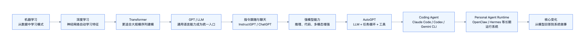
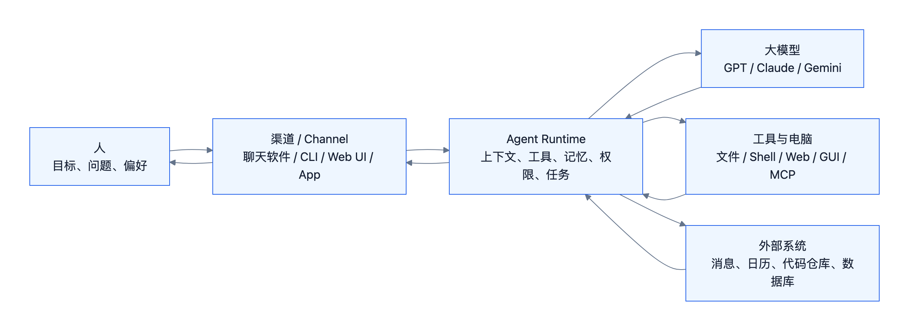
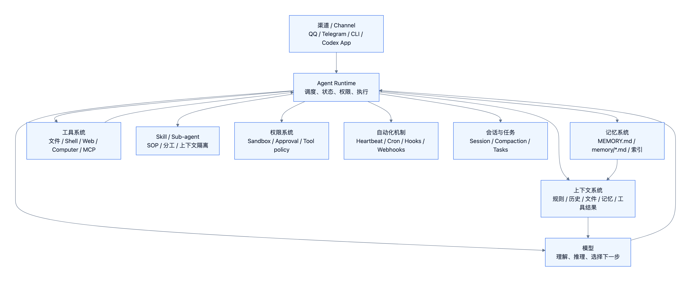
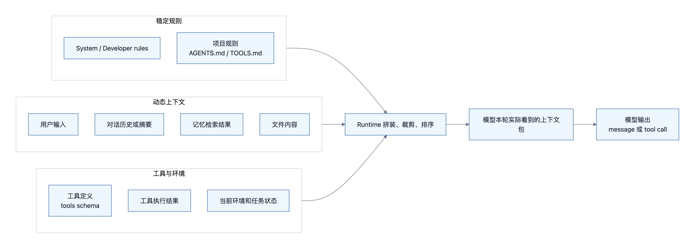
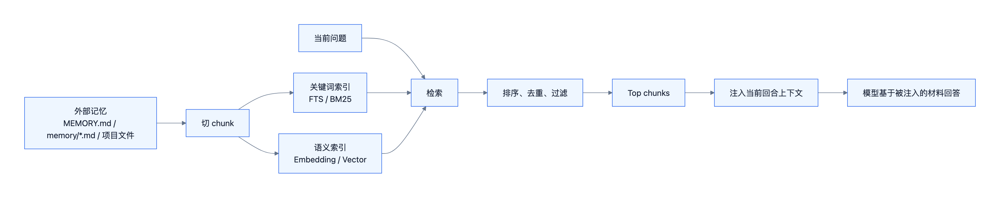
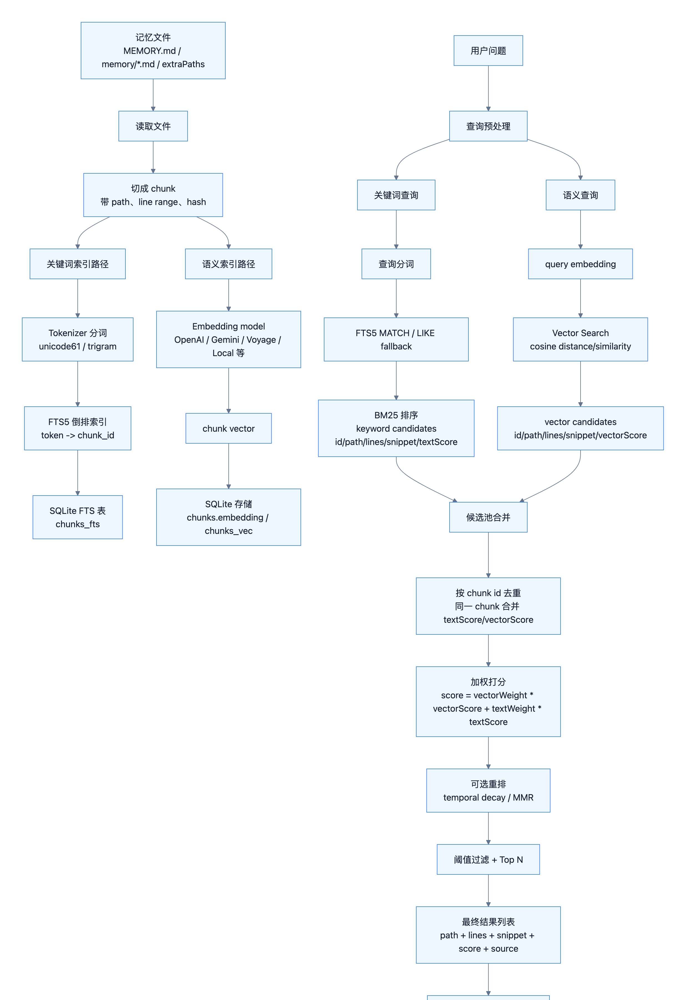
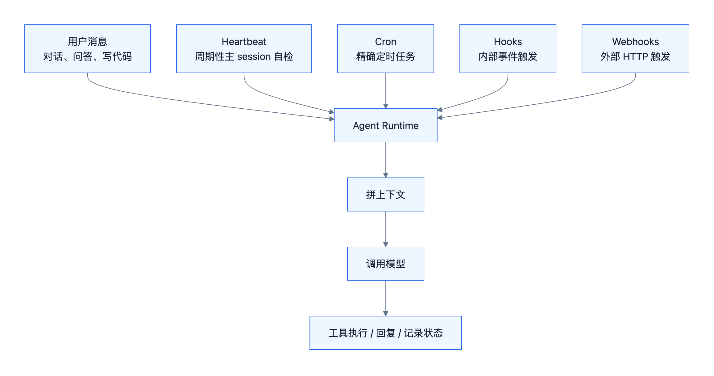
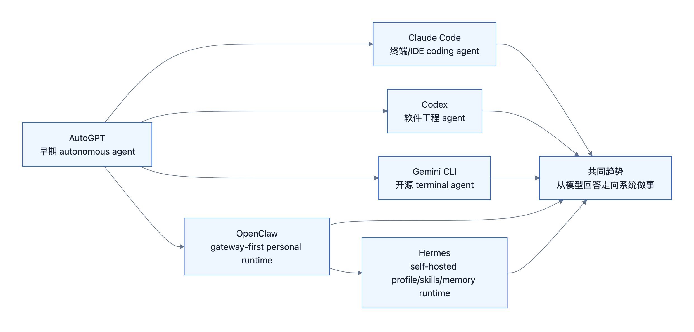

# Agent 到底是什么

## 这节课要解决的问题

这节课的核心问题和题目一样：

> **Agent 到底是什么？**

如果只说“Agent 是会用工具的大模型”，这个说法太粗。更准确地说：

> **Agent 是一个围绕大模型建立的软件系统：它接收人的目标，拼装上下文，调用模型，使用工具，保存和检索记忆，并通过触发、任务和安全机制持续完成工作。**

本节课用 OpenClaw 作为核心教学例子，但主旨不是介绍 OpenClaw 这个产品，而是借它理解抽象的 Agent 结构。



## 1. 背景：AI 的历史

Agent 不是突然出现的新概念。早期 AI 和强化学习里就有 agent：它在环境里行动，收到反馈，再调整策略。但 2023 年以后大众语境里的 Agent，更多指的是：

```text
大语言模型 + 上下文 + 工具 + 记忆 + 多轮执行循环 + Agent Runtime
```

### 1.1 从“会预测”到“会对话”

| 阶段 | 核心变化 | 和 Agent 的关系 |
| --- | --- | --- |
| 传统机器学习 | 从数据中学习模式，完成分类、预测、排序。 | 能力相对任务化，通常不是开放式交互。 |
| 深度学习 | 神经网络自动学习特征，图像、语音、文本能力提升。 | 为大模型提供训练范式。 |
| Transformer | 更适合大规模序列建模和并行训练。 | 成为现代 LLM 的关键架构基础。 |
| GPT / LLM | 通用语言模型开始成为统一接口。 | 模型能理解自然语言任务，也能生成计划、代码和工具参数。 |
| 指令跟随 / ChatGPT | 模型从“续写文本”变成“可对话助手”。 | 用户开始直接把目标交给模型。 |
| Agent Runtime | 系统把模型接入工具、记忆、电脑和外部服务。 | 模型不只回答，而是在 Runtime 协调下做事。 |

语言模型本质上仍然是在给定 prompt 后生成 response。不同的是，当模型足够会理解指令、写代码、选择工具、解释结果以后，它就可以成为 Agent 系统里的“推理核心”。

### 1.2 从 AutoGPT 到 coding agent

2023 年 AutoGPT 重要，不是因为它已经很好用，而是它让很多人第一次直观看到：

- LLM 可以作为任务循环的大脑。
- 系统可以让模型自己拆任务、搜索、读写文件、调用工具。
- “AI 只动口不动手”的时代开始变化。

但 AutoGPT 也暴露了早期 Agent 的问题：自动循环容易跑偏、卡住、幻觉、烧成本，还缺少稳定的权限和监督机制。

2025 年前后，Claude Code、Codex、Gemini CLI 等 coding agent 开始进入真实开发工作流。变化不只是“模型会写代码”，而是系统开始能：

- 读代码仓库和项目规则。
- 修改文件。
- 运行命令和测试。
- 根据错误继续迭代。
- 在终端、IDE、云端沙箱或本地 App 里完成多步工程任务。

所以 Agent 的成熟不只依赖模型能力，也依赖工具接口、执行环境、权限控制、上下文管理和人类监督方式。

### 1.3 产品对比：AutoGPT 为什么没有成为日常生产工具

这里保留 AutoGPT，但重点放在对比。

| 系统 | 定位 | 主要能力 | 核心短板 / 边界 |
| --- | --- | --- | --- |
| AutoGPT | 早期 autonomous agent | 展示 LLM 可以循环规划、搜索、读写文件和调用工具。 | 容易跑偏、成本高、权限和监督弱，更像历史信号。 |
| Claude Code | coding agent | 进入终端/IDE 工作流，读代码、改文件、跑命令、辅助工程任务。 | 重点是代码和开发场景，不是多渠道个人 Agent。 |
| Codex | 软件工程 agent | 面向仓库、任务、测试、PR、云端/本地工程闭环。 | 强在软件工程，不是长期个人生活/消息渠道编排系统。 |
| OpenClaw | gateway-first personal agent runtime | 多渠道、长期在线、记忆、工具、Heartbeat、Hooks、Cron。 | 教学中只是示例；聪明程度仍取决于背后模型和配置。 |

名词提醒：这里讨论的是 Anthropic 的 **Claude Code**。如果口头说成 `Cloud Code`，容易和 Google 早已有的 Cloud Code 开发工具混淆；本节课语境下应该统一写作 `Claude Code`。

更直白地说：AutoGPT 证明“模型可以进入循环”，Claude Code / Codex 证明“Agent 可以进入真实工程工作”，OpenClaw 则适合说明“一个长期运行的个人 Agent Runtime 需要哪些部件”。

## 2. Agent 是什么，以及 Agent 的定位

Agent 可以先用一句话定义：

> **Agent 是一个能接收目标、组织上下文、调用大模型、使用工具、维护状态，并通过多轮循环完成任务的软件系统。**

这句话里最重要的边界是：**Agent 不等于大模型本身。**



### 2.1 Agent 位于人和模型之间

课堂 PPT 里用 OpenClaw 表达了一个很重要的结构：

```text
人 / 通讯软件 -> OpenClaw -> 语言模型
```

抽象成通用 Agent，就是：

```text
人 / 渠道 / 工作目标
-> Agent Runtime
-> 模型 / 工具 / 电脑 / 外部系统
```

大模型提供基础智能；Agent Runtime 负责把这个智能接进真实工作流。

### 2.2 感性的理解：OpenClaw 是“AI 里不太 AI 的部分”

你当时的直觉是：

> OpenClaw 其实是 AI Agent 里“不太 AI”的部分。它的价值不是模型智能本身，而是把人的意图、聊天渠道、电脑环境、记忆和任务管理组织起来，让背后的语言模型更容易被使用。

这个直觉很有价值。更严谨地说：

> OpenClaw 不是模型智能的主要来源，而是把模型智能工程化、产品化、日常化的中介层。

所以本节课用 OpenClaw，不是为了说 OpenClaw 本身就是更强的 AI，而是用它拆解一个完整 Agent 系统的典型结构。

### 2.3 Agent 的能力来自两部分

| 来源 | 负责什么 |
| --- | --- |
| 大模型 | 理解语言、推理、生成文本、写代码、选择工具。 |
| Agent Runtime | 组织上下文、接入渠道、执行工具、保存状态、控制权限、调度任务。 |

一个 Agent “聪不聪明”主要取决于模型；但一个 Agent “能不能稳定做事”，取决于 Runtime、工具、记忆、权限和任务系统。

## 3. Agent 的组成

完整 Agent 不是一个模型 API 调用，而是一组协同模块。



| 模块 | 作用 | OpenClaw / Codex 例子 |
| --- | --- | --- |
| 渠道 / Channel | 用户从哪里和 Agent 交互 | QQ、Telegram、Discord、Web UI、CLI、Codex App |
| Agent Runtime | 组织整个 Agent 流程 | OpenClaw Gateway、Codex runtime |
| 模型 | 理解、推理、决策 | GPT、Claude、Gemini |
| 上下文系统 | 拼装模型输入 | system prompt、AGENTS.md、history、memory、files |
| 记忆系统 | 保存和检索长期信息 | MEMORY.md、memory files、FTS/BM25、vector search |
| 工具系统 | 对外行动 | file、shell、web、computer、MCP、message |
| Skill / SOP | 复用复杂任务流程 | 视频制作、发邮件、数据处理等 `SKILL.md` |
| Sub-agent | 拆分任务和隔离上下文 | 并行读论文、摘要子任务、专家分工 |
| 权限系统 | 控制风险 | sandbox、approval、tool policy、config |
| 会话与任务状态 | 管理多轮任务 | session、compaction、tasks |
| 自动化机制 | 非用户消息触发 | Heartbeat、Cron、Hooks、Webhooks |

这里的“渠道 / Channel”来自 OpenClaw 官方文档的 `Chat channels` / `channels` 表述；以后在讲聊天接入面时优先用“渠道”，不再用我自己随口说的“入口”。

### 3.1 渠道：人怎么把任务交给 Agent

渠道决定用户从哪里进入 Agent：聊天软件、CLI、Web UI、App、Webhook、IDE 都可以是渠道或触发面。

OpenClaw 更强调多渠道和长期在线；Codex 更强调代码仓库、CLI/App、工程任务队列。

### 3.2 Agent Runtime：真正组织流程的系统

Runtime 是最容易被忽略的一层。它负责：

- 拼装上下文。
- 调用模型。
- 解析模型输出。
- 执行工具。
- 管理权限。
- 保存会话和任务状态。
- 把结果回传给用户。

没有 Runtime，模型只是能回答；有 Runtime，模型才可能稳定做事。

### 3.3 Skill 和 Sub-agent：复杂任务怎么拆

PDF 里把 Skill 说成工作的 SOP，这个理解很贴切。

| 机制 | 作用 | 直觉 |
| --- | --- | --- |
| Skill | 把复杂流程写成可复用说明、脚本和资源。 | “做影片”的 SOP，不必每次从零想。 |
| Sub-agent | 把任务拆给更小的专门 Agent。 | 一个读论文 A，一个读论文 B，主 Agent 只拿摘要比较。 |

Skill 和 Sub-agent 都和 Context Engineering 有关：它们不是把所有信息都塞进主上下文，而是按需读取、拆分、压缩和回传。

## 4. Agent 的运行机制

这部分参考 PDF 的讲法，按五个问题组织：

1. Agent 如何知道自己是谁？
2. Agent 如何使用工具？
3. Agent 如何记忆？
4. Agent 如何定时工作？
5. Agent 如何长时间执行？

### 4.1 Agent 如何知道自己是谁：它给大模型输入了什么

大模型本身不会天然知道“自己是谁”“主人是谁”“之前做过什么”。每次调用模型时，Agent 都要把相关信息拼进 prompt / context。



上下文包可能包含：

| 内容 | 作用 |
| --- | --- |
| System prompt | 告诉模型身份、边界、行为方式。 |
| 身份文件 | 例如 `SOUL.md`、`IDENTITY.md`、`USER.md`、`MEMORY.md`。 |
| 项目规则 | 例如 `AGENTS.md`、`TOOLS.md`、仓库规范。 |
| 用户输入 | 当前任务、问题或补充信息。 |
| 对话历史或摘要 | 保持多轮任务连续性。 |
| 记忆检索结果 | 把长期记忆中相关片段带回本轮。 |
| 文件内容 | 当前任务需要看的代码、文档或资料。 |
| 工具定义 | 告诉模型有哪些工具、参数怎么写。 |
| 工具执行结果 | 上一轮工具调用后的 stdout、文件内容、网页结果等。 |
| 当前环境和任务状态 | 工作目录、时间、运行状态、待办、限制条件。 |

你当时一个很重要的感性理解是：

> 大模型本身不会记住过去的对话。它看起来记得，是因为 Agent 帮它把历史、摘要、记忆和当前环境拼成了上下文。

这个理解要保留下来，因为它比纯理论更好记。

更严谨地说：

```text
模型记得
通常不是参数变了
而是 Runtime 把相关材料重新放进了本轮上下文
```

### 4.2 Agent 如何使用工具：它如何行动

这里重点不是 runtime 这个词，而是：**Agent 如何通过工具行动。**

模型不直接操作电脑。它在输出里提出工具调用，Agent Runtime 再把这个调用变成真实动作。


一个简化过程是：

```text
System prompt / tools schema 告诉模型有哪些工具
-> 模型输出 tool call
-> Runtime 校验工具名、参数、权限、沙箱
-> Runtime 在电脑或外部系统里执行工具
-> 工具结果回写给模型
-> 模型继续判断或回复用户
```

常见工具可以分成几类：

| 工具类型 | 做什么 | 例子 |
| --- | --- | --- |
| 文件工具 | 读写本地文件 | Read、Write、Edit |
| Shell 工具 | 执行命令 | `exec("python script.py")`、跑测试、调用 CLI |
| Web 工具 | 搜索和打开网页 | 搜索资料、抓取页面 |
| Computer 工具 | 操作图形界面 | 截图、点击、输入、滚动 |
| Message 工具 | 给人或渠道发消息 | WhatsApp、Telegram、QQ、Discord |
| MCP / API 工具 | 调外部服务 | GitHub、Google Drive、数据库、业务系统 |
| Media 工具 | 处理音频、图片、视频 | TTS、ASR、FFmpeg、图片生成 |
| Sub-agent 工具 | 派生专门 Agent | 并行读论文、分工调查 |

PDF 里提到 OpenClaw 强大的原因之一是可以用 `exec` 执行 shell command。这个能力很强，但也危险。AI 做事和 AI 搞事只有一线之隔。

所以工具系统必须配合权限：

- 哪些工具可用。
- 哪些命令要审批。
- 哪些路径能读写。
- 外部账号和密钥如何隔离。
- 高风险动作是否需要人确认。

### 4.3 Skill：Agent 如何复用工作流程

Skill 可以理解成 Agent 的 SOP。

PDF 里做影片的例子很典型：

```text
做一支自我介绍影片
-> 读 video/SKILL.md
-> 写脚本 narration.json
-> 做 HTML 投影片
-> 截图成 PNG
-> TTS 配音
-> ASR 验证
-> FFmpeg 合成影片
```

Skill 的价值不是“给模型更多文字”，而是把复杂工作流程变成可复用、可维护、可按需读取的能力包。它也能避免每次都把完整 SOP 塞进 System Prompt。

但 Skill 也有风险：网上下载的 Skill 可能恶意要求执行危险命令、偷密钥或污染上下文。因此 Skill 也需要来源审查和权限边界。

### 4.4 Agent 如何记忆：记忆是什么样子

Agent 的记忆通常不是模型权重变化，而是外部文件、数据库或索引系统。



以 OpenClaw 为例，可以先分成三层：

| 层 | 含义 |
| --- | --- |
| 人类可读记忆 | `MEMORY.md`、`memory/*.md`、工作区文件。 |
| 机器检索索引 | SQLite、FTS/BM25、embedding/vector index。 |
| 当前上下文注入 | 检索后选出的少量相关片段。 |

PDF 里有一个非常关键的提醒：

> 模型说“没问题，我一定牢牢记住”不等于真的记住。只要它没有用工具去写入 `.md` 文件或外部存储，就是“记了个寂寞”。

这句话很重要，因为它解释了 Agent 记忆的本质：**记忆必须落到外部存储，并且未来能被检索回来。**

更完整的记忆搜索流程是：



核心流程可以概括为：

```text
记忆文件
-> 切 chunk
-> 建关键词索引和向量索引
-> 查询时关键词检索 + 语义检索
-> hybrid merge
-> top chunks 注入当前上下文
-> 模型基于这些片段回答
```

这里和 RAG 有关系，但本节只需要理解“Agent 记忆如何进入当前上下文”。RAG 后续作为专题单独学习：[[2026-06-14-RAG专题预留]]。

### 4.5 Agent 如何定时工作

定时工作不是模型自己一直醒着，而是 Runtime / Gateway 到时间后触发一次 Agent turn。

| 机制 | 含义 | 适合场景 |
| --- | --- | --- |
| Heartbeat | 周期性唤醒主 session，没事可静默 `HEARTBEAT_OK`。 | 检查通知、follow-up、例行自检。 |
| Cron | 精确定时执行任务。 | 日报、提醒、固定周期任务。 |
| Hooks | 内部事件触发。 | `/new`、`/reset`、compaction、gateway startup。 |
| Webhooks | 外部 HTTP 触发。 | 第三方系统唤醒 Agent。 |



Heartbeat 的关键不是“让模型一直思考”，而是让长期运行 Agent 有一个低频、可控、可静默的自检入口。

### 4.6 Agent 如何长时间执行

长时间执行会遇到一个核心限制：上下文窗口有限。即使模型支持很长上下文，输入越长也越容易混乱、成本越高。

PDF 里提到的 Context Compression 可以这样理解：

```text
长对话 / 长任务
-> 上下文逐渐变长
-> 触发 compaction
-> 把旧历史压缩成 summary
-> 新一轮继续带 summary 工作
```

这解决了“长期任务如何继续”的问题，但也带来新风险：摘要可能丢细节、误解上下文或把错误判断沉淀下来。

长时间自主运行还需要安全环境：

- 不要给 Agent 平常使用的主账号密码。
- 尽量用隔离账号、沙箱电脑或格式化后的测试环境。
- 检查它做了什么。
- 给清晰安全规则。
- 对危险工具和外部动作加审批。

这也是本节课最后的判断：AI Agent 有强大的力量，但目前仍是不成熟的想法，需要安全边界和人类监督。

## 5. 现在有哪些 Agent，以及各 Agent 的特点

这里不把它们叫“例子”，因为它们代表了当前 Agent 生态里的不同方向。



| Agent / 系统 | 定位 | 特点 |
| --- | --- | --- |
| AutoGPT | 早期 autonomous agent | 展示了 agent loop，但容易跑偏、卡住、成本高。 |
| Claude Code | coding agent | 读代码、改文件、跑命令，进入终端/IDE 工作流。 |
| Codex | 软件工程 agent | 面向仓库、任务、测试、PR、云端/本地工程闭环。 |
| Gemini CLI | 开源 terminal agent | 把 Gemini 接入终端，面向开发者工作流。 |
| OpenClaw | gateway-first personal agent runtime | 多渠道、长期在线、记忆、Heartbeat、Hooks、Cron。 |
| Hermes | self-hosted agent runtime | profile、skills、memory、gateway/cron，更偏长期个人化运行。 |

### 5.1 横向判断

| 类型 | 代表 | 核心价值 |
| --- | --- | --- |
| 早期 autonomous agent | AutoGPT | 证明 LLM 可以进入任务循环。 |
| Coding agent | Claude Code、Codex、Gemini CLI | 把模型接进真实代码仓库和工程流程。 |
| Personal agent runtime | OpenClaw、Hermes | 把模型接进多渠道、记忆、自动化和长期个人工作流。 |

## 常见误区

| 误区 | 更准确的理解 |
| --- | --- |
| Agent 就是大模型 | 大模型是智能核心，Agent 是围绕模型组织上下文、工具、记忆和执行的软件系统。 |
| 模型记住了过去 | 多数情况下是历史、摘要或外部记忆被重新注入上下文。 |
| 模型说“我记住了”就真的记住 | 如果没有写入外部记忆或未来可检索的存储，就是“记了个寂寞”。 |
| 模型直接操作电脑 | 模型提出工具调用，Runtime 校验并执行。 |
| 工具越多越好 | 工具越多，权限和安全边界越复杂，需要最小化启用。 |
| AutoGPT 失败说明 Agent 不行 | AutoGPT 证明了方向，但生产可用还需要 Runtime、权限、工具稳定性和监督机制。 |

## 本节关键判断

1. Agent 的核心不是“模型更会聊天”，而是“模型可以在 Runtime 协调下做事”。
2. Agent 位于人和模型之间，负责协调渠道、上下文、工具、记忆、任务和权限。
3. 模型每轮看到的是上下文包，不是整个世界，也不是所有历史。
4. 记忆不是模型权重变化，而是外部信息被保存、检索并注入上下文。
5. 工具调用不是模型直接操作电脑，而是模型提出意图，Runtime 执行动作。
6. Skill 是 Agent 的 SOP，Sub-agent 是任务拆分和上下文隔离工具。
7. Heartbeat、Cron、Hooks、Webhooks 让 Agent 具备长期运行和事件驱动能力。
8. Compaction 让长任务能继续，但也会带来摘要丢失和误压缩风险。
9. OpenClaw、Codex、Claude Code 的差异主要在 Runtime 目标和工作流侧重点，而不只是底层模型不同。

## 主动回忆题

1. 为什么说 Agent 不是大模型本身？
2. 从机器学习到 LLM Agent，中间最关键的能力变化是什么？
3. AutoGPT 为什么重要？它为什么没有直接成为日常生产工具？
4. Agent Runtime 具体负责哪些事情？
5. 模型每一轮真正看到的“上下文包”包含哪些内容？
6. 为什么说“上下文拼接不等于模型真的记住”？
7. 为什么模型说“我会记住”不等于真的写入记忆？
8. OpenClaw 的记忆如何进入当前回答？
9. Agent 的工具有哪些类型？为什么工具需要权限控制？
10. Skill 和 Sub-agent 分别解决什么问题？
11. Heartbeat、Cron、Hooks、Webhooks 的区别是什么？
12. 长时间执行为什么需要 compaction 和安全环境？

## 后续专题

- RAG 与检索增强：[[2026-06-14-RAG专题预留]]
- OpenClaw 记忆机制：[[OpenClaw记忆机制]]
- 记忆搜索总览：[[记忆搜索总览]]
- Agent 执行循环：[[Agent执行循环]]
- Agent 当前回合上下文包：[[Agent当前回合上下文包]]
