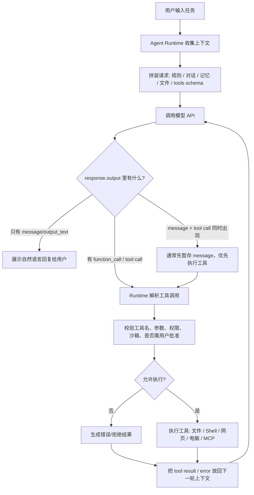
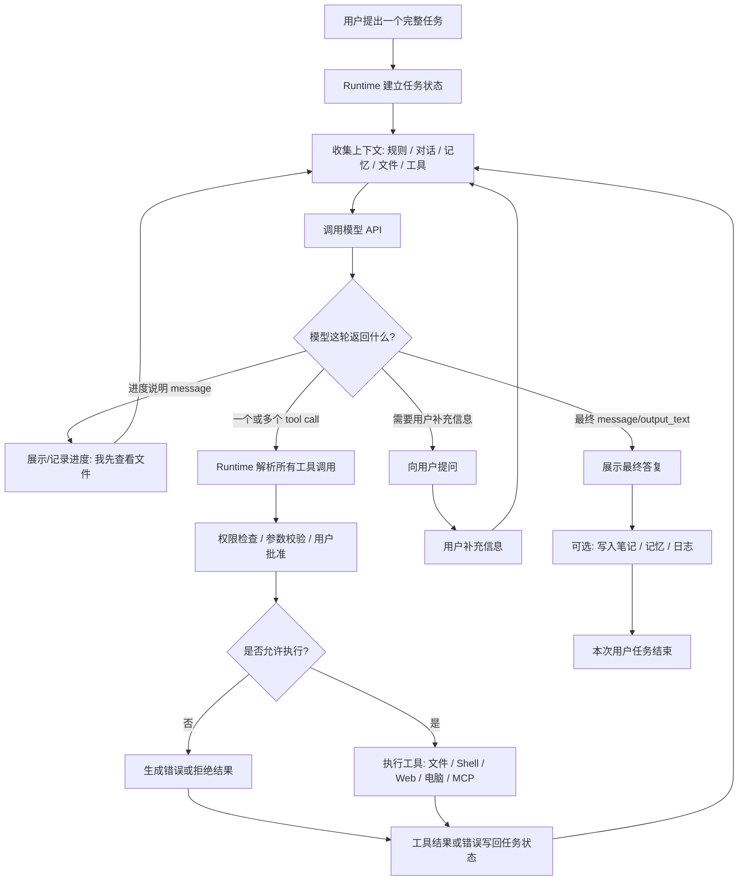

# Agent 执行循环

## 一句话理解

Agent 不是模型直接操作电脑，而是模型决定下一步，Runtime 执行工具，再把结果回写给模型继续判断。

这也是 Agent 和普通聊天机器人的关键区别：普通聊天主要产出文本，Agent 可以在 Runtime 约束下把模型判断转成工具动作。

## 核心机制

导出图片：



| 阶段 | 谁负责 | 做什么 | 产物 |
| --- | --- | --- | --- |
| 1. 收集上下文 | Runtime | 收集系统规则、项目规则、对话历史、记忆、文件、工具列表 | 当前上下文包 |
| 2. 调用模型 | Runtime -> API | 把上下文和 tools schema 发给模型 | API 请求 |
| 3. 决定下一步 | 模型 | 判断直接回答还是调用工具 | `message` 或 `function_call` |
| 4. 识别工具调用 | Runtime | 遍历 `response.output`，找到 tool call item | 工具名和参数 |
| 5. 安全检查 | Runtime | 校验 schema、权限、沙箱、用户批准、风险等级 | 允许 / 拒绝 |
| 6. 执行工具 | Runtime / Tool Server | 读文件、跑命令、搜网页、操作 GUI、调用 MCP | 工具执行结果 |
| 7. 回写结果 | Runtime -> API | 把结果作为 tool output 放回下一轮上下文 | 新一轮模型请求 |
| 8. 最终回复 | 模型 | 基于工具结果继续调用工具，或回复用户 | `message/output_text` |

## 循环粒度

上面的流程图不是固定代表“一次完整对话”，而是代表 **一次模型 API 往返 + 可能的一次工具执行分支**。

实际产品里要分三层看：

| 粒度 | 含义 | 例子 |
| --- | --- | --- |
| 一次 API 往返 | Runtime 把上下文发给模型，模型返回 `message` 或 `function_call` | 模型返回“我要读取文件”这个工具调用 |
| 一次工具循环 | 模型请求工具 -> Runtime 执行 -> 结果回写 -> 再请求模型 | 读取 `AGENTS.md` 后，把文件内容回传给模型 |
| 一次用户任务 / 对话轮次 | 用户提出一个任务，Agent 可能经历多次 API 往返和多次工具调用，最后给用户总结 | “帮我整理这个文档”可能读文件、查资料、改文件、再检查 |

所以，一次用户对话经常会走很多次循环：

```text
用户发任务
-> 模型可能先生成进度说明: “我先查看相关文件”
-> Runtime 调用工具读文件
-> 工具结果回写
-> 模型判断还需要搜索
-> Runtime 调用搜索 / shell / 文件工具
-> 工具结果再次回写
-> 模型生成最终回复
```

你在产品里看到的“我正在开始做什么”“我开始执行工具了”，可能来自三种来源：

| 来源 | 说明 |
| --- | --- |
| 模型生成的 `message/output_text` | 模型在调用工具前或工具后给用户一句进度说明。 |
| Runtime / 产品 UI 状态 | 产品界面自己展示“正在读取文件”“正在运行命令”，不一定来自模型文本。 |
| Streaming 事件 | 模型或工具执行过程边生成边返回，前端把中间状态实时展示出来。 |

## 一次完整用户任务流程图

上一张图更像“一次 API/tool loop 的基本单元”。下面这张图表达一次完整用户任务：中间可能有多次模型 API 调用、多次工具调用、多次进度说明，也可能需要向用户补充提问。

导出图片：



## API 格式样本

下面用 OpenAI Responses API 的形状做一个最小例子。不同厂商字段名会不一样，但核心结构相似：请求里带上下文和工具定义，响应里返回文本消息或结构化工具调用，Runtime 执行后把工具结果回写。

### 1. 第一次请求：上下文 + tools schema

```json
{
  "model": "gpt-5.5",
  "input": [
    {
      "role": "system",
      "content": "You are a helpful agent. Use tools when needed."
    },
    {
      "role": "user",
      "content": "检查这个仓库的 AGENTS.md，并总结关键规则。"
    }
  ],
  "tools": [
    {
      "type": "function",
      "name": "read_file",
      "description": "Read a UTF-8 text file from the current workspace.",
      "parameters": {
        "type": "object",
        "properties": {
          "path": {
            "type": "string",
            "description": "File path relative to the workspace root."
          }
        },
        "required": ["path"],
        "additionalProperties": false
      },
      "strict": true
    }
  ],
  "tool_choice": "auto",
  "parallel_tool_calls": true
}
```

这里的 `tools` 不是“已经执行了工具”，而是告诉模型：你可以请求调用这些工具，参数格式必须长这样。

### 2. 模型响应：返回 function_call

```json
{
  "id": "resp_001",
  "object": "response",
  "status": "completed",
  "model": "gpt-5.5",
  "output": [
    {
      "type": "function_call",
      "id": "fc_001",
      "call_id": "call_001",
      "name": "read_file",
      "arguments": "{\"path\":\"AGENTS.md\"}",
      "status": "completed"
    }
  ],
  "usage": {
    "input_tokens": 1200,
    "output_tokens": 80
  }
}
```

这个响应还没有真的读取文件。它只是模型说：“我想调用 `read_file`，参数是 `AGENTS.md`。”
接下来 Runtime 会解析 `output`，识别出 `type=function_call`，校验权限，然后执行真正的文件读取。

### 3. Runtime 执行工具

```text
name = "read_file"
arguments = {"path": "AGENTS.md"}

Runtime:
  1. 检查 read_file 是否是允许的工具
  2. 检查 path 是否在允许的工作区内
  3. 读取文件
  4. 得到工具结果
```

工具结果可能是：

```json
{
  "path": "AGENTS.md",
  "content": "# Agent Learning Repository Instructions\n\nThis repository is..."
}
```

### 4. 第二次请求：把工具结果回写给模型

```json
{
  "model": "gpt-5.5",
  "previous_response_id": "resp_001",
  "input": [
    {
      "type": "function_call_output",
      "call_id": "call_001",
      "output": "{\"path\":\"AGENTS.md\",\"content\":\"# Agent Learning Repository Instructions\\n\\nThis repository is...\"}"
    }
  ],
  "tools": [
    {
      "type": "function",
      "name": "read_file",
      "description": "Read a UTF-8 text file from the current workspace.",
      "parameters": {
        "type": "object",
        "properties": {
          "path": { "type": "string" }
        },
        "required": ["path"],
        "additionalProperties": false
      },
      "strict": true
    }
  ]
}
```

重点是 `call_id` 要和上一轮模型返回的 `function_call.call_id` 对上。这样模型才能知道：这是刚才那个工具调用的结果。

### 5. 最终响应：返回自然语言 message

```json
{
  "id": "resp_002",
  "object": "response",
  "status": "completed",
  "model": "gpt-5.5",
  "output": [
    {
      "type": "message",
      "role": "assistant",
      "content": [
        {
          "type": "output_text",
          "text": "我看完了 AGENTS.md。这个仓库的关键规则是：学习时先捕捉、再理解、再整理；用户观点先作为假设记录，确认后再沉淀；发散联想放到 Branch Notes。"
        }
      ]
    }
  ]
}
```

这才是通常展示给用户的最终自然语言回复。

## Function Call 和 Tool Call 的关系

| 名称 | 更准确的含义 | 在 Responses API 里的样子 |
| --- | --- | --- |
| Tool | 泛称，表示模型可请求使用的外部能力 | `tools` 数组里的一个工具定义 |
| Function | 一类自定义工具，由开发者用 JSON schema 定义 | `{"type":"function","name":"read_file",...}` |
| Function call | 模型请求调用某个 function | `{"type":"function_call","name":"read_file","arguments":"..."}` |
| Tool result / tool output | Runtime 执行工具后的结果 | `{"type":"function_call_output","call_id":"...","output":"..."}` |
| Built-in tool call | 平台内置工具调用，如网页搜索、文件搜索、代码解释器 | `web_search_call`、`file_search_call`、`code_interpreter_call` 等 |

可以粗略记成：

```text
Tool 是总称。
Function 是一种自定义 Tool。
Function call 是模型请求使用这个 Tool。
Function call output 是 Runtime 执行后返回给模型的结果。
```

## 常见工具类型

更广义地说，Agent 的工具可以先按“连接外部世界的通道”来分：

| 广义工具类型 | 核心作用 | 典型例子 | 适合做什么 |
| --- | --- | --- | --- |
| CLI / 终端工具 | 让 Agent 像开发者一样在终端里工作 | Codex CLI、Claude Code、Gemini CLI、Hermes CLI | 改代码、跑测试、查日志、管理项目 |
| Shell / 命令工具 | 执行具体系统命令 | `ls`、`git status`、`npm test`、`python script.py` | 文件检查、构建、测试、脚本自动化 |
| 浏览器自动化工具 | 通过浏览器访问和操作网页 | Playwright、browser-use、Chrome DevTools、Browser MCP | 测试网页、抓取页面、操作 Web UI |
| 文件 / 工作区工具 | 读写项目文件和目录 | read file、write file、apply patch、list files | 理解仓库、编辑文档、修改代码 |
| GUI / 电脑操作工具 | 直接操作桌面图形界面 | screenshot、click、type、scroll、computer use | 操作没有 API 的桌面软件或网页界面 |
| 外部 API / 连接器 | 调用第三方服务能力 | GitHub、Google Drive、Linear、Notion、Slack、QQ、数据库 | 读写外部系统、同步数据、发消息、建 issue |
| 代码执行 / 沙箱工具 | 在受控环境里运行代码 | Python sandbox、code interpreter、Vercel Sandbox | 计算、数据分析、生成图表、验证想法 |
| 搜索 / 检索工具 | 从网络或知识库找资料 | web search、file search、向量检索、RAG | 查最新信息、查文档、从资料库找依据 |
| 生成工具 | 生成非文本产物 | image generation、TTS、PPT、PDF、docx | 生成图片、语音、文档、演示材料 |

如果用更短的方式记：

```text
CLI / Shell：像开发者一样操作系统
Browser / Playwright：像用户一样操作网页
Files：操作项目材料
Connectors / APIs：连接外部服务
GUI / Computer Use：操作没有 API 的界面
Sandbox / Code Interpreter：运行代码验证
Search / Retrieval：获取资料
Generation：生成产物
```

更细地按 Agent 的能力边界分类，常见工具还可以展开成这些类型：

| 工具类型 | 做什么 | 典型例子 | 关键风险 |
| --- | --- | --- | --- |
| 信息检索工具 | 从外部或本地资料中找信息 | web search、file search、知识库检索、向量数据库 | 搜到的信息可能过时、错误或来源不可靠 |
| 文件系统工具 | 读写本地或工作区文件 | read file、write file、list directory、apply patch | 误改文件、覆盖用户改动、泄露敏感文件 |
| Shell / 代码执行工具 | 执行命令、跑脚本、运行测试 | shell、local shell、code interpreter、Python sandbox | 命令破坏性、环境污染、权限过大、执行不可信代码 |
| 浏览器 / 网页操作工具 | 打开网页、点击、输入、抓取页面状态 | browser automation、web UI testing、Playwright | 误操作账号、提交表单、依赖页面状态 |
| 电脑 GUI 操作工具 | 像人一样操作桌面应用 | screenshot、click、type、scroll、computer use | 误点真实应用、隐私泄露、操作不可逆 |
| 通讯 / 消息工具 | 发送或接收消息 | email、Slack、QQ、Telegram、Discord | 发错对象、泄露内容、造成外部影响 |
| 外部服务 / 连接器工具 | 调用 SaaS、数据库、代码托管平台 | GitHub、Google Drive、Linear、Notion、database、MCP server | 权限边界复杂、写入真实系统、审计困难 |
| 生成类工具 | 生成图片、音频、视频、文档等内容 | image generation、TTS、PPT/PDF/docx generator | 版权、质量不可控、生成内容需要复核 |
| 记忆 / 状态工具 | 读取或写入长期状态 | memory read/write、profile、task state、conversation store | 记错、过度记忆、隐私和跨场景污染 |
| 权限 / 审批工具 | 请求用户确认或记录批准结果 | approval request、approval response、permission gate | 提示不清导致误授权，或过度阻塞工作流 |

一个简单判断标准：

```text
只读工具风险较低；
写入工具风险更高；
能影响外部世界的工具风险最高。
```

所以 Agent Runtime 通常会按风险分层：

| 风险层级 | 工具例子 | 常见处理 |
| --- | --- | --- |
| 低风险只读 | 读项目文件、搜索公开网页、查看日志 | 可自动执行，记录日志 |
| 中风险本地写入 | 编辑文件、运行测试、生成文档 | 需要工作区限制、diff 检查、失败回滚 |
| 高风险外部影响 | 发消息、推代码、改数据库、付款、删资源 | 通常需要用户确认、权限审计和明确目标 |

对 OpenClaw / Codex 这类 Agent 来说，工具多少不是关键，关键是 Runtime 是否能把工具分层、限制、审计，并把结果可靠地回写给模型。

## 适用场景

- 理解 Codex、Claude Code、OpenClaw、Gemini CLI 这类 Agent 为什么能改文件、跑命令、搜网页。
- 区分“模型生成工具调用”和“Runtime 真正执行工具”。
- 分析一个 Agent 的安全边界、权限控制和失败点。

## 例子

用户说：“帮我检查这个仓库的 AGENTS.md。”

```text
Runtime 拼上下文和工具 schema
-> 模型返回 function_call: read_file({"path":"AGENTS.md"})
-> Runtime 校验路径和权限
-> Runtime 读取文件
-> 文件内容作为 tool output 回写
-> 模型基于文件内容回复用户
```

## 常见误区

| 误区 | 更准确的理解 |
| --- | --- |
| 模型自己直接操作电脑 | 模型提出工具调用，Runtime 执行真实动作。 |
| tool call 是普通自然语言回复 | 现代 API 通常把 tool call 放在结构化字段里。 |
| 有 tool call 就可以立刻展示最终答案 | 通常要先执行工具，把结果回写，再生成最终答案。 |
| 工具调用和文本回复绝对互斥 | `response.output` 可以混合多个 item，但产品通常分阶段处理。 |

## 相关概念

- Agent 当前回合上下文包
- 工具调用
- Runtime
- MCP
- System Prompt
- 上下文拼接不等于模型记忆

## 我的判断

理解 Agent 的关键不是把它看成“一个更长的 prompt”，而是看成一个循环系统：上下文装配、模型决策、工具执行、结果回写、继续决策。

## 自测问题

1. 为什么说模型不是直接操作电脑？
2. Runtime 在工具调用中至少负责哪三件事？
3. 为什么工具执行结果还要回写给模型？
4. `message + tool call` 同时出现时，为什么通常先处理工具调用？
