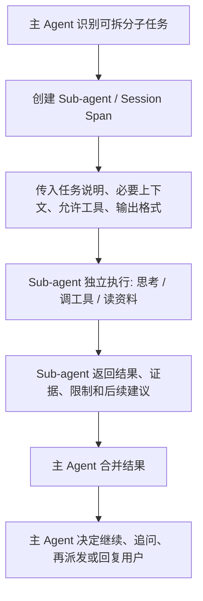

# Sub-agent 与 Session Span

## 一句话理解

Sub-agent 是主 Agent 为了完成一个子任务而临时或长期派生出的独立执行单元；Session Span 是这段子任务执行过程的隔离上下文和生命周期。

## 核心机制

可以先按这个流程理解：



## 为什么需要 Sub-agent

| 目的 | 说明 |
| --- | --- |
| 隔离上下文 | 子任务只拿必要信息，避免污染主上下文。 |
| 并行处理 | 多个子任务可以同时跑，例如分别查资料、读代码、写测试。 |
| 专家化 | 子 Agent 可以有不同 prompt、skill、工具和角色。 |
| 控制风险 | 子 Agent 的工具权限可以比主 Agent 更窄。 |
| 压缩结果 | 子 Agent 只把结论和证据交回主 Agent，减少主上下文压力。 |

## 核心作用：Context 管理

Sub-agent 的一个核心作用是管理 context，而不只是“并行多开几个模型”。

主 Agent 面对复杂任务时，如果把所有材料、所有探索过程、所有中间失败都留在同一个上下文里，会很快出现几个问题：

| 问题 | Sub-agent 怎么缓解 |
| --- | --- |
| 上下文太长 | 子 Agent 只处理某个子任务，主 Agent 只接收压缩后的结论。 |
| 噪声太多 | 子 Agent 的搜索过程、失败尝试、无关材料不会全部污染主上下文。 |
| 注意力分散 | 每个子 Agent 只关注一个明确目标，减少任务切换。 |
| 证据难追踪 | 子 Agent 可以返回“结论 + 证据 + 来源 + 不确定性”。 |
| 权限过大 | 子 Agent 可以被限制在更窄的工具、文件和 source 范围内。 |

可以把 Sub-agent 理解成一种 **context partition**：

```text
主 Agent 保留任务目标、用户偏好、总体判断
Sub-agent 处理局部探索、资料读取、代码检查、实验验证
Sub-agent 返回压缩结果
主 Agent 再合并、审核、对用户负责
```

所以 Sub-agent 的价值不只是“多一个执行者”，更是把复杂任务拆成多个可隔离、可压缩、可审计的上下文片段。

## 通讯结构

Sub-agent 与主 Agent 通常不是自由聊天，而是结构化交接。

| 阶段 | 主 Agent 给 Sub-agent | Sub-agent 返回给主 Agent |
| --- | --- | --- |
| 创建 | 子任务目标、背景、约束、可用资料、输出格式 | 无 |
| 执行中 | 可能追加上下文、批准工具、取消任务 | 进度、工具请求、错误 |
| 完成 | 无 | 结论、证据、引用、文件变更、风险、未解决问题 |

一个好的子任务交接应该包含：

```text
任务目标
必须使用/禁止使用的资料
上下文摘要
可用工具和权限
完成标准
输出格式
时间/成本限制
```

## 上下文隔离

Sub-agent 的关键价值之一是隔离。

| 内容 | 是否应默认共享 | 理由 |
| --- | --- | --- |
| 用户原始任务 | 是，但应摘要化 | 子 Agent 需要知道目标，但不一定需要完整聊天历史。 |
| 主 Agent 全部上下文 | 否 | 容易浪费 token，也容易泄露无关信息。 |
| 相关文件/资料 | 是，按需提供 | 子 Agent 需要证据和操作对象。 |
| 主 Agent 的中间推理 | 通常否 | 只传判断依据和要求，不传完整思考过程。 |
| 子 Agent 的完整过程 | 通常否 | 主 Agent 更需要结果、证据和失败原因。 |
| 子 Agent 的最终结论 | 是 | 主 Agent 要合并结果并对用户负责。 |

更准确地说：Sub-agent 不是“共享一个大脑”，而是通过 Runtime 建立一个隔离的 session/span，只交换必要信息。

## 资源隔离

Sub-agent 不应该默认继承主 Agent 的所有能力。更稳的做法是按任务授予最小资源。

| 资源 | 隔离原则 |
| --- | --- |
| Tools | 默认只给完成子任务需要的工具；高风险工具需单独授权。 |
| Skills | 只加载相关 skill，避免子 Agent 误用无关能力。 |
| Source / Files | 只提供相关文件、目录或检索结果。 |
| Memory | 默认只给必要记忆摘要；避免跨任务污染。 |
| Credentials | 默认不传敏感凭据；外部写操作需要审批。 |
| Workspace | 可用独立临时目录、sandbox 或只读挂载。 |

OpenClaw schema 里能看到相关配置面，例如：

| 配置面 | 可能相关的控制点 |
| --- | --- |
| `agents.defaults.subagents` | 子 Agent 并发、默认策略等。 |
| `tools.subagents` | spawned subagents 的工具能力边界。 |
| `tools.agentToAgent` | 是否允许 agent-to-agent tool calls，以及允许访问哪些目标 agent。 |
| `session.agentToAgent` | inter-agent session exchanges 和循环预防。 |
| `agents.list` | 明确配置不同 agent 的 ID、模型、工具、身份、workspace。 |

## 子 Agent 是否还能生成子 Agent

原则上可以，但默认不建议无限开放。

| 策略 | 适用情况 | 风险 |
| --- | --- | --- |
| 禁止再派生 | 大多数普通任务 | 最安全，结构清晰。 |
| 允许一层派生 | 复杂研究、代码审查、并行搜索 | 需要深度、数量、预算限制。 |
| 允许多层派生 | 大型自动化系统 | 容易失控、循环、成本爆炸、责任不清。 |

更稳的默认规则：

```text
Sub-agent 默认不能再生成 Sub-agent。
如果允许，必须限制最大深度、最大数量、工具权限、预算和超时。
```

### 递归派活 / Undercommitment

用户提出的直觉：人会懒，大模型也可能偏向“懒”。如果给 Agent 无限生成子 Agent 的能力，可能出现“递归派活”：每个 Agent 都不直接完成任务，而是继续把任务派给下一级。

这个问题在研究中确实有对应现象。ReDel 论文把一种相关失败称为 `undercommitment`：模型错误地判断自己没有必要工具或能力，于是假设未来的子 Agent 会有工具/能力来解决问题，结果不断委派，直到达到深度上限或超时。

可以这样理解：

| 现象 | 含义 |
| --- | --- |
| 懒式委派 | Agent 能自己做，但选择派给子 Agent。 |
| 能力误判 | Agent 以为自己不能做，假设子 Agent 能做。 |
| 递归派活 | 子 Agent 继续派给子子 Agent，形成链式委派。 |
| 委派循环 | 系统不断创建新 Agent，但实际问题没有推进。 |

这不是简单的“模型偷懒”，更像是目标函数和工具设计导致的行为偏差：

```text
如果 delegation 工具太容易用，
且没有成本、深度、完成标准和直接执行约束，
模型可能把“拆任务/派任务”当成一种低风险动作，
从而逃避直接解决问题。
```

防护原则：

| 防护 | 作用 |
| --- | --- |
| 子 Agent 默认没有 delegation 工具 | 防止无限递归。 |
| 最大深度限制 | 即使允许嵌套，也不能无限派生。 |
| 最大 Agent 数 / token / 时间预算 | 防止成本爆炸。 |
| 直接执行优先规则 | 能自己完成的小任务不要委派。 |
| 委派理由检查 | 要说明为什么子 Agent 比自己更适合。 |
| 结果必须可验证 | 子 Agent 不能只返回空泛总结。 |
| 主 Agent 审核合并 | 最终责任仍在主 Agent。 |

## 和主 Agent 的责任关系

主 Agent 不能把责任完全交给 Sub-agent。

| 角色 | 责任 |
| --- | --- |
| 主 Agent | 拆任务、定义边界、审核结果、合并结论、对用户最终负责。 |
| Sub-agent | 在给定边界内完成子任务，返回证据和限制。 |
| Runtime | 创建 session/span、隔离上下文、限制工具、记录日志、阻止循环。 |

## 常见误区

| 误区 | 更准确的理解 |
| --- | --- |
| Sub-agent 越多越聪明 | Sub-agent 主要解决隔离和并行，不自动提高判断质量。 |
| 子 Agent 应该拿到全部上下文 | 只应拿必要上下文，否则浪费 token 且增加泄露/污染风险。 |
| 子 Agent 的结论可以直接给用户 | 主 Agent 应审核、合并、解释不确定性。 |
| 子 Agent 可以无限再派生 | 需要深度、数量、预算、权限和循环检测。 |
| 子 Agent 委派总是更高效 | 有时只是 undercommitment：Agent 没有直接做事，而是在递归派活。 |

## 待确认问题

1. OpenClaw 中 `Sub-agent` 和 `Session Span` 是否是同一概念，还是前者是执行实体、后者是追踪/上下文生命周期？
2. OpenClaw 默认是否允许 subagent 再创建 subagent？
3. `tools.subagents` 的默认继承策略是什么：继承父 Agent、使用独立 allowlist，还是按 profile 限制？
4. Sub-agent 的输出是否会完整写入主会话，还是先压缩成摘要后回写？
5. OpenClaw 是否有 undercommitment / delegation loop 的检测，例如深度限制、任务数限制、超时、循环图可视化？

## 我的判断

Sub-agent 的核心不是“多开几个 AI”，而是把复杂任务拆成可隔离、可并行、可审计、可压缩的 context span。真正重要的是上下文边界、工具边界、结果格式和循环控制。

## 自测问题

1. 为什么 Sub-agent 不应该默认拿到主 Agent 的全部上下文？
2. Sub-agent 和普通工具调用有什么区别？
3. 为什么主 Agent 仍然要审核子 Agent 的结论？
4. 如果允许 Sub-agent 再生成 Sub-agent，至少要限制哪些东西？
5. 为什么说 Sub-agent 是一种 context 管理机制？
6. 什么是 undercommitment？它和“递归派活”有什么关系？
