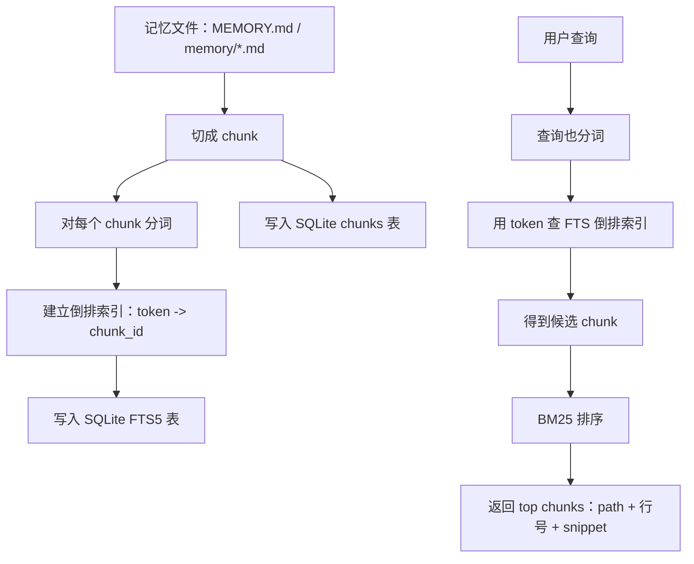
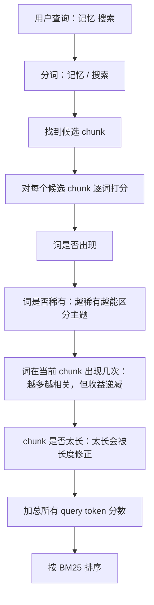

# 关键词检索：FTS、倒排索引与 BM25

## 一句话理解

关键词检索的核心不是每次搜索时重新读全文，而是提前把文本建成“token -> chunk”的倒排索引；查询时先查索引拿到候选 chunk，再用 BM25 给候选结果排序。

## 总流程



## 1. 为什么要切 chunk

chunk 的主要价值不是让搜索更快，而是定义“检索和排序的单位”。

| 检索单位 | 问题 |
| --- | --- |
| 整篇文件 | 太粗，命中后会把大量无关内容带进上下文。 |
| 单独一行 | 太碎，很多概念需要几行甚至几段才完整。 |
| chunk | 粒度比较合适：能保留局部语义，又不会太长。 |

chunk 通常包含：

| 字段 | 作用 |
| --- | --- |
| `text` | 这一小段正文。 |
| `path` | 来自哪个 memory 文件。 |
| `start_line` / `end_line` | 来自原文件哪几行。 |
| `hash` | 内容指纹，用来判断是否变化。 |
| `id` | chunk 唯一标识。 |

## 2. SQLite 在这里做什么

SQLite 可以理解为“本地数据库引擎 + 一个 `.sqlite` 数据库文件”。

OpenClaw 不直接拿 Markdown 文件做每次查询，而是把 memory 文件预处理后写入 SQLite：

| 表/结构 | 作用 |
| --- | --- |
| `chunks` | 保存每个 chunk 的正文、路径、行号、hash、model 等信息。 |
| `chunks_fts` | FTS5 全文搜索表，用来快速关键词查询。 |
| `chunks_vec` | 向量检索表，属于语义搜索，不是本篇重点。 |

所以 Markdown 是人类维护的记忆正文，SQLite 是机器检索用的索引库。

## 3. FTS 和倒排索引

FTS = Full Text Search，全文搜索。SQLite 里的具体实现叫 FTS5。

FTS 的核心结构是倒排索引：

```text
普通文本方向：
chunk_1 -> 记忆 / 搜索 / OpenClaw
chunk_2 -> Agent / 工具 / 调用

倒排索引方向：
记忆 -> chunk_1, chunk_8, chunk_20
搜索 -> chunk_1, chunk_5, chunk_8
OpenClaw -> chunk_1, chunk_3
```

所以当用户搜“记忆 搜索”时，系统不是重新扫描所有 chunk，而是直接查：

```text
记忆 出现在哪些 chunk？
搜索 出现在哪些 chunk？
哪些 chunk 同时或部分命中？
```

这就是 FTS 比 `grep` 更适合长期记忆检索的核心原因：`grep` 更像每次临时扫文本，FTS 是提前建索引后查询索引。

## 4. Token 与中文问题

这里的 token 不是大模型 token，而是全文搜索系统拆出来的可检索词项。

`trigram` 直译是“三元组”。在文本检索里，可以先理解成“三字符滑窗切分”：从文本中连续取 3 个字符作为一个检索片段。

| 文本 | 可能的 token 处理 |
| --- | --- |
| `OpenClaw memory search` | `openclaw` / `memory` / `search` |
| `解剖小龙虾` | 在 trigram 下可能拆成 `解剖小` / `剖小龙` / `小龙虾` |
| `龙虾` | 少于 3 字，trigram 不一定好处理，可能需要 fallback 子串匹配。 |

中文难点在于没有天然空格。OpenClaw 的 FTS tokenizer 可配置：

| tokenizer | 适合 | 问题 |
| --- | --- | --- |
| `unicode61` | 英文、数字、代码、配置项。 | 中文连续文本匹配可能不稳定。 |
| `trigram` | 中文、日文、韩文等无空格文本。 | 对单字、两字短查询不够自然。 |

## 5. Fallback 子串匹配

Fallback 子串匹配就是 FTS 不适合或失败时，退回到“文本字段里是否包含这串字”的朴素匹配。

例如搜：

```text
龙虾
```

如果 trigram 索引不容易直接命中，系统可以退回类似：

```sql
WHERE text LIKE '%龙虾%'
```

它的价值是补漏：

| 方式 | 优点 | 缺点 |
| --- | --- | --- |
| FTS | 快，可排序，可查索引。 | 短中文、特殊符号可能不理想。 |
| 子串匹配 | 对短字符串直观有效。 | 通常更慢，排序能力弱。 |

## 6. BM25 是什么

FTS 负责找到候选 chunk，BM25 负责给候选 chunk 排序。

一句话：

> BM25 会对每个命中的 query token 计算“这个词有多稀有、在这个 chunk 里出现得多集中、这个 chunk 是否太长”，最后把所有查询词的分数加起来排序。



BM25 的三个核心直觉：

| 判断项 | 直觉 |
| --- | --- |
| IDF | 稀有词更重要，比如 `BM25` 比 `的` 更能说明主题。 |
| TF | 一个词在当前 chunk 出现越多，通常越相关，但不是线性加分。 |
| 长度归一化 | 很长的 chunk 容易什么词都出现，所以要扣一点水分。 |

## 关键词检索各组件分工

| 组件 | 解决的问题 |
| --- | --- |
| chunk | 候选结果应该多大。 |
| SQLite | 把 chunk、索引、元数据存成本地数据库。 |
| FTS5 | 如何快速找到包含关键词的候选 chunk。 |
| 倒排索引 | 避免查询时重新扫描全文。 |
| tokenizer | 查询和正文应该拆成哪些可检索 token。 |
| fallback 子串匹配 | FTS 对短中文或特殊字符不好用时补漏。 |
| BM25 | 候选 chunk 里谁更相关、谁排前面。 |

## 常见误区

| 误区 | 更准确的理解 |
| --- | --- |
| chunk 让检索变快 | 主要提速来自 FTS 索引；chunk 主要改善检索粒度和上下文质量。 |
| FTS 查询就是 grep | FTS 查询是查预先建好的倒排索引；grep 更像临时扫文本。 |
| 搜索时会读所有 chunk 判断是否包含词 | 建索引时读全文；查询时先查 token -> chunk 的索引。 |
| BM25 理解语义 | BM25 不理解语义，只根据关键词分布做相关性排序。 |
| 中文关键词一定能像中文分词一样准确 | FTS tokenizer 是规则系统，trigram 更稳但不等于真正理解中文词义。 |

## 我的判断

关键词检索的本质不是“AI 理解了内容”，而是一套经典信息检索工程：

```text
预处理建索引
-> 查询索引
-> 取候选片段
-> 关键词相关性排序
-> 注入 Agent 上下文
```

它和语义搜索互补：关键词检索适合精确词、ID、报错、配置项、专有名词；语义搜索适合表达不同但意思接近的内容。

## 自测问题

1. 为什么说 FTS 的核心价值是“查询时不读全文”？
2. chunk 的主要价值为什么不是速度，而是检索粒度？
3. 倒排索引里的“倒排”是什么意思？
4. `unicode61` 和 `trigram` 对中文查询的差异是什么？
5. fallback 子串匹配为什么是补漏，而不是主检索方式？
6. BM25 为什么要考虑 chunk 长度？
7. BM25 和语义搜索最大的区别是什么？
