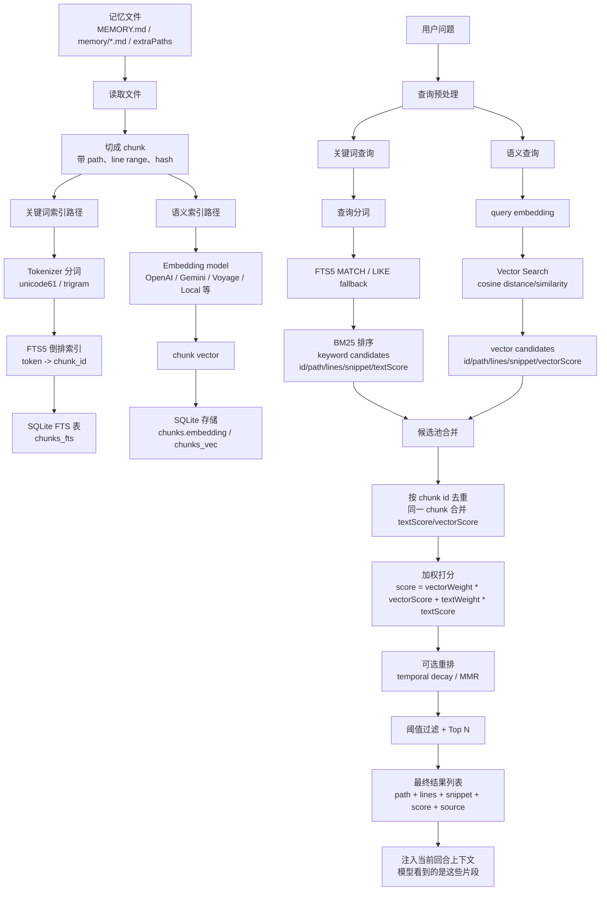
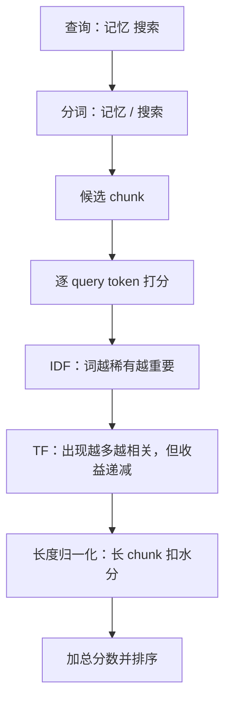

# 记忆搜索总览

## 一句话理解

记忆搜索不是模型“凭空想起来”，而是 Agent Runtime 把记忆文件预处理成可检索索引；用户提问时，系统同时用关键词检索和语义检索召回相关 chunk，合并排序后把少量片段注入当前上下文。

## 总框架图

这张图分两部分看：上半部分是“建索引”，下半部分是“查询与融合”。最终产物不是一个抽象的“搜索结果”，而是一组可注入上下文的 chunk 片段。



## 1. 记忆正文与搜索索引

| 层 | 作用 | 人是否直接维护 |
| --- | --- | --- |
| `MEMORY.md` | 长期、精炼、耐久记忆。 | 是 |
| `memory/YYYY-MM-DD.md` | 日常工作层、详细记录、临时上下文。 | 是 |
| SQLite index | 机器检索用的索引库。 | 通常否 |

SQLite 在这里既是数据库引擎，也是一个本地数据库文件。它适合 OpenClaw 这类本机记忆索引，因为不需要单独启动数据库服务，同时支持表、索引、事务、FTS5、扩展向量检索等能力。

## 2. Chunk：检索单位

chunk 是从长记忆文件中切出来的小段。它的主要价值不是让检索更快，而是定义“候选结果应该多大”。

| 如果不切 chunk | 问题 |
| --- | --- |
| 整篇文件作为结果 | 太粗，命中后会把大量无关内容带进上下文。 |
| 单独一行作为结果 | 太碎，很多概念跨多行表达。 |
| chunk 作为结果 | 粒度较合适：能保留局部语义，又不会太长。 |

一个 chunk 通常包含：

| 字段 | 含义 |
| --- | --- |
| `text` | chunk 正文 |
| `path` | 来源文件 |
| `start_line` / `end_line` | 原文行号范围 |
| `hash` | 内容指纹，用于判断变化 |
| `id` | chunk 唯一标识 |

OpenClaw 文档中描述默认约为 400 tokens、80 tokens overlap；本机代码实现会近似换算成字符长度处理。overlap 的作用是避免一个意思刚好被切断。

## 3. 关键词检索：FTS5 + 倒排索引 + BM25

关键词检索的核心是提前建立倒排索引，而不是查询时重新扫描全文。

```text
建索引阶段：读全文 -> 切 chunk -> 分词 -> 记录 token -> chunk_id
查询阶段：输入查询 -> 查询也分词 -> 查倒排索引 -> 得到候选 chunk
```

倒排索引的直觉：

```text
普通方向：
chunk_1 -> 记忆 / 搜索 / OpenClaw

倒排方向：
记忆 -> chunk_1, chunk_8, chunk_20
搜索 -> chunk_1, chunk_5, chunk_8
```

### FTS5

FTS = Full Text Search，全文搜索，是通用概念；FTS5 是 SQLite 的具体实现。

| 组件 | 作用 |
| --- | --- |
| `chunks_fts` | SQLite FTS5 虚拟表，保存可全文检索的 chunk 文本和定位信息。 |
| `MATCH` | FTS5 查询操作，用 query token 查倒排索引。 |
| tokenizer | 决定正文和查询如何被拆成 token。 |

### Tokenizer 与中文

| tokenizer | 适合 | 限制 |
| --- | --- | --- |
| `unicode61` | 英文、数字、代码、配置项；SQLite FTS5 默认 tokenizer。 | 中文连续文本没有天然空格，匹配可能不够稳定。 |
| `trigram` | 中文、日文、韩文等无空格文本；把连续三字符片段作为 token。 | 少于 3 个 Unicode 字符的查询不适合完整 FTS 匹配。 |

`trigram` 直译是“三元组”。在这里可以理解成“三字符滑窗切分”：从文本里连续取 3 个字符作为一个可检索片段。

例如：

```text
解剖小龙虾
-> 解剖小 / 剖小龙 / 小龙虾
```

短中文或特殊符号查询可能会触发 fallback 子串匹配，即退回到类似：

```sql
WHERE text LIKE '%龙虾%'
```

### BM25

FTS5 找候选，BM25 给候选排序。

一句话：

> BM25 根据“词是否稀有、词在当前 chunk 出现得多不多、chunk 是否过长”来判断候选 chunk 和查询的字面相关性。



注意：SQLite FTS5 的 `bm25()` 实现中，返回值越小表示匹配越好，所以 SQL 里通常 `ORDER BY bm25(table)` 升序排列。

## 4. 语义检索：Embedding + Vector Search

语义检索解决的是“字面不一样，但意思接近”的问题。

```text
建索引：
chunk -> embedding model -> chunk vector -> 存入向量索引

查询：
用户问题 -> embedding model -> query vector -> 找最近 chunk vector
```

| 组件 | 作用 |
| --- | --- |
| Embedding model | 把文本变成高维数字向量。 |
| Vector | 文本的语义坐标，意思相近的文本向量距离更近。 |
| Vector store/index | 存 chunk 向量，支持相似度检索。 |
| Similarity search | 比较 query vector 与 chunk vector 的距离。 |

OpenClaw 支持多种 embedding provider，例如 OpenAI、Gemini、Voyage、Mistral、DeepInfra、Bedrock、Ollama、Local 等。常见默认模型包括：

| Provider | 常见/默认模型 |
| --- | --- |
| OpenAI | `text-embedding-3-small` |
| Gemini | `gemini-embedding-001` |
| Voyage | `voyage-4-large` |
| Mistral | `mistral-embed` |
| DeepInfra | `BAAI/bge-m3` |
| Local | `embeddinggemma-300m-qat-Q8_0.gguf` |

这些 embedding 模型通常是官方或第三方预训练好的通用模型，不是 OpenClaw 自己训练的。聊天模型和 embedding 模型是两套东西。

本机 OpenClaw 代码路径显示：chunk embedding 会存入 `chunks.embedding`；如果 `sqlite-vec` 可用，会写入 `chunks_vec` 并用 cosine distance 做向量检索；如果不可用，会 fallback 到进程内 cosine similarity 遍历。

## 5. Hybrid Search：两条检索路径合并

关键词检索和语义检索各有盲点：

| 检索方式 | 擅长 | 不擅长 |
| --- | --- | --- |
| 关键词检索 | 精确词、文件名、路径、报错、配置项、专有名词。 | 换一种说法可能搜不到。 |
| 语义检索 | 同义表达、概念相近、用户自然语言改写。 | 精确字符串、版本号、错误码、路径可能不稳。 |

因此 OpenClaw 默认思路是 hybrid retrieval：

```text
用户问题
├─ FTS/BM25：字面候选
└─ Embedding/Vector：语义候选
        ↓
合并候选池
        ↓
同一 chunk 去重
        ↓
把 textScore 与 vectorScore 合成一个总分
        ↓
可选做时间衰减或多样性重排
        ↓
过滤低分结果，取 Top N
        ↓
返回 top chunks
```

OpenClaw 文档和配置中默认权重大致为：

| 分数来源 | 默认权重 |
| --- | --- |
| Vector / 语义分数 | `0.7` |
| Text / BM25 分数 | `0.3` |

这个默认值不代表语义永远更重要。对学习笔记和概念改写，语义检索很有价值；对代码路径、报错、配置项，关键词检索通常更可靠。

### 融合到底在融合什么

融合的对象不是整篇文件，而是两条检索路径各自召回的 chunk 候选。

| 来源 | 候选里通常有什么 | 分数含义 |
| --- | --- | --- |
| 关键词检索 | `id`、`path`、`start_line`、`end_line`、`snippet`、`textScore` | 这个 chunk 和查询词在字面上有多相关。 |
| 语义检索 | `id`、`path`、`start_line`、`end_line`、`snippet`、`vectorScore` | 这个 chunk 和查询在语义向量上有多接近。 |

如果同一个 chunk 同时被关键词检索和语义检索命中，它不会作为两条结果重复注入，而是合并成一条：

| chunk | textScore | vectorScore | 最终处理 |
| --- | --- | --- | --- |
| 只被关键词命中 | 有 | 0 | 仍可进入候选池，尤其适合专有名词/路径/报错。 |
| 只被语义命中 | 0 | 有 | 仍可进入候选池，适合同义表达或概念改写。 |
| 两边都命中 | 有 | 有 | 通常更稳定，因为字面和语义都支持它相关。 |

默认加权直觉可以写成：

```text
finalScore = 0.7 * vectorScore + 0.3 * textScore
```

实际系统还会考虑 `candidateMultiplier`、`minScore`、`maxResults`、可选 temporal decay 和 MMR。简化理解是：

| 步骤 | 作用 |
| --- | --- |
| 扩大候选池 | 先多拿一些候选，避免太早漏掉有用片段。 |
| 去重 | 同一个 chunk 只保留一条，合并两边分数。 |
| 加权 | 把语义分数和关键词分数变成一个总排序分。 |
| temporal decay | 可选，让旧的日记型记忆降权；`MEMORY.md` 这类 evergreen 文件不衰减。 |
| MMR | 可选，让结果更多样，避免 top results 全是重复内容。 |
| 阈值/Top N | 丢掉太低分的结果，只保留最可能有用的几个 chunk。 |

### 最终结果长什么样

最终返回给 Agent 的不是“某个数据库行号”本身，而是一组带出处的片段：

```text
[
  {
    path: "memory/2026-06-13.md",
    start_line: 42,
    end_line: 58,
    snippet: "OpenClaw 的 memory-core 会把长期记忆文件切块并建立索引...",
    score: 0.82,
    source: "memory"
  },
  {
    path: "MEMORY.md",
    start_line: 10,
    end_line: 18,
    snippet: "用户偏好：学习时希望先保留原始假设，再由 Codex 指出修正...",
    score: 0.76,
    source: "memory"
  }
]
```

然后 Runtime 会把这些片段放进当前回合上下文。模型真正看到的是这些 `snippet` 和来源信息，而不是整个 SQLite 索引。

## 6. 结果如何进入 Agent 上下文

搜索结果一般包含：

| 字段 | 作用 |
| --- | --- |
| `path` | 来源文件 |
| `start_line` / `end_line` | 原文位置 |
| `snippet` | 命中的 chunk 文本片段 |
| `score` | 排序分数 |
| `source` | 来源类型，如 memory 或 sessions |

Runtime 会把 top results 作为检索片段注入当前上下文。模型并不是“真正记住了这些内容”，而是在当前回合看到了这些被检索出来的内容。

## 7. 现代检索技术扩展

截至 2026 年，RAG / Agent memory 里的主流检索方案通常不是单一技术，而是一套多阶段检索管线。

### 常见生产形态

```text
文档/记忆
-> chunk / metadata / entity
-> 多路索引：BM25/FTS + dense vector + sparse vector + graph
-> 多路召回：关键词 + 语义 + 过滤条件 + 图关系
-> 融合：weighted score / RRF / 自定义 fusion
-> rerank：cross-encoder / late interaction / LLM rerank
-> top context 注入模型
```

| 技术词 | 是什么 | 解决什么问题 |
| --- | --- | --- |
| Vector Database / Vector Store | 专门或半专门存 embedding 向量并做相似度搜索的系统。 | 大规模语义检索、ANN 加速、metadata filter。 |
| Dense vector | 常规 embedding，通常每个 chunk 一个高维稠密向量。 | 找语义相近内容。 |
| Sparse vector | 高维稀疏向量，很多维度为 0，可表达关键词/词项权重。 | 保留精确词、专有名词、代码、缩写。 |
| Hybrid search | 同时使用关键词/稀疏检索和稠密向量检索。 | 兼顾字面精确性和语义相似性。 |
| RRF | Reciprocal Rank Fusion，按多个检索结果的排名做融合。 | 不同检索分数难以直接比较时，用排名融合更稳。 |
| Reranker | 先粗召回一批候选，再用更贵但更准的模型重排。 | 提高 top results 精度。 |
| Cross-encoder rerank | query 和候选文档一起输入模型打分。 | 准确但慢，适合 top-k 后处理。 |
| Late interaction / ColBERT | 文档不只存一个向量，而是存 token-level 多向量，查询时用 MaxSim 等方式精细匹配。 | 比单向量更准，尤其长文档、多细节查询。 |
| Multi-vector search | 一个对象有多个向量字段，如标题、正文、图片、稀疏向量、稠密向量。 | 多字段、多模态、多模型联合检索。 |
| GraphRAG | 从文本抽取实体/关系/社区摘要，结合图结构检索。 | 适合跨文档、全局性、关系型问题。 |

### 常见系统/产品

你记得的 “V 开头” 很可能是这几类：

| 名称 | 类型 | 备注 |
| --- | --- | --- |
| Vector database / Vector DB | 泛称 | 不是具体产品，指向量数据库这个类别。 |
| Vespa | 搜索/推荐/向量检索引擎 | 强项是 hybrid search、复杂 ranking、在线特征和大规模服务。 |
| Vald / Vearch | 向量检索系统 | 也是 V 开头，但在常见 RAG 讨论里没有 Vespa、Milvus、Qdrant、Weaviate、Pinecone 常见。 |

更常被提到的向量库/检索系统：

| 系统 | 典型定位 |
| --- | --- |
| Pinecone | 托管向量数据库，支持 dense/sparse hybrid、rerank 等。 |
| Weaviate | 向量数据库，内置 hybrid search、BM25F、reranking 模块。 |
| Qdrant | 向量数据库，支持 sparse/dense、RRF、多向量、late interaction。 |
| Milvus / Zilliz | 大规模向量数据库，支持 multi-vector hybrid search。 |
| Vespa | 搜索、推荐、向量和复杂排序一体化。 |
| LanceDB | 本地/云端向量数据库，强调数据湖/多模态和 reranking。 |
| pgvector | PostgreSQL 扩展，把向量检索放进 Postgres。 |
| OpenSearch / Elasticsearch | 传统搜索引擎扩展向量和 hybrid search。 |

### 现在更推荐怎么理解

| 旧理解 | 现在更准确的理解 |
| --- | --- |
| 语义检索 = 一个 embedding + 一个向量库 | 生产系统通常是 multi-stage retrieval：粗召回 + 融合 + rerank。 |
| hybrid = BM25 + vector 简单加权 | 常见还有 RRF、归一化、学习排序、自定义 reranker。 |
| 一个 chunk 一个向量就够了 | 长文档/复杂文档可能需要多向量、字段级向量、late interaction。 |
| 向量搜索能替代关键词搜索 | 不能。专有名词、路径、报错、代码仍然需要关键词/稀疏检索。 |
| RAG 只是在文档里搜索 | 新方案会结合 metadata、filters、graph、entity、session memory、权限和新鲜度。 |

### 和 OpenClaw 记忆搜索的关系

OpenClaw builtin memory search 属于轻量本地版 hybrid retrieval：

```text
FTS5/BM25 + embedding vector search + weighted merge
```

它和主流生产方案方向一致，但规模和复杂度更轻。更大型系统会继续加：

| 增强项 | OpenClaw 轻量方案里是否必需 |
| --- | --- |
| 独立向量数据库 | 不一定，本地 SQLite/sqlite-vec 足够小规模使用。 |
| Reranker | 有助于质量，但会增加延迟和成本。 |
| RRF | 比简单加权更适合分数不可比的多路检索。 |
| GraphRAG | 适合跨文档关系和全局总结，不是所有记忆场景都需要。 |
| 多向量/late interaction | 适合高精度检索和长文档，但存储/计算成本更高。 |

## 8. 权威资料核对

| 我们的理解 | 权威资料核对 | 结论 |
| --- | --- | --- |
| SQLite 是本地数据库引擎，也是数据库文件格式。 | SQLite 官网说明它是小型、自包含、高可靠的 SQL database engine；SQLite 文件格式文档说明完整数据库状态通常在一个 main database file 中。 | 正确。 |
| FTS 是通用全文搜索，SQLite FTS5 是具体实现。 | SQLite FTS5 官方文档描述了 FTS5 tokenizer、MATCH 查询、trigram tokenizer 和 bm25 函数。 | 正确。 |
| FTS5 默认 tokenizer 是 `unicode61`，可用 `trigram`。 | SQLite FTS5 官方文档列出内置 tokenizer，并说明 `unicode61` 是默认，`trigram` 将连续三字符作为 token。 | 正确。 |
| trigram 对短中文查询有限制。 | SQLite FTS5 官方文档说明少于 3 个 Unicode 字符的 substring 不会匹配 full-text query。 | 正确，需要保留短查询 fallback 的说明。 |
| BM25 用来给全文搜索结果排序。 | SQLite FTS5 官方文档说明 `bm25()` 表示当前行匹配全文查询的程度。 | 正确，但要注意 SQLite 中分数越小越好。 |
| 语义检索是 query/document embedding 后做相似度比较。 | OpenAI 官方 Embeddings 文档示例使用 query 与 document embeddings 的 cosine similarity 返回最高分文档。 | 正确。 |
| OpenClaw 一定启用了语义检索。 | 本机配置没有显式 `agents.defaults.memorySearch`，只看到 GLM 聊天 provider；OpenClaw 文档说需要 provider/API key 或 local model。 | 不能这样说。应表述为“配置了 embedding provider 时启用；否则退回关键词检索”。 |
| 主流检索方案是 hybrid + rerank。 | Pinecone、Weaviate、Qdrant、Vespa、Milvus、LanceDB 等官方文档都把 dense/vector、sparse/keyword、fusion/rerank 作为核心能力或推荐路径。 | 正确，是当前生产 RAG 的主流方向。 |

## 9. 需要补充或修正的点

| 点 | 修正后说法 |
| --- | --- |
| “chunk 让搜索变快” | 主要提速来自 FTS/向量索引；chunk 主要改善检索粒度、排序质量和上下文注入质量。 |
| “BM25 分数越高越好” | 通用直觉可以说相关性越强越靠前，但 SQLite FTS5 的 `bm25()` 返回值是越小越好。 |
| “OpenClaw 一定有语义检索” | 只有配置或自动检测到 embedding provider 时才有语义检索。 |
| “中文可以像中文分词一样理解词义” | FTS tokenizer 是规则切分，trigram 更稳但不理解中文语义；真正语义相近要靠 embedding。 |
| “向量数据库就是最新答案” | 向量数据库只是基础设施；真正影响效果的是 chunk、metadata、hybrid 召回、fusion、rerank 和评估。 |

## 我的判断

记忆搜索本质上是一个小型 RAG 检索系统：

```text
人类可读记忆文件
-> 机器可查索引
-> 按 query 召回少量相关片段
-> 注入模型上下文
-> 让模型基于检索片段回答
```

它的关键不是“模型自己记住”，而是 Runtime 负责把外部记忆变成当前回合可见的信息。

## 自测问题

1. 为什么说记忆搜索是“检索后注入上下文”，而不是模型权重里的记忆？
2. chunk 的主要价值是什么？
3. 倒排索引为什么能避免查询时扫描全文？
4. FTS5 和 BM25 分别解决什么问题？
5. 为什么中文短查询需要 fallback？
6. 语义检索为什么能找到字面不同但意思接近的内容？
7. 为什么 hybrid search 比只用关键词或只用语义更稳？
