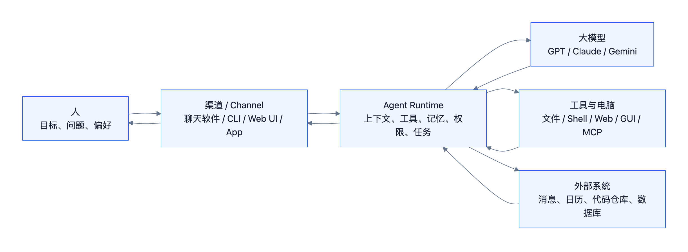
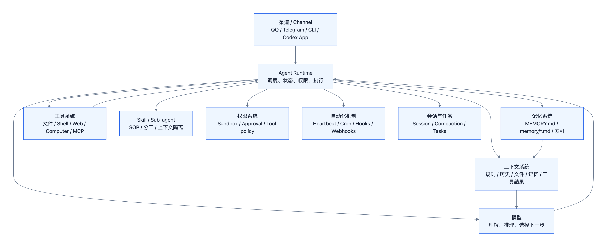
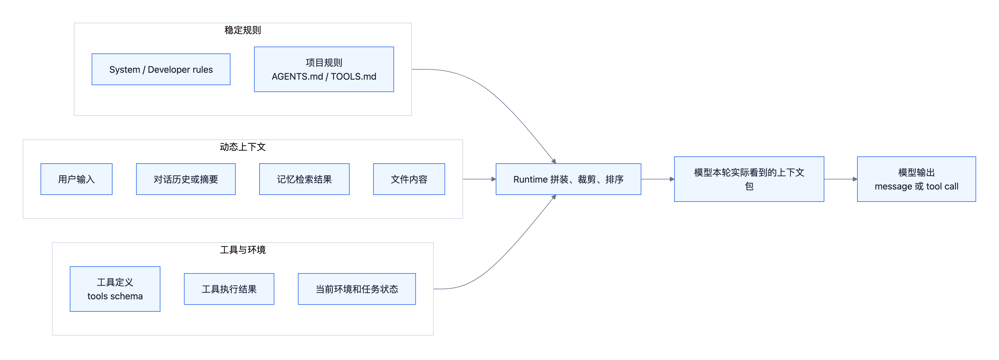
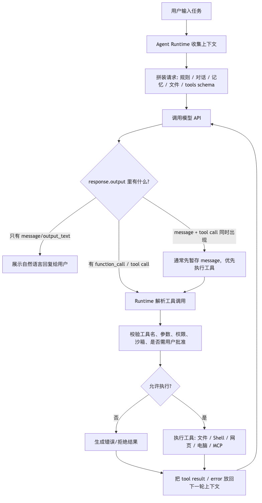
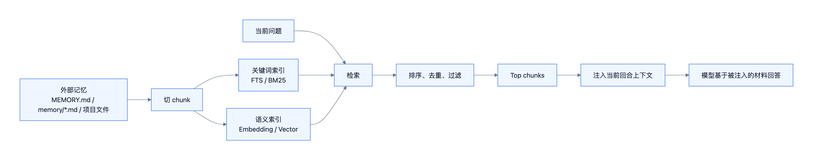
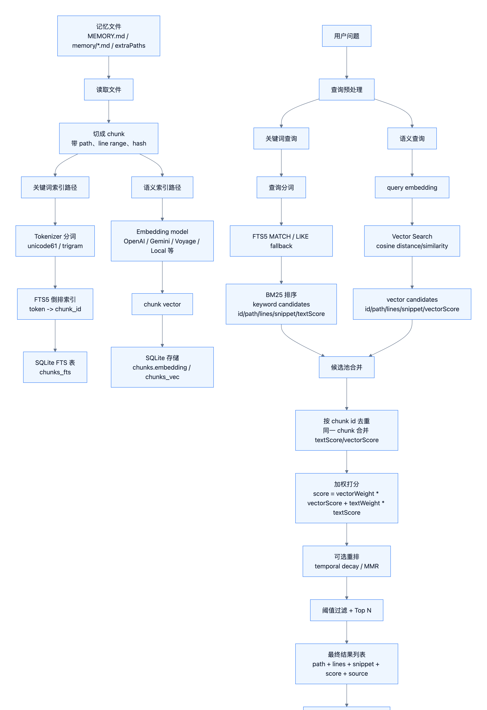
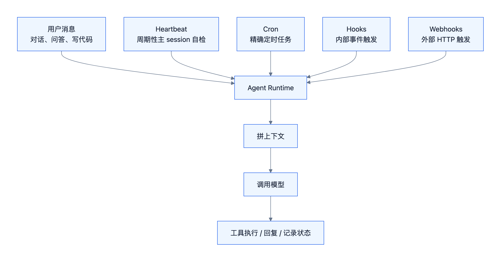
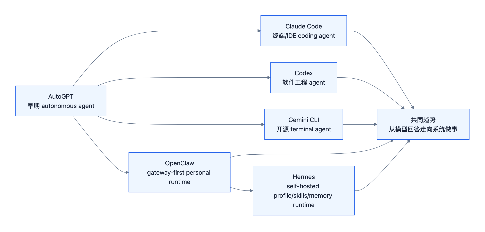

# Agent 到底是什么

> 这份是复习笔记版，保留较完整的课程细节、表格和自检问题。面向分享的文章版见：[[2026-06-13-Agent到底是什么-分享版]]

## 为什么 Agent 这个词会让人困惑

现在说 Agent 的人很多，但每个人指的东西不太一样。

有人说 Agent 是“会自己做事的 AI”，有人说它是 “LLM + tools”，也有人直接把 AutoGPT、Claude Code、Codex、OpenClaw 这些产品叫 Agent。这些说法都不算错，但都只讲到了一面。

“会自己做事”抓住了行动感，但容易把 Agent 讲得太神秘，好像模型突然变成了一个持续存在的主体；“LLM + tools”抓住了工具调用，但又太窄，好像只要接几个 API 就有了 Agent；把某个产品直接叫 Agent 最直观，但会让人分不清：哪些是模型能力，哪些是产品能力，哪些是外层 Runtime 做的事。

真正容易被忽略的是：Agent 不是一个更神秘的大模型，也不是一个单独的提示词技巧。它是一套包在语言模型外面的运行系统，让模型能够带着身份、知识、记忆和工具去完成任务。

这个理解很关键。因为语言模型本身并不是一个持续在线、一直记得你、能自己操作电脑的主体。更朴素地说，它每次被调用时，只是在给定上下文里继续生成文字。你感觉它“记得过去”，很多时候不是因为模型真的把过去写进了脑子里，而是外层系统把历史、摘要、文件、记忆搜索结果重新拼进了这一次上下文。

所以，理解 Agent 的入口不是先背框架名，而是先问一个问题：

> 一个只会根据上下文生成文字的模型，怎么变成一个能在真实环境里持续做事的系统？

能回答这个问题的那一层，就是 Agent。

## 从模型到 Agent，中间补了什么

先把结论说完整一点：

> Agent 是围绕语言模型搭起来的运行系统。它把人的目标变成模型能理解的上下文，把模型的判断变成工具行动，再把行动结果带回下一轮上下文。

这层系统主要补五件事：

- 模型不知道自己是谁，Agent 给它身份、规则、任务目标和当前环境。
- 模型不能直接操作电脑，Agent 提供工具，并负责校验参数、权限和沙箱。
- 模型没有天然长期记忆，Agent 把历史、摘要、日志和记忆库检索出来，再注入当前上下文。
- 模型不会自己按时醒来，Agent 通过用户消息、Heartbeat、Cron、Hooks 或 Webhooks 被触发。
- 模型不知道什么操作有风险，Agent 用审批、安全策略和任务状态控制边界。

后面所有内容都围绕这条线展开：语言模型缺什么，Agent 补什么；补完以后，系统如何真的做事。

OpenClaw 会作为贯穿案例出现，因为官方 PDF 本来就是用 OpenClaw 来讲 AI Agent 的运作原理，而且它把身份、工具、Skill、记忆、Heartbeat、Hooks、长期运行这些机制展示得比较清楚。但 OpenClaw 不是主角，它只是一个观察窗口。真正要讲清楚的，仍然是 Agent 这个抽象概念。


## 背景：AI 从“会预测”到“会做事”

讲 Agent 之前，需要先知道它不是凭空冒出来的。AI 的主线大致经历了几次变化：

| 阶段 | 核心变化 | 和 Agent 的关系 |
| --- | --- | --- |
| 机器学习 | 从数据中学习模式，做分类、预测、排序。 | AI 主要是任务模型。 |
| 深度学习 | 神经网络自动学习特征，图像、语音、文本能力提升。 | 为大模型提供训练范式。 |
| Transformer | 更适合大规模序列建模。 | 成为现代 LLM 的基础架构。 |
| GPT / LLM | 语言模型变成通用自然语言接口。 | 模型能理解目标、生成计划、写代码和工具参数。 |
| ChatGPT | 模型从“续写文本”变成大众可用的对话助手。 | 人开始直接把任务交给模型。 |
| Agent Runtime | 系统把模型接入工具、记忆、电脑和外部服务。 | 模型不只回答，而是在系统协调下做事。 |

过去 AI 经常是“动口不动手”：能回答、能解释、能写代码，但不能自己打开文件、查网页、跑命令、发消息、持续跟进任务。

Agent 时代真正改变的是：

```text
模型能回答
-> 系统能做事
```

中间缺的就是 Agent Runtime。

### AutoGPT 的位置

2023 年 AutoGPT 的意义不是“它很好用”，而是它让很多人第一次看到：

- LLM 可以进入任务循环。
- 模型可以自己拆任务、搜索、读写文件、调用工具。
- Agent loop 这个想法可以被普通开发者直观看见。

但 AutoGPT 没有成为日常生产工具，因为它容易跑偏、卡住、幻觉、烧成本，也缺少稳定的权限、上下文管理和人类监督方式。

后来的 Claude Code、Codex、Gemini CLI、OpenClaw 这些系统，真正补上的不是“再接一个更强模型”这么简单，而是更完整的 Runtime、工具接口、权限控制、任务状态和工作流接入。

## 先把语言模型讲清楚：核心是文字接龙

官方 PDF 先提醒了一件非常重要的事：

> 语言模型真正做的事情就是文字接龙。

一次语言模型调用可以简化成：

```text
外界给 prompt
-> 语言模型根据已有文字继续生成
-> 返回 response
```

这里有三个关键边界：

| 边界 | 含义 |
| --- | --- |
| 它不是持续存在的主体 | 每次调用都要重新给它上下文。 |
| 它有 context window | 输入和输出长度有限，太长会丢精度、增加成本、变混乱。 |
| 它不会天然记住过去 | 多轮对话的连续性通常来自应用层重新拼上下文。 |

所以这篇分享里最重要的直觉是：

> 不是模型自己记住了过去，而是 Agent / 应用层帮它把历史、摘要、记忆和当前环境重新拼进了上下文。

这也是后面所有机制的起点：身份、工具、知识、记忆、触发、长期执行，都不是模型单独完成的，而是 Runtime 帮模型补上的系统能力。

## Agent 的定位：人和语言模型之间的运行系统

课堂 PPT 的关键图可以抽象成：

```text
人 / 通讯软件 -> OpenClaw -> 语言模型
```

更通用一点就是：

```text
人 / 渠道 / 工作目标
-> Agent Runtime
-> 语言模型 / 工具 / 电脑 / 外部系统
```



这时可以给 Agent 一个严格一点的定义：

> Agent 是围绕语言模型建立的软件运行系统。它接收人的目标，组织上下文，调用模型，执行工具，获取知识，保存和检索记忆，并通过触发、任务状态和安全机制推进工作。

### OpenClaw 的定位

你在学习时有一个很有记忆点的理解：

> OpenClaw 是 AI Agent 里“不太 AI”的部分。

这个说法很有价值，但要稍微修正得更严谨：

> OpenClaw 不是模型智能的主要来源，而是把模型智能工程化、产品化、日常化的中介层。

模型负责理解、推理和生成；OpenClaw / Codex / Claude Code 这类 Agent Runtime 负责让模型进入真实工作流。

| 部分 | 负责什么 |
| --- | --- |
| 语言模型 | 理解语言、推理、生成文本、写代码、选择工具。 |
| Agent Runtime | 接收消息、拼上下文、调模型、执行工具、保存状态、控制权限、触发任务。 |

一个 Agent “聪不聪明”主要看模型；一个 Agent “能不能稳定做事”主要看 Runtime。

## 一个完整 Agent 包含什么

完整 Agent 不是一个模型 API 调用，而是一组协同模块。



| 模块 | 作用 | 例子 |
| --- | --- | --- |
| 渠道 / Channel | 用户从哪里和 Agent 交互。 | QQ、Telegram、Discord、Web UI、CLI、Codex App |
| Agent Runtime | 组织整个 Agent 流程。 | OpenClaw Gateway、Codex runtime |
| 模型 | 理解、推理、决策和生成。 | GPT、Claude、Gemini |
| 上下文系统 | 拼装模型当前输入。 | system prompt、AGENTS.md、history、files、tool results |
| 工具系统 | 让 Agent 对外行动。 | file、shell、web、computer、MCP、message |
| 知识系统 | 让 Agent 获取任务相关知识。 | Skill、知识库、文档、网页、数据库、RAG |
| 记忆系统 | 保存和检索 Agent 自己的连续性。 | MEMORY.md、memory files、daily notes、FTS/BM25、vector search |
| 权限系统 | 控制风险。 | sandbox、approval、tool policy、config |
| 会话与任务状态 | 管理多轮任务。 | session、task ledger、summary、compaction |
| 触发机制 | 让 Agent 不只被用户消息唤起。 | Heartbeat、Cron、Hooks、Webhooks |

这里“渠道 / Channel”比“入口”更合适，因为很多 Agent 官方文档会用 channel 表示聊天软件、Web UI、CLI 等接入面。

## Agent 如何知道自己是谁

语言模型本身不会天然知道：

- 我是谁？
- 我的主人是谁？
- 我的人生目标是什么？
- 我之前做过什么？
- 我现在有哪些规则和边界？

Agent 的做法是：每次调用模型前，把身份、规则、用户信息、历史摘要、工具定义、记忆检索方式等拼进当前上下文。



一个当前回合上下文包可能包含：

| 内容 | 作用 |
| --- | --- |
| System prompt | 告诉模型身份、边界、行为方式。 |
| 身份文件 | 例如 `SOUL.md`、`IDENTITY.md`、`USER.md`。 |
| 项目规则 | 例如 `AGENTS.md`、仓库规范、课程整理规则。 |
| 用户输入 | 当前任务、问题或补充信息。 |
| 对话历史 / 摘要 | 保持当前任务连续。 |
| 记忆检索结果 | 把长期记忆中相关片段带回本轮。 |
| 文件和网页内容 | 当前任务需要看的资料。 |
| 工具定义 | 告诉模型有哪些工具、参数怎么写。 |
| 工具执行结果 | 上一轮工具调用后的结果。 |
| 当前环境 | 时间、工作目录、权限、任务状态。 |

关键认知：

> Agent 的“自我”不是模型权重里的灵魂，而是每次调用前被拼进上下文的身份、规则、目标和记忆。

所以“System Prompt”只是入口概念。更完整的说法应该是“当前回合上下文包”。

## Agent 如何使用工具

Agent 能做事，核心靠工具。

模型不直接操作电脑。模型负责在输出中提出工具调用；Runtime 负责校验、执行和回写结果。



简化流程：

```text
Runtime 把工具定义放进上下文
-> 模型决定是否调用工具
-> 模型输出 tool call
-> Runtime 校验工具名、参数、权限、沙箱和审批
-> Runtime 执行工具
-> 工具结果回写给模型
-> 模型继续判断或给用户最终回答
```

常见工具类型：

| 工具类型 | 做什么 | 例子 |
| --- | --- | --- |
| 文件工具 | 读写本地文件。 | Read、Write、Edit |
| Shell 工具 | 执行命令。 | 跑测试、调用 CLI、执行脚本 |
| Web 工具 | 搜索和打开网页。 | 搜索资料、抓取页面 |
| Computer 工具 | 操作图形界面。 | 截图、点击、输入、滚动 |
| Message 工具 | 给人或渠道发消息。 | QQ、Telegram、Discord |
| MCP / API 工具 | 调外部服务。 | GitHub、Google Drive、数据库 |
| Media 工具 | 处理音频、图片、视频。 | TTS、ASR、FFmpeg、图片生成 |
| Sub-agent 工具 | 派生专门执行单元。 | 并行读资料、分工调查、局部验证 |

### 工具调用如何被识别

不同系统实现不完全一样，但大致有两类：

| 方式 | 说明 | 特点 |
| --- | --- | --- |
| 结构化 tool call | API 返回 `function_call` / `tool_use` / `tool_call` 对象。 | 更稳定，便于校验参数和权限。 |
| 文本标记解析 | 模型输出 `Action: read_file` 之类格式，Runtime 解析。 | 简单通用，但更容易格式错或误触发。 |

工具调用和自然语言也不是绝对互斥。现代 API 里一次返回可以包含 message、reasoning、function_call 等多个 output item。工程上通常会优先执行工具，把结果回写后，再让模型生成最终自然语言回复。

### 工具为什么危险

PDF 里提到 OpenClaw 强大的原因之一是可以用 `exec` 执行 shell command。这个能力很强，但也危险。

> AI 做事和 AI 搞事只有一线之隔。

因此 Agent 必须有权限系统：

- 哪些工具可用。
- 哪些路径能读写。
- 哪些命令要审批。
- 外部账号和密钥如何隔离。
- 高风险动作是否需要人确认。
- 失败后是否允许自动重试。

## Agent 如何获取知识：Skill 和知识库

这一节的核心问题是：

> Agent 如何获得当前任务需要的知识？

Agent 的知识来源可以分成三类：

| 知识类型 | 形式 | 解决的问题 |
| --- | --- | --- |
| 模型内知识 | 模型训练时学到的通用知识。 | 常识、语言能力、一般推理。 |
| 流程知识 | Skill / SOP / 工作流说明。 | 这类任务应该按什么步骤做。 |
| 外部资料知识 | 文档、网页、知识库、数据库、项目文件。 | 当前任务需要的事实、上下文和证据。 |

### Skill：流程性知识

Skill 可以理解成 Agent 的 SOP，也可以理解成“程序化经验”。

它不是单个工具，而是一套完成任务的方法说明、脚本、模板、参考资料和资源。

```text
做一支自我介绍影片
-> 读取 video/SKILL.md
-> 写 narration.json
-> 做 HTML 投影片
-> 投影片截图
-> TTS 配音
-> ASR 验证
-> FFmpeg 合成视频
```

Skill 的价值不是简单“给模型更多文字”，而是告诉 Agent：

- 什么时候应该使用这套能力。
- 先读什么资料。
- 按什么顺序做。
- 调用哪些工具。
- 产出什么格式。
- 失败时怎么处理。

Skill 通常按需读取，不需要一开始全部塞进上下文。这也是一种 Context Engineering：先把索引和触发条件给模型，必要时再读取详细流程、脚本和参考资料。

### 知识库：事实性知识

知识库提供的是事实、证据、文档和领域知识。

它可以是：

- Markdown 文件夹。
- PDF / Word / 网页。
- 代码仓库和项目文档。
- 数据库和业务系统。
- 向量库、全文索引、RAG 系统。

Agent 通常不会把整个知识库塞给模型，而是：

```text
用户问题
-> 检索相关资料
-> 筛选和排序片段
-> 注入当前上下文
-> 模型基于这些片段回答或继续调用工具
```

关键区分：

| 机制 | 更像什么 | 回答的问题 |
| --- | --- | --- |
| Skill | 方法和流程 | 我该怎么做？ |
| 知识库 | 事实和证据 | 我需要知道什么？ |
| 记忆 | Agent 自己的连续性 | 我之前经历过什么、承诺过什么、学到什么？ |

RAG 会作为后续专题学习。这里先理解一件事：知识不是“自然出现在模型脑子里”，而是 Agent 运行时按需检索并注入上下文。

## Agent 如何记忆

Agent 的记忆通常不是模型权重改变，而是外部文件、数据库、索引和摘要系统。



### 记忆的几种形式

| 记忆类型 | 形式 | 作用 |
| --- | --- | --- |
| 短期记忆 | 当前对话历史、当前任务状态、未压缩上下文。 | 保持本轮任务连续。 |
| 长期记忆 | `MEMORY.md`、长期偏好、重要事实、稳定决策。 | 跨 session 保持连续。 |
| 每日日志 | `memory/YYYY-MM-DD.md`、daily notes、事件流水。 | 记录发生过什么，方便后续回顾和提取长期记忆。 |
| 摘要记忆 | session summary、compaction summary。 | 上下文变长后保留关键信息。 |

PDF 里有一句很重要的提醒：

> 如果模型只是说“我会记住”，但没有通过工具写入 `.md` 文件或外部存储，那就是“记了个寂寞”。

这句话很直观，但背后是一个严肃边界：

```text
说记住了
不等于写入记忆
写入记忆
也不等于本轮一定能用
只有被检索并注入当前上下文
模型才真正能使用
```

### 记忆如何搜索

更完整的记忆搜索流程是：



可以简化成：

```text
记忆文件
-> 切 chunk
-> 建关键词索引和语义索引
-> 查询时关键词搜索 + 语义搜索
-> 候选合并、去重、加权
-> 取 Top N 片段
-> 注入当前上下文
-> 模型基于这些记忆回答
```

关键词搜索、语义搜索和加权的区别：

| 机制 | 擅长 | 不擅长 |
| --- | --- | --- |
| 关键词搜索 | 路径、名字、日期、术语、报错、精确字符串。 | 换一种说法可能搜不到。 |
| 语义搜索 | 意思相近、表达不同、自然语言问题。 | 精确版本号、路径、错误码可能不稳。 |
| 加权融合 | 综合字面相关、语义相关、时间、重要性、来源可信度。 | 需要调参和评估，不能保证每次都完美。 |

所以 Agent 记忆不是一个神秘黑箱，它更像一个小型 RAG 系统：保存、索引、检索、筛选、注入。

## Agent 什么时候会被触发

用户发消息不是 Agent 唯一的触发方式。



| 触发方式 | 含义 | 适合场景 |
| --- | --- | --- |
| 用户消息 | 人主动发起任务。 | 对话、问答、写代码、整理笔记。 |
| Heartbeat | 周期性唤醒 Agent 检查是否有事。 | 长期陪伴、follow-up、轻量巡检。 |
| Cron | 按固定时间执行任务。 | 日报、周报、定时同步、提醒。 |
| Hooks | 系统内部事件触发。 | `/new`、`/reset`、compaction、工具前后、gateway startup。 |
| Webhooks | 外部系统通过 HTTP 触发。 | GitHub、飞书、QQ、业务系统通知。 |

### Heartbeat

Heartbeat 不是普通网络心跳，也不是让模型一直思考。

在 Agent 语境里，它更像：

```text
定时器到点
-> Runtime 唤醒主 session
-> 读取 HEARTBEAT.md 或任务规则
-> 检查 inbox / 通知 / 承诺 / standing orders
-> 无事：HEARTBEAT_OK 静默
-> 有事：通知用户或继续执行
```

### Cron、Hooks、Webhooks

| 机制 | 触发原因 | 核心区别 |
| --- | --- | --- |
| Heartbeat | 时间间隔到了。 | 近似周期、自检、无事静默。 |
| Cron | 精确时间到了。 | 准点执行、适合独立后台任务。 |
| Hooks | 内部事件发生。 | 生命周期自动化，例如 compaction 前后、session reset。 |
| Webhooks | 外部 HTTP 请求进来。 | 第三方系统唤醒 Agent。 |

这部分要把名字分清楚：Hooks 和 Webhooks 很像，但前者是内部事件机制，后者是外部 HTTP 入口。

在原始记录里，我们已经确认 OpenClaw 不是“未来可能有 hooks”，而是已经有 hooks 机制。后续深入时要继续区分 Internal hooks、Plugin hooks 和 Webhooks。

## Agent 如何长时间执行

语言模型的上下文窗口有限。即使模型支持很长上下文，输入越长也越贵、越慢、越容易混乱。

长期任务会遇到一个问题：

```text
对话越来越长
工具结果越来越多
文件和网页越来越多
模型上下文放不下
```

PDF 里讲的 Context Compression / Compaction 可以这样理解：

```text
长对话 / 长任务
-> 上下文逐渐变长
-> 触发 compaction
-> 把旧历史压缩成 summary
-> 新一轮继续带 summary 工作
```

Compaction 解决的是“任务如何继续”，但也带来风险：

- 摘要可能丢细节。
- 摘要可能把错误判断写成事实。
- 后续模型只能看到 summary，看不到完整原始过程。
- 重要证据需要保留文件、日志或引用，不能只靠摘要。

长期执行还必须配合安全环境：

- 不要给 Agent 平常使用的主账号密码。
- 尽量用隔离账号、沙箱电脑或测试环境。
- 检查它做了什么。
- 给清晰安全规则。
- 对危险工具和外部动作加审批。

到这里可以形成一个判断：AI Agent 很强，但还不成熟，需要安全边界和人类监督。

## 当前有哪些 Agent，以及各自特点

这里不叫“例子”，因为这些系统代表了当前 Agent 生态里的不同方向。



| Agent / 系统 | 定位 | 特点 |
| --- | --- | --- |
| AutoGPT | 早期 autonomous agent | 展示 agent loop，但容易跑偏、卡住、成本高。 |
| Claude Code | coding agent | 读代码、改文件、跑命令，进入终端/IDE 工作流。 |
| Codex | 软件工程 agent | 面向仓库、任务、测试、PR、云端/本地工程闭环。 |
| Gemini CLI | terminal agent | 把 Gemini 接入终端，面向开发者工作流。 |
| OpenClaw | gateway-first personal agent runtime | 多渠道、长期在线、记忆、Heartbeat、Hooks、Cron。 |
| Hermes | self-hosted agent runtime | profile、skills、memory、gateway/cron，更偏长期个人化运行。 |

横向看：

| 类型 | 代表 | 核心价值 |
| --- | --- | --- |
| 早期 autonomous agent | AutoGPT | 证明 LLM 可以进入任务循环。 |
| Coding agent | Claude Code、Codex、Gemini CLI | 把模型接进真实代码仓库和工程流程。 |
| Personal agent runtime | OpenClaw、Hermes | 把模型接进多渠道、记忆、自动化和长期个人工作流。 |

## 最后回到定义：Agent 到底是什么

最后可以用这张表收束：

| 问题 | 语言模型本身 | Agent 补上的系统能力 |
| --- | --- | --- |
| 我是谁 | 不天然知道。 | 身份文件 + system prompt + 当前上下文包。 |
| 我能做什么 | 只能生成文本。 | 工具系统 + Runtime 执行。 |
| 我如何获取知识 | 主要依赖模型内知识。 | Skill、知识库、检索、文件和网页。 |
| 我如何记住 | 不会自动长期记忆。 | 外部记忆 + 检索 + 上下文注入。 |
| 我什么时候运行 | 不会自己醒来。 | 用户消息、Heartbeat、Cron、Hooks、Webhooks。 |
| 我如何长期执行 | context window 有限。 | Compaction、session、task state。 |
| 我如何避免乱做 | 只靠模型不可靠。 | 权限、沙箱、审批、隔离环境。 |

一句话版本：

> Agent 不是模型本身，而是让语言模型能带着身份、知识、记忆和工具进入真实世界做事的运行系统。

## 读完后再回看几个误区

如果前面的机制都理解了，下面这些说法就能被更准确地修正：

| 误区 | 更准确的理解 |
| --- | --- |
| Agent 就是大模型 | 大模型是智能核心，Agent 还包含 Runtime、上下文、工具、记忆、权限和触发机制。 |
| 模型真的记住了过去 | 多数情况下是历史、摘要或外部记忆被重新注入上下文。 |
| 模型说“我记住了”就真的记住 | 如果没有写入外部记忆或未来可检索的存储，就是“记了个寂寞”。 |
| 模型直接操作电脑 | 模型提出工具调用，Runtime 校验并执行。 |
| Skill 就是工具 | 工具回答“能做什么动作”，Skill 回答“这类任务怎么做”。 |
| 知识库就是记忆 | 知识库偏外部事实和资料，记忆偏 Agent 自己的历史连续性。 |
| Heartbeat 是网络心跳 | Agent 里的 Heartbeat 更像周期性唤醒主 session。 |
| AutoGPT 失败说明 Agent 不行 | AutoGPT 证明了方向，但生产可用还需要 Runtime、权限、工具稳定性和监督方式。 |

## 关键判断

1. Agent 的核心不是“模型更会聊天”，而是“模型能在 Runtime 协调下做事”。
2. Agent 位于人和模型之间，负责协调渠道、上下文、工具、知识、记忆、任务和权限。
3. 语言模型的核心是文字接龙；连续体验来自上下文拼接。
4. System Prompt 不是完整 Agent，当前回合上下文包才是模型真正看到的输入。
5. 工具调用不是模型直接操作电脑，而是模型提出意图，Runtime 执行动作。
6. Skill 提供流程性知识，知识库提供事实性知识，记忆提供连续性。
7. 记忆不是模型权重变化，而是外部信息被保存、检索并注入上下文。
8. Heartbeat、Cron、Hooks、Webhooks 让 Agent 具备长期运行和事件驱动能力。
9. Compaction 让长任务能继续，但会带来摘要丢失和误压缩风险。
10. OpenClaw 是分析案例，它展示了一个长期在线个人 Agent Runtime 需要哪些部件。

## 读完后应该能回答的问题

1. 为什么说语言模型的核心是文字接龙？
2. 为什么说 Agent 不是大模型本身？
3. OpenClaw 为什么可以被理解成 AI Agent 里“不太 AI”的部分？
4. 当前回合上下文包通常包含哪些内容？
5. 为什么“上下文拼接”不等于“模型真的记住”？
6. 一次工具调用从模型输出到真实执行，中间经过哪些步骤？
7. Skill、知识库、记忆三者分别解决什么问题？
8. 短期记忆、长期记忆、每日日志和摘要记忆有什么区别？
9. 关键词搜索和语义搜索各自适合什么场景？
10. Heartbeat、Cron、Hooks、Webhooks 的区别是什么？
11. Context Compression 解决了什么问题，又带来什么风险？
12. AutoGPT、Claude Code、Codex、OpenClaw 的定位差异是什么？

## 继续深入

- RAG 与检索增强：[[2026-06-14-RAG专题预留]]
- Agent 执行循环：[[Agent执行循环]]
- Agent 当前回合上下文包：[[Agent当前回合上下文包]]
- 上下文拼接不等于模型记忆：[[上下文拼接不等于模型记忆]]
- Skill 是什么：[[Skill是什么]]
- 记忆搜索总览：[[记忆搜索总览]]
- OpenClaw 长期运行机制：[[OpenClaw长期运行机制]]
