# 互联网业务分析知识库如何构建并给 Agent 使用

## 0. 摘要

### 30 秒结论

互联网业务分析知识库的核心不是“买一个 AI 工具”，也不是“把所有文档丢进向量库”。对数据团队来说，更容易理解的建设方式是：

```text
原始资料
-> 标准明细
-> 主题资产
-> 关系资产
-> 数据服务
-> AI Agent 应用
```

### 摘要图

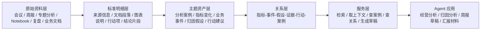

这不是一套全新的“AI 黑盒”。它更像一条面向 AI 的数据资产链路：

| 层 | 数据团队熟悉的理解 | AI 侧对应能力 |
| --- | --- | --- |
| 原始资料层 | ODS / 原始日志 | 原始文档和文件 |
| 标准明细层 | DWD / 标准化明细 | 可检索、可引用的证据片段 |
| 主题资产层 | DWS / 主题域资产 | 分析案例、指标变化、假设、行动建议 |
| 关系层 | 关系表 / 主题补充关系 | 轻量关系网络 |
| 服务层 | API / 数据服务 | Agent 工具调用 |

### 关键判断

| 判断 | 含义 |
| --- | --- |
| 公开完整案例很少 | 没有找到足够完整的“互联网业务分析 AI 知识库从原始资料到 Agent”的公开案例。 |
| AI 前资产实践仍然重要 | Airbnb、Pinterest Querybook 不是为 AI 建的，但回答了“业务分析知识应该先沉淀成什么”。 |
| AI 产品案例只能做形态参考 | 腾讯音乐、阿里云、火山引擎展示了 AI/Agent 怎么使用知识，但没有完整公开建库 pipeline。 |
| 技术路线应成熟优先 | 第一版应优先采用文档解析、混合检索、业务对象抽取、人审和引用。 |
| 图谱可以探索，不宜主线 | 图谱适合跨文档关系发现，但第一期应先做少量关键关系表。 |

## 1. 目录

| 章节 | 内容 |
| --- | --- |
| 2 | 调研问题与边界 |
| 3 | 调研内容摘要 |
| 4 | 总体发现 |
| 5 | 两层框架：AI 前知识库、AI 知识库 |
| 6 | 知识库目标形态 |
| 7 | 数据资产处理流程 |
| 8 | 技术方案组合关系 |
| 9 | 候选架构方案 |
| 10 | 第一阶段建议路线 |
| 11 | 评估标准与风险 |
| 12 | 资料索引 |

## 2. 调研问题与边界

本次调研关注的是：**互联网业务分析知识库如何从零构建，并给 Agent 用于经营分析、归因分析、知识沉淀和汇报生成**。

不重点讨论传统数仓、数据血缘、指标治理平台，也不把 Text-to-SQL 作为第一期主线。它们是基础能力或后续能力，但当前核心问题是：

```text
会议纪要、周报、专题分析、Notebook、复盘、业务文档
如何被处理成 Agent 可复用的业务分析知识资产？
```

## 3. 调研内容摘要

这次调研没有找到一个可以直接照抄的完整案例。公开资料主要分成几组：一组讲 **AI 之前，人怎么沉淀分析知识**；一组讲 **AI Agent 怎么消费企业知识**；另一组讲 **AI 知识库的成熟工程做法**。

### 3.1 调研覆盖与结论

| 调研方向 | 代表资料 | 重点看什么 | 对我们的结论 |
| --- | --- | --- | --- |
| AI 前分析资产 | Airbnb Knowledge Repo、Pinterest Querybook | 分析报告、Notebook、DataDoc 如何沉淀为可复用资产 | 适合作为“分析资产表/分析案例库”的形态参考。 |
| AI Agent 产品实践 | 腾讯音乐 SuperSonic、阿里云 Data Agent、火山引擎 DataAgent | Agent 如何使用语义、规则、上下文、工具和报告框架 | 适合作为 Agent 应用形态参考，但不能直接回答“原始业务资料如何清洗入库”。 |
| AI 知识库工程方案 | Unstructured、Anthropic、Bedrock、Azure、Neo4j、Microsoft 关系探索方案 | 文档解析、检索增强、引用、权限、评估、跨文档关系 | 适合作为第一期工程实现参考，尤其是文档解析、混合检索、引用和评估。 |
| 暂不作为主线 | Text-to-SQL、指标平台、数据血缘、传统数据地图 | 取数、口径、血缘、指标治理 | 这些是基础能力或后续工具能力，本次不把它们作为知识库建设主线。 |

### 3.2 调研后的核心判断

| 判断 | 解释 |
| --- | --- |
| 没有公开完整标杆 | 没有看到互联网公司公开完整披露“会议/周报/复盘/Notebook -> AI 知识库 -> Agent”的端到端方案。 |
| 不能只看 AI 产品 | AI 产品展示的是最终能力，不一定说明背后的数据资产怎么清洗、审核和组织。 |
| 也不能只看传统知识库 | Airbnb / Querybook 很成熟，但它们主要服务人的复用，不是直接服务 Agent。 |
| 可落地路线要拼接 | 更现实的做法是：用 AI 前案例定义业务资产形态，用 AI 产品案例定义应用形态，用成熟技术文档定义工程实现。 |

### 3.3 详情跳转

完整调研细节放在长版报告中，分享稿只保留结论：

| 想看什么 | 详情位置 |
| --- | --- |
| AI 前分析资产怎么建 | [长版调研第 3 章：AI 之前的分析数据资产知识库](互联网业务分析知识库Agent调研报告.md#3-ai-之前的分析数据资产知识库是怎么建的) |
| AI Agent 知识库公开实践 | [长版调研第 4 章：AI Agent 的知识库](互联网业务分析知识库Agent调研报告.md#4-ai-agent-的知识库是怎么建的公开资料有限) |
| AI 知识库技术方案 | [长版调研第 5 章：AI 知识库的构建技术方案](互联网业务分析知识库Agent调研报告.md#5-ai-知识库的构建技术方案) |
| 各类资料如何采集、清洗、组织 | [长版调研第 6 章：数据资产构建流程](互联网业务分析知识库Agent调研报告.md#6-数据资产构建流程) |
| 架构路径和候选路线 | [长版调研第 7-9 章：架构路径、技术评估、候选路线](互联网业务分析知识库Agent调研报告.md#7-架构路径对比) |

## 4. 总体发现

### 4.1 一张图看结论

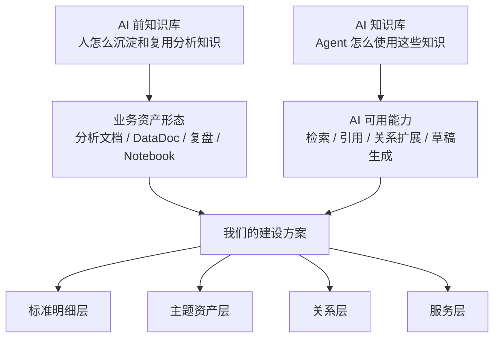

### 4.2 结论矩阵

| 问题 | 结论 |
| --- | --- |
| 有没有强相关完整公开案例？ | 基本没有。公开资料要么是 AI 前分析资产实践，要么是 AI 产品能力介绍，要么是通用技术方案。 |
| Airbnb / Querybook 为什么还值得看？ | 它们回答“分析知识如何组织成可复用资产”，这是 AI 知识库的前置数据资产。 |
| 腾讯音乐 / 阿里云 / 火山引擎为什么不能直接照抄？ | 它们讲了语义层、企业知识、工具和 Agent，但没有完整讲业务资料清洗、抽取、审核、入库。 |
| 最成熟可落地的技术路线是什么？ | 文档解析 + 混合检索 + 业务对象抽取 + 引用 + 人审 + 轻量关系层。 |

## 5. 两层框架：AI 前知识库、AI 知识库

### 5.1 两层资料框架

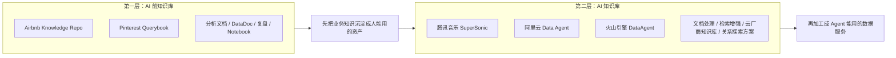

### 5.2 两层资料评价

| 层级 | 代表资料 | 成熟度 | 对本项目的价值 | 局限 |
| --- | --- | --- | --- | --- |
| AI 前知识库 | Airbnb Knowledge Repo、Pinterest Querybook | 高 | 定义业务分析知识资产形态 | 不是为 GenAI/Agent 建的 |
| AI 知识库 | 腾讯音乐、阿里云、火山引擎、文档处理工具、云厂商知识库、关系探索工具 | 中高到高 | 参考 AI 产品形态和成熟工程方法 | 业务建库案例不完整，需要结合自身业务设计；技术名词只作为实现参考，不作为分享主线 |

## 6. 知识库目标形态

### 6.1 按数据分层理解 AI 知识库

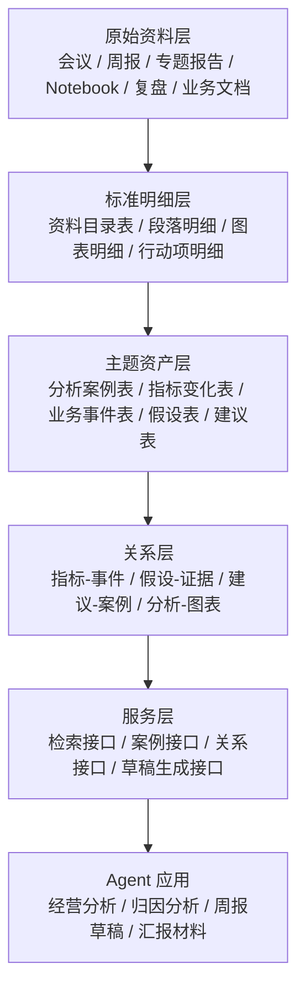

### 6.2 核心资产定义

| 数据层 | 数据团队理解 | 建议产物名 | 作用 |
| --- | --- | --- | --- |
| 原始资料层 | ODS 原始数据 | 原始资料记录 | 保留原始证据和版本。 |
| 资料目录表 | 元数据表 | 资料卡 | 管理来源、时间、业务域、owner、权威等级。 |
| 证据明细表 | DWD 明细 | 证据片段 | 支持检索、引用和追溯。 |
| 分析资产表 | DWS 主题资产 | 分析资产 | 保存完整分析过程：问题、证据、步骤、结论、行动。 |
| 业务对象表 | 主题明细/汇总 | 业务知识对象 | 保存指标变化、业务事件、假设、建议、案例。 |
| 关系表 | 关系模型 | 关键关系表 | 支持归因路径和类似案例。 |
| 服务接口 | 数据服务 API | Agent 数据服务 | 给 Agent 按需读取和组合知识。 |

## 7. 数据资产处理流程

### 7.1 从原始资料到 Agent 的主链路

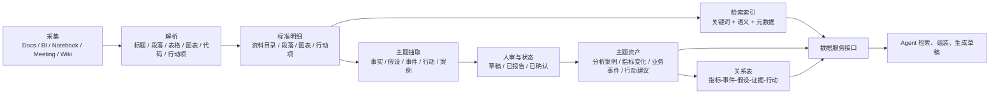

### 7.2 各类资料处理成什么

| 原始资料 | 处理重点 | 结果物 |
| --- | --- | --- |
| 会议纪要 | 区分事实、假设、决策、行动项、待确认项 | 决策项、行动项、业务假设、待确认问题 |
| 周报/月报 | 抽取指标变化、解释、风险、行动建议 | 指标变化、业务事件、风险提示、行动建议 |
| 专题分析 | 保留问题、方法、证据、图表、结论 | 分析资产、分析步骤、图表证据 |
| Notebook/图表 | 抽取分析步骤、图表证据、可复用模板 | 分析模板、图表证据、可复用代码片段 |
| 业务文档 | 抽取业务术语、指标、维度、实体、规则 | 业务概念、指标定义、业务规则 |
| 复盘/实验 | 抽取背景、策略、结果、经验、适用边界 | 分析案例、经验结论、适用边界 |
| 零散资料 | 默认只作为线索，不直接进权威库 | 原始线索、候选证据 |

## 8. 技术方案组合关系

### 8.1 这些方案不是互斥的

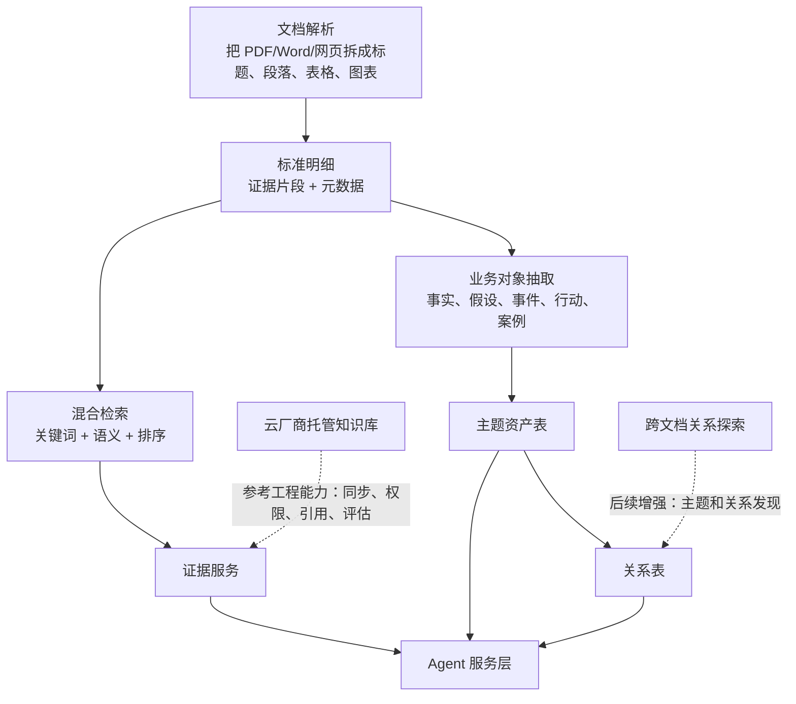

### 8.2 技术方案分层

| 层级 | 方案 | 数据团队理解 | 是否第一期主线 |
| --- | --- | --- | --- |
| 文档处理层 | 文档解析工具、云厂商分块能力 | ETL 解析，把非结构化资料拆成标准明细 | 是 |
| 检索层 | 上下文增强检索、关键词+语义混合检索、重排序 | 给明细表建索引，支持召回证据 | 是 |
| 对象层 | 按固定表结构抽取业务对象 | 从明细抽主题对象，类似 DWD 到 DWS | 是 |
| 关系层 | 轻量图谱、关系数据库、属性图 | 建关系表，连接指标、事件、假设、案例 | 小范围做 |
| 服务层 | 数据服务接口、工具调用、上下文管理 | Agent 按需调用数据服务 | 是 |
| 探索层 | 跨文档关系探索 | 跨文档主题发现和社区摘要 | 小样本实验 |

## 9. 候选架构方案

### 9.1 方案 A：证据检索层

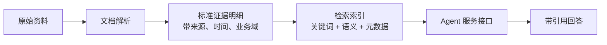

| 适合 | 优点 | 缺点 |
| --- | --- | --- |
| 快速做文档证据检索 | 成熟、快、成本低 | 不能稳定处理事实/假设/行动建议 |

### 9.2 方案 B：主题资产层

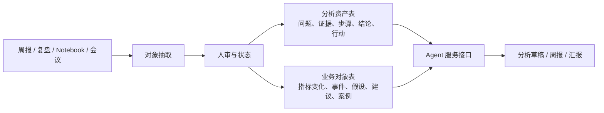

| 适合 | 优点 | 缺点 |
| --- | --- | --- |
| 经营分析、复盘、历史案例复用 | 最贴近业务分析目标 | 需要 schema、人审和流程设计 |

### 9.3 方案 C：轻量关系层

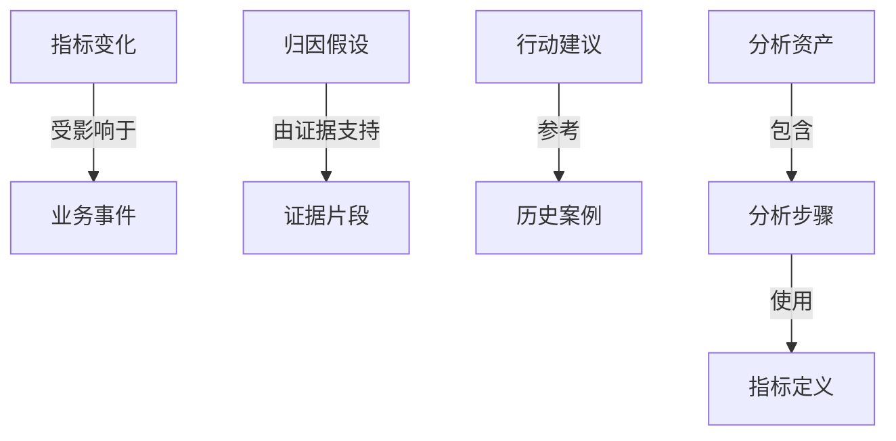

| 适合 | 优点 | 缺点 |
| --- | --- | --- |
| 归因链路、类似案例、跨文档关系 | 让知识从“片段”变成“网络” | 实体对齐和关系质量要求高 |

### 9.4 方案 D：跨文档关系探索

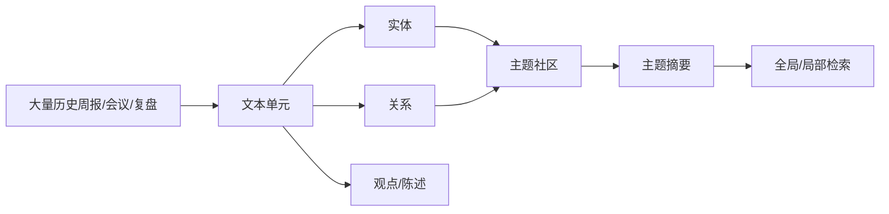

| 适合 | 优点 | 缺点 |
| --- | --- | --- |
| 大量历史资料的主题发现 | 能回答“整体发生了什么” | 成本高、噪声高，不适合第一期主线 |

## 10. 第一阶段建议路线

### 10.1 推荐组合

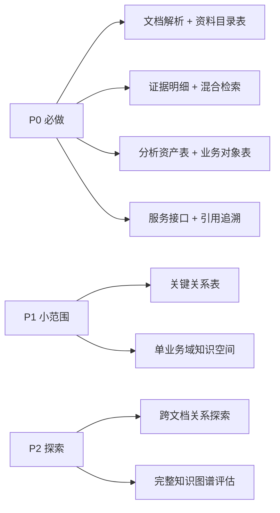

### 10.2 第一阶段范围建议

| 项目 | 建议 |
| --- | --- |
| 业务域 | 先选 1 个业务域，例如增长、渠道、交易、留存。 |
| 资料范围 | 最近 3-6 个月核心周报、会议、专题分析、复盘。 |
| 资料规模 | 100-300 份核心资料。 |
| 分析资产 | 50-100 个已审核分析资产。 |
| 对象类型 | 先做 5-8 类：指标变化、业务事件、假设、行动建议、分析案例、分析步骤。 |
| Agent 能力 | 找证据、查历史案例、组织归因链路、生成分析草稿。 |

## 11. 评估标准与风险

### 11.1 什么样算第一版做好

| 维度 | 合格标准 |
| --- | --- |
| 证据质量 | 每个结论可追溯到原文、图表、会议或复盘。 |
| 对象质量 | 能正确区分事实、假设、决策、行动项、待确认项。 |
| 分析复用 | 能找到历史类似案例，并说明适用边界。 |
| Agent 输出 | 能生成有引用、有风险提示、有待确认项的分析草稿。 |
| 人审闭环 | 用户确认/修改后能沉淀为新的对象或 artifact。 |

### 11.2 主要风险

| 风险 | 应对 |
| --- | --- |
| 只做文档检索，无法回答复杂业务问题 | 文档检索只做证据层，同时做主题资产和分析资产。 |
| 过早做大图谱，维护成本失控 | 先做少量关键关系表。 |
| Agent 把会议假设当事实 | 所有对象必须有 status 和 evidence。 |
| 历史资料质量不稳定 | 资料分级：authoritative、reviewed、reported、proposed、unverified。 |
| 技术探索过重 | 成熟优先，第一期用文档解析、混合检索、对象抽取、人审。 |

## 12. 资料索引

| 类别 | 资料 | 作用 |
| --- | --- | --- |
| AI 前分析资产 | [Airbnb Knowledge Repo](https://github.com/airbnb/knowledge-repo)、[Scaling Knowledge at Airbnb](https://medium.com/airbnb-engineering/scaling-knowledge-at-airbnb-875d73eff091) | 分析知识产品化参考。 |
| AI 前分析工作台 | [Querybook Docs](https://www.querybook.org/docs/)、[Querybook GitHub](https://github.com/pinterest/querybook) | DataDoc / 分析过程容器参考。 |
| AI Agent 形态 | [SuperSonic README_CN](https://github.com/tencentmusic/supersonic/blob/master/README_CN.md) | 业务语义对象化参考。 |
| AI Agent 形态 | [阿里云 DataWorks Data Agent](https://help.aliyun.com/zh/dataworks/user-guide/overview) | Rules、Context、工具和企业知识参考。 |
| AI Agent 形态 | [火山引擎深度研究 Agent](https://www.volcengine.com/docs/85637/1546902) | 分析框架和深度研究报告参考。 |
| 文档处理 | [Unstructured Chunking](https://docs.unstructured.io/open-source/core-functionality/chunking) | 文档解析和 chunk 参考。 |
| 检索增强 | [Anthropic Contextual Retrieval](https://www.anthropic.com/engineering/contextual-retrieval) | 上下文增强、关键词+语义混合检索、重排序参考。 |
| 托管知识库 | [Amazon Bedrock Knowledge Bases](https://docs.aws.amazon.com/bedrock/latest/userguide/knowledge-base.html)、[Azure AI Search RAG](https://learn.microsoft.com/en-us/azure/search/retrieval-augmented-generation-overview) | 成熟企业知识库工程能力参考。 |
| 关系探索 | [Microsoft GraphRAG](https://microsoft.github.io/graphrag/)、[Neo4j KG Builder](https://neo4j.com/docs/neo4j-graphrag-python/current/user_guide_kg_builder.html) | 跨文档关系和轻量图谱参考。 |
