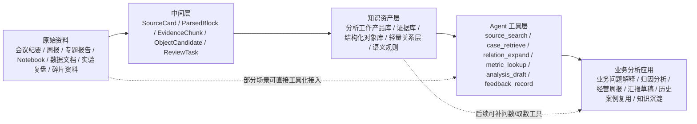

# 互联网业务分析知识库 Agent 调研报告

## 0. 导读摘要

### 0.1 30 秒摘要

本轮调研的核心判断是：

> 互联网业务分析知识库不是“把资料切片进向量库”，也不是“先做一个大而全知识图谱”。更可落地的方向是：保留原文证据，把会议、周报、专题分析、数据文档、实验复盘等资料加工成一组可检索、可审核、可组合的知识资产，再让 Agent 通过检索、结构化查询、历史案例复用和受控工具调用来回答业务问题。

第一版最值得考虑的底座是：

```text
原始资料
-> 中间层：SourceCard / ParsedBlock / EvidenceChunk / ObjectCandidate / ReviewTask
-> 知识库：分析工作产品库 + 证据库 + 结构化业务对象库 + 轻量关系层
-> Agent：检索证据、复用分析案例、组织归因链路、生成经营分析和汇报草稿
```

阶段性判断：

| 判断 | 解释 |
| --- | --- |
| 要做结构化表达 | 会议和周报里的“事实、假设、决策、行动项、指标变化、业务事件”必须拆开，否则 Agent 会把猜测当结论。 |
| 要先沉淀“分析工作产品” | Airbnb Knowledge Repo 和 Pinterest Querybook 的共同点是先把分析过程、证据、图表、结论和解释变成可复用资产，而不是先做聊天框。 |
| 要做图谱，但先轻量 | 不建议第一期做全量企业知识图谱。建议先做业务对象关系层，例如指标、事件、报告、假设、行动建议、历史案例之间的关系。 |
| RAG 必须做，但只能作为证据层 | RAG 负责找证据，不负责自动判断业务结论是否成立。 |
| Text-to-SQL 暂不作为主线 | 问数取数是后续重要能力，但当前第一版更应该围绕“业务问题如何被分析、解释、复盘、沉淀”设计知识库。 |
| Agent 应优先支持分析任务流 | Agent 的核心不是自由聊天，而是围绕“理解问题 -> 找证据 -> 找历史案例 -> 组织假设 -> 生成分析草稿 -> 标注待确认项”工作。 |
| 强相关真实案例有限 | 公开资料中真正接近本问题的案例主要是 Airbnb、Pinterest Querybook、腾讯音乐、阿里云、火山引擎；其他 Text-to-SQL 案例只作为旁证。 |

### 0.2 5 分钟导读

如果只想先抓重点，建议按这个顺序阅读：

| 阅读顺序 | 看哪一节 | 你能得到什么 |
| --- | --- | --- |
| 1 | 0. 导读摘要 | 先知道结论、路线和边界。 |
| 2 | 2. 三层结构与总体发现 | 先区分“AI 前资产实践 / AI Agent 知识库实践 / AI 知识库技术方案”。 |
| 3 | 3. AI 之前的分析数据资产知识库 | 看 Airbnb、Pinterest Querybook 如何沉淀分析工作产品。 |
| 4 | 4. AI Agent 的知识库公开实践 | 看腾讯音乐、阿里云、火山引擎；同时明确它们没有完整讲建库 pipeline。 |
| 5 | 5. AI 知识库构建技术方案 | 重点看成熟官方方案：文档解析、Contextual RAG、Managed RAG、GraphRAG、知识图谱。 |
| 6 | 6. 数据资产构建流程 | 重点回答“会议纪要、周报、分析报告、Notebook、业务文档到底处理成什么”。 |
| 7 | 7-10. 架构路径、候选路线、验收标准 | 拿去内部讨论第一期怎么选，不在本报告里直接拍板。 |

### 0.3 总览图：这是分析框架，不是预设结论



报告会使用这条链路作为主分析框架，但不会强行要求所有资料都经过完整链路。实际落地时，Notebook、指标平台、数据目录可以先以工具方式接入 Agent；会议纪要、周报、专题报告、复盘则更适合先走中间层和结构化抽取。Text-to-SQL 暂时只作为附属能力，不作为第一期主线。

### 0.4 可信等级说明

| 等级 | 含义 | 本报告使用方式 |
| --- | --- | --- |
| A | 公司工程博客、官方文档、开源仓库、论文或技术报告，有明确机制和结果 | 可作为主要依据。 |
| B | 大会分享、产品文档、案例介绍，机制可信但落地细节有限 | 可作为趋势和方案参考。 |
| C | 二手转述、媒体稿、摘要页，缺少技术细节 | 只用于补充线索，不作为关键结论。 |

本报告刻意排除无来源转载、营销号、内容农场和泛泛的“AI 赋能数据分析”文章。

## 1. 调研问题与边界

### 1.1 本次真正要回答的问题

你要建设的是互联网业务分析知识库。它面向的是经营分析、业务分析、看数取数、知识沉淀和汇报，而不是传统意义上的数据治理平台。

本报告回答四个问题：

| 问题 | 本报告如何回答 |
| --- | --- |
| 其他互联网/科技公司怎么构建类似知识资产 | 重点看 Airbnb、Pinterest Querybook、腾讯音乐、阿里云、火山引擎。 |
| 原始资料如何采集、清洗、加工、组织 | 按会议纪要、周报、专题分析、Notebook、业务文档、实验复盘、碎片资料逐类拆解。 |
| 处理后的结果应该是什么形态、存在哪里 | 给出 SourceCard、EvidenceChunk、AnalysisArtifact、KnowledgeObject、关系边等中间/最终产物。 |
| Agent 最终如何使用知识库 | 通过检索、结构化查询、历史案例复用、任务拆解、引用证据和人审反馈闭环来使用。 |

### 1.2 不把传统数据治理当主线

指标平台、数据地图、数据血缘、元数据治理、质量监控是重要基础，但它们不是本次调研主线。原因是：

1. 你们已经有成熟方案，不需要重新调研传统能力。
2. 业务分析知识库的核心难点不只是“表在哪里、口径是什么”，而是“这段业务变化怎么解释、证据在哪里、历史上怎么处理过、能否形成下一步建议”。
3. AI/Agent 时代的新变化在于：业务文档、分析工作台、会议复盘、指标平台和数据目录要能被 Agent 动态组合，而不是各自孤立。

所以本报告只在 AI/Agent 相关场景中引用数据治理资料。传统数仓、数据地图、数据血缘不作为重点；Text-to-SQL 相关案例也只保留为“后续问数能力”的旁证。

### 1.3 金融不是主线

虽然你们项目有互联网金融属性，但本报告按互联网业务逻辑理解：用户、流量、转化、留存、渠道、活动、版本、策略、收入、风险、实验、经营复盘。金融行业资料只作为合规和可信回答的轻量参考，不作为主要对标对象。

## 2. 三层结构与总体发现

### 2.1 为什么要分三层

这一版不再把传统数仓、传统数据治理和 Text-to-SQL 当主线。它们是底层能力和后续能力，但不是当前最该解决的问题。

更准确的调研结构应该分成三层：

| 层级 | 核心问题 | 代表资料 | 结论 |
| --- | --- | --- | --- |
| 1. AI 之前的分析数据资产知识库 | 业务分析知识在没有 GenAI 前是怎么沉淀、组织、复用的？ | Airbnb Knowledge Repo、Pinterest Querybook。 | 公开案例较成熟，能告诉我们“业务分析知识应该先被处理成什么样”。 |
| 2. AI Agent 的知识库 | 有没有互联网公司公开讲清楚“为了 Agent 从零建业务分析知识库”？ | 腾讯音乐 SuperSonic、阿里云 Data Agent、火山引擎 DataAgent。 | 有 AI 产品形态，但没有完整公开“会议/周报/复盘怎么清洗入库”的细节。 |
| 3. AI 知识库构建技术方案 | 没有完整业务案例时，成熟技术方案如何处理原始资料？ | Anthropic Contextual Retrieval、Unstructured、Bedrock KB、Azure AI Search、Microsoft GraphRAG、Neo4j KG Builder、LlamaIndex Property Graph。 | 技术文档充足，应该作为第一期落地方案的主要工程参考。 |

因此，本报告的判断不是“找到了完整标杆可以照抄”，而是：

```text
业务资产形态参考 Airbnb / Querybook
+ AI 产品形态参考腾讯音乐 / 阿里云 / 火山引擎
+ AI 知识库工程方法参考 Anthropic / Unstructured / AWS / Azure / Microsoft GraphRAG / Neo4j
```

### 2.2 本轮重心调整

当前主线是：

```text
互联网业务分析资料
-> 分析工作产品化
-> 业务对象结构化
-> 历史案例和证据可复用
-> Agent 能回答业务问题、组织归因、生成分析草稿
```

重点材料调整为三类：

| 材料 | 可信等级 | 为什么重点看 |
| --- | --- | --- |
| Airbnb Knowledge Repo / Knowledge Graph | A | AI 前成熟实践，最像“业务分析知识如何沉淀为可复用工作产品”。 |
| Pinterest Querybook | A | AI 前成熟实践，最像“分析工作台如何把问题、过程、图表和结论组织成 DataDoc”。 |
| 腾讯音乐 SuperSonic | A | AI 产品/开源项目，重点看“语义对象如何约束数据问答”，不是看建库 pipeline。 |
| 阿里云 DataWorks Data Agent | B | AI 产品文档，能看出“企业知识库、Rules、Context、工具”如何被产品化。 |
| 火山引擎 DataAgent / 企业知识引擎 | B | AI 产品文档，重点看“知识文档、结构化提取、深度研究 Agent、业务分析框架”。 |
| Anthropic / Unstructured / AWS / Azure / GraphRAG / Neo4j | A/B | 技术方案更成熟，直接回答 AI 知识库怎么处理资料。 |

低优先级旁证：

| 案例 | 为什么降级 |
| --- | --- |
| Uber QueryGPT | 主要解决 Text-to-SQL，和当前“分析问题”主线有距离。 |
| LinkedIn SQL Bot | 主要解决数据查询和 SQL 生成，保留其“知识图谱整合多源上下文”的启发即可。 |
| Snowflake VQR / Databricks Genie | 是问数准确率方案，后续再重点考虑。 |
| 美团 OneData / DataMan | 有业务知识沉淀启发，但传统数仓/质量治理色彩更重。 |

### 2.3 重新归纳后的总体发现

| 发现 | 证据 | 对我们意味着什么 |
| --- | --- | --- |
| 业务分析知识的基本单位不是 chunk，而是 analysis artifact | Airbnb Knowledge Repo 把分析结论、代码、查询、图表、文字解释和 metadata 打包成 Knowledge Post。 | 第一版应定义我们自己的 `AnalysisArtifact` / `AnalysisCase`，而不是只切文档。 |
| 分析过程本身需要工作台化 | Pinterest Querybook 的 DataDoc 把富文本、query、chart 组织在一个协作文档里。 | 周报、专题分析、经营复盘应被组织成“问题-证据-分析-结论-行动”的结构。 |
| AI Agent 公开案例没有完整建库细节 | 腾讯音乐、阿里云、火山引擎都讲了 AI 如何用语义/知识/工具，但没有细到原始业务资料如何清洗入库。 | 不能把这些产品文档当成“业务知识库构建案例”，只能作为产品形态参考。 |
| 成熟技术方案比单个案例更可落地 | Anthropic、Unstructured、AWS、Azure、Microsoft GraphRAG、Neo4j 都有明确的数据处理或索引流程。 | 第一版工程设计应优先参考成熟技术文档，而不是追逐最新概念。 |
| 图谱应服务业务问题，不应为了图谱而图谱 | Airbnb Knowledge Graph 解决的是实体关系和上下文推荐；GraphRAG 解决跨文档主题和关系。 | 第一版做轻量业务关系层即可，优先连接指标、事件、假设、案例、行动和证据。 |

## 3. AI 之前的分析数据资产知识库是怎么建的

AI 之前的案例不是为了大模型或 Agent 建的，但它们很重要。原因是：AI 知识库不是凭空长出来的，必须先有可复用、可审核、可检索的业务分析资产。Airbnb 和 Querybook 解决的正是这件事。

### 3.1 两个成熟案例如何对应我们的问题

| 案例 | 更像哪一层 | 回答什么业务问题 | 关键产物 |
| --- | --- | --- | --- |
| Airbnb Knowledge Repo | 分析工作产品库 | “过去有人分析过这个问题吗？当时结论、证据、图表和代码是什么？” | Knowledge Post、metadata、review、可复现分析。 |
| Pinterest Querybook | 分析工作台 | “一次业务分析如何组织过程、图表、解释和协作？” | DataDoc、text/query/chart cells、table docs、sample queries、lineage。 |

### 3.2 Airbnb：把分析沉淀成 Knowledge Post，而不是散落在 PPT 和邮件里

来源：[Scaling Knowledge at Airbnb](https://medium.com/airbnb-engineering/scaling-knowledge-at-airbnb-875d73eff091)、[Knowledge Repo GitHub](https://github.com/airbnb/knowledge-repo)、[Scaling Knowledge Access and Retrieval at Airbnb](https://medium.com/airbnb-engineering/scaling-knowledge-access-and-retrieval-at-airbnb-665b6ba21e95)

Airbnb 的问题不是“怎么查 SQL”，而是“怎么让组织已经做过的分析能被复用”。它看到的痛点是：数据团队做过很多分析，结果散落在幻灯片、邮件、文档、旧代码和个人记忆里，导致历史问题重复分析，结论不可追溯，新人无法学习组织经验。

Airbnb 的处理方式可以拆成两层：

| 层 | 做法 | 对我们有何意义 |
| --- | --- | --- |
| Knowledge Repo | 把一项分析打包成 Knowledge Post，通常包含文本解释、Notebook/R Markdown/Markdown、查询、图表、代码、metadata 和 TLDR。 | 这是业务分析知识库的核心原型：不是“资料库”，而是“分析工作产品库”。 |
| Knowledge Graph | 用图结构表达实体和关系，帮助在平台中检索和推荐相关上下文。 | 说明图谱的价值是帮助发现相关信息，而不是为了做一个全量知识图谱。 |

Airbnb 案例中的数据处理逻辑：

| 处理阶段 | 具体做法 | 我们可转化的产物 |
| --- | --- | --- |
| 采集 | 分析师提交 notebook、markdown、query、图表和解释文本。 | 从周报、专题报告、Notebook、复盘中采集 `RawAnalysisArtifact`。 |
| 组织 | 把分析内容组织成一个完整 post，而不是分散文件。 | 形成 `AnalysisArtifact`：问题、背景、数据、方法、结论、图表、行动。 |
| 元数据 | 作者、标签、摘要、主题、时间等结构化 metadata。 | SourceCard + AnalysisCard。 |
| 审核 | 通过 PR/peer review 保证质量。 | 高价值分析进入知识库前需要业务/分析师确认。 |
| 发布 | Web 界面让组织搜索、阅读、收藏和复用。 | 给人看是分析知识库，给 Agent 用是结构化对象和证据索引。 |

如果映射到你们的业务知识库，建议把 Airbnb 的 Knowledge Post 改造成：

```yaml
analysis_artifact:
  artifact_id: growth_case_2026w24_channel_quality_drop
  title: 渠道A新客质量下降导致支付转化下滑分析
  business_question: 为什么本周支付转化率下降？
  business_domain: 增长
  time_range: 2026-W24
  author: analyst_a
  status: reviewed
  tldr: 渠道A低意向新客占比上升是主要贡献项，建议下调预算并复核投放人群。
  evidence:
    - report_chunk_12
    - chart_03
    - notebook_cell_18
  structured_objects:
    - metric_movement_pay_conversion_w24
    - business_event_channel_a_mix_change
    - hypothesis_low_intent_users
    - action_reduce_channel_a_budget
  review:
    reviewer: growth_owner
    reviewed_at: 2026-06-15
```

这个案例真正可借鉴的是：

| 可借鉴 | 怎么落地到我们 |
| --- | --- |
| 分析结果必须产品化 | 每次业务分析都沉淀成 `AnalysisArtifact`，不是只留一个周报段落。 |
| 分析资产必须可追溯 | 结论必须连回指标、图表、原始段落、Notebook cell、会议决策。 |
| 分析资产必须可审核 | 重要结论有 reviewer 和状态，区分 draft/reported/reviewed/deprecated。 |
| 分析资产必须可学习 | Agent 检索历史案例时，优先召回 reviewed artifact，而不是随便召回聊天片段。 |

不能照搬：

| 不适合照搬 | 原因 |
| --- | --- |
| 纯手工写 Knowledge Post | 成本过高，第一版应通过自动解析周报/复盘/Notebook 生成草稿，再人工确认。 |
| 只用 Git 管理 | 你们还需要权限、对象库、向量/全文索引、业务关系层和 Agent 工具。 |
| 把分析帖当成最终形态 | Agent 还需要把帖子里的问题、证据、假设、行动拆成结构化对象。 |

### 3.3 Pinterest Querybook：DataDoc 是“分析过程知识库”的典型形态

来源：[Querybook 官网](https://www.querybook.org/)、[Querybook 文档](https://www.querybook.org/docs/)、[Querybook GitHub](https://github.com/pinterest/querybook)、[Open sourcing Querybook](https://medium.com/pinterest-engineering/open-sourcing-querybook-pinterests-collaborative-big-data-hub-ba2605558883)

Querybook 不是一个知识图谱，也不是一个纯 BI 工具。它更像是 Pinterest 给数据分析打造的协作工作台：用户可以发现数据、写分析、放查询、放图表、补充文字解释，并通过 DataDoc 组织整个分析过程。

对我们当前问题来说，Querybook 的重点不是 SQL，而是 DataDoc 这种“分析过程容器”：

| DataDoc 元素 | 业务含义 | Agent 可抽取什么 |
| --- | --- | --- |
| text cell | 分析背景、问题、解释、结论、风险、下一步 | `BusinessQuestion`、`AnalysisConclusion`、`Hypothesis`、`ActionRecommendation`。 |
| query cell | 支撑分析的数据计算过程 | `MetricComputation`、`DatasetUsage`、`QueryRecipe`。 |
| chart cell | 图表和可视化结果 | `ChartEvidence`、`MetricMovement`、`SegmentContribution`。 |
| table docs | 表和字段的业务说明 | `DatasetAsset`、`FieldDefinition`、`BusinessConcept`。 |
| sample queries / past runs | 历史分析做法 | `ReusableAnalysisStep`、`AnalysisTemplate`。 |
| collaboration | 多人协作和更新 | owner、reviewer、comment、status。 |

Querybook 对我们最大的启发是：业务分析知识不是一次性“抽完入库”，而是在工作过程中不断生成的。一次经营分析至少包含：

```text
业务问题
-> 背景说明
-> 使用了哪些指标和数据
-> 怎么拆解
-> 图表显示了什么
-> 形成哪些假设
-> 哪些假设被证据支持
-> 结论是什么
-> 行动建议是什么
-> 后续结果如何
```

如果照着 Querybook 的思路，我们可以把“周报/专题分析/复盘”处理成内部 `BusinessAnalysisDoc`：

```yaml
business_analysis_doc:
  doc_id: badoc_2026w24_growth_review
  title: 2026W24 增长经营分析
  cells:
    - cell_type: question
      text: 本周新客支付转化率为什么下降？
    - cell_type: evidence_chart
      metric_id: pay_conversion_rate
      chart_ref: chart_03
      extracted_movement: metric_movement_01
    - cell_type: analysis_text
      text: 渠道A低意向用户占比上升贡献最大
      extracted_objects: [hypothesis_01, business_event_02]
    - cell_type: action
      text: 下周降低渠道A预算，复核人群包
      extracted_objects: [action_01]
  status: reviewed
  owner: growth_analysis_team
```

对 Agent 的使用方式：

| Agent 问题 | Querybook/DataDoc 式知识如何回答 |
| --- | --- |
| “之前有没有分析过类似问题？” | 检索 `BusinessAnalysisDoc` 的 business_question、tags、metrics、conclusion。 |
| “这个结论有什么证据？” | 展开 chart cell、query cell、text cell 的 evidence_ref。 |
| “这类问题通常怎么分析？” | 召回历史 DataDoc 的分析步骤，生成 `AnalysisPlaybook`。 |
| “帮我写本周分析草稿” | 按 DataDoc 模板填入指标变化、证据、假设、行动建议。 |
| “这个建议以前有效吗？” | 查同类 action 的后续 outcome。 |

可借鉴与不能照搬：

| 可借鉴 | 不适合照搬 |
| --- | --- |
| 把分析过程组织成结构化 DataDoc，而不是只保存最终结论。 | 不要把项目目标变成“做一个 Querybook 克隆”。 |
| 让文字、图表、查询、表说明共处一个分析容器。 | 不要把 DataDoc 里的 SQL cell 当第一期重点。 |
| 从协作过程沉淀 owner、review、comment、status。 | 不要期望所有分析师马上改变工作习惯，第一期可以从现有周报/复盘自动转化。 |

## 4. AI Agent 的知识库是怎么建的（公开资料有限）

这一层要先讲清楚边界：目前公开资料中，没有找到“互联网业务分析 AI 知识库从原始资料清洗到 Agent 使用”的完整案例。腾讯音乐、阿里云、火山引擎都和 AI/Agent 相关，但它们主要说明产品形态、语义层、企业知识、工具和深度分析流程，并没有把底层知识库构建 pipeline 完整公开。

所以这一节的定位是：

| 能看什么 | 不能证明什么 |
| --- | --- |
| AI Agent 需要哪些知识层：语义对象、Rules、Context、Tools、知识文档、任务拆解。 | 不能证明这些厂商已经公开了“会议/周报/复盘如何清洗、抽取、审核、入库”的完整方法。 |
| 产品形态如何组织：ChatBI、Data Agent、深度研究 Agent、企业知识引擎。 | 不能直接作为你们知识库建设流程的唯一依据。 |
| 哪些能力成熟到可以参考：语义层、上下文引用、知识文档配置、工具接入。 | 不能说明业务分析知识对象 schema 应该如何设计。 |

### 4.1 腾讯音乐 SuperSonic：业务语义对象是 Agent 回答业务问题的边界

来源：[SuperSonic GitHub](https://github.com/tencentmusic/supersonic)、[README_CN](https://github.com/tencentmusic/supersonic/blob/master/README_CN.md)

SuperSonic 的公开定位是融合 ChatBI 和 HeadlessBI。它最值得借鉴的地方不是 Text-to-SQL，而是它把自然语言问答建立在“统一治理的语义模型”上：不复制底层数据，而是在物理数据模型之上构建逻辑语义模型，定义指标、维度、实体、标签及其业务含义和关系。

对我们来说，它回答的是另一个关键问题：

> Agent 在回答业务问题时，如何知道用户说的“转化”“活跃”“新客”“渠道质量”到底是什么意思？

SuperSonic 给出的方向是把业务语义对象化：

| 语义对象 | 在经营分析中的作用 | 我们的落地方式 |
| --- | --- | --- |
| 指标 Metric | 确定业务问题中的衡量对象 | `MetricDefinition`，包含口径、公式、粒度、owner、版本。 |
| 维度 Dimension | 支持分层拆解 | `DimensionDefinition`，如渠道、城市、用户类型、版本。 |
| 实体 Entity | 表示业务主体 | `BusinessEntity`，如用户、订单、商品、渠道、活动。 |
| 标签 Tag | 表示业务分类和状态 | `BusinessTag`，如高意向用户、首贷用户、沉默用户。 |
| 关系 Relation | 表示语义之间如何连接 | `Metric BELONGS_TO Domain`、`Entity HAS_TAG Tag`、`Metric CAN_SPLIT_BY Dimension`。 |

这对“分析问题”很重要，因为业务分析不是只问一个数，而是问：

```text
哪个业务对象变了？
哪个指标受影响？
按哪些维度拆？
哪些标签人群贡献最大？
这些变化和哪些业务事件相关？
以前类似实体/标签/指标组合下发生过什么？
```

因此，SuperSonic 对我们的借鉴方式不是“先做 ChatBI”，而是“先把 Agent 能理解的业务语义对象定义出来”。这部分可以作为结构化对象库的权威基础。

建议我们定义的语义对象层：

```yaml
business_semantic_object:
  metrics:
    - pay_conversion_rate
    - active_user_count
    - loan_apply_success_rate
  dimensions:
    - channel
    - user_type
    - city_tier
    - app_version
  entities:
    - user
    - order
    - campaign
    - channel
  tags:
    - new_user
    - high_intent_user
    - risk_rejected_user
  relations:
    - metric: pay_conversion_rate
      can_split_by: [channel, user_type, app_version]
```

可借鉴与不能照搬：

| 可借鉴 | 不适合照搬 |
| --- | --- |
| 指标、维度、实体、标签要成为 Agent 的显式上下文。 | 不要把 SuperSonic 当完整业务分析知识库，它强在语义问数，不覆盖会议、复盘、行动建议。 |
| 逻辑语义模型可以不复制底层数据。 | 不要让第一期目标变成大规模语义层重建；已有指标平台应继续作为权威源。 |
| 业务含义和关系比物理表更重要。 | 不要把自然语言问题都导向 SQL，分析问题还需要证据、历史案例和解释链。 |

### 4.2 阿里云 DataWorks Data Agent：企业知识库要拆成 Rules、Context 和 Tools

来源：[DataWorks Data Agent 官方文档](https://help.aliyun.com/zh/dataworks/user-guide/overview)、[Data Agent 系统设置](https://help.aliyun.com/zh/dataworks/user-guide/data-agent-system-settings)、[Quick BI 小 Q 问数](https://help.aliyun.com/zh/quick-bi/user-guide/chat-bi-overview)

阿里云 DataWorks Data Agent 是产品文档，不是单一公司的内部实践，但它把 AI 数据平台需要的组件讲得比较清楚：自定义企业知识库、Rules、Context、MCP 工具、对话历史、ChatBI、代码助手等。

对我们来说，它的价值不是“照抄 DataWorks”，而是拆清楚企业知识如何进入 Agent：

| 组件 | 在阿里云文档中的含义 | 我们应如何借鉴 |
| --- | --- | --- |
| 自定义企业知识库 | 把企业规范、业务口径、技术标准融入 AI。 | 存放业务分析规则、口径解释、报告规范、复盘模板、禁用口径。 |
| Rules | 注入持久化规则和偏好，让 Agent 遵守特定要求。 | 写成 `AnalysisRules`：事实/假设必须区分、结论必须引用、不得输出未经确认建议。 |
| Context | 每次对话可指定表、代码、数据专辑、Rules、本地文件等上下文。 | 业务用户可以显式指定周报、会议、复盘、项目、业务域作为分析上下文。 |
| MCP/工具 | 接入外部服务和工具。 | 接入检索、指标、图表、案例、任务管理、反馈记录等工具。 |
| 历史会话 | 管理最近对话。 | 把有价值的 Agent 分析会话沉淀成 `AnalysisArtifactCandidate`，而不是只做聊天记录。 |

这给我们的架构启发是：不要把“知识库”做成一个单一向量库，应至少分成四层：

```text
Rules：怎么分析、什么不能乱说、输出格式和风险约束
Context：当前问题相关的文档、业务域、指标、案例、项目
Knowledge Objects：沉淀后的事实、事件、假设、行动、案例
Tools：需要实时查询或计算时调用的外部能力
```

如果要回答业务问题，Agent 的任务流可以是：

| 步骤 | Agent 动作 | 使用的知识层 |
| --- | --- | --- |
| 1. 定义问题 | 识别用户问的是归因、复盘、方案还是汇报 | Rules + Context。 |
| 2. 找上下文 | 检索相关周报、会议、案例、指标定义 | Context + EvidenceChunk。 |
| 3. 抽取事实 | 找出已确认事实、指标变化、业务事件 | Knowledge Objects。 |
| 4. 组织假设 | 给出可能原因，并标注证据强弱 | RelationEdge + Evidence。 |
| 5. 生成输出 | 输出分析框架、结论草稿、风险、待确认项 | Rules + Artifact template。 |
| 6. 沉淀反馈 | 用户修改和确认后入库 | ReviewTask + KnowledgeObject。 |

可借鉴与不能照搬：

| 可借鉴 | 不适合照搬 |
| --- | --- |
| 把企业知识库拆成规则、上下文、工具和沉淀对象。 | 不要按 DataWorks 的产品边界设计你们的系统。 |
| 用 Rules 约束 Agent 的分析行为。 | 不要只写 prompt，规则要能版本化、审核和生效范围控制。 |
| 支持显式 @ 上下文。 | 不要只支持表和代码，业务分析还需要 @ 周报、会议、复盘、项目。 |

### 4.3 火山引擎 DataAgent：从问数走向“深度研究/业务分析报告”

来源：[数据智能体](https://www.volcengine.com/docs/85637)、[智能问数 Agent](https://www.volcengine.com/docs/85637/1544066)、[深度研究 Agent](https://www.volcengine.com/docs/85637/1546902)、[企业知识引擎概述](https://www.volcengine.com/docs/85637/1852304)、[知识文档配置](https://www.volcengine.com/docs/85637/1588466)

火山引擎公开资料同样是产品文档，但它比单纯 ChatBI 更接近你现在关心的方向：智能问数只是基础能力，深度研究 Agent 更强调解析自然语言需求、构建分析框架、拆解任务、结合数据和知识输出研究报告。

其中几个点对我们很关键：

| 能力 | 文档表达的方向 | 对我们的启发 |
| --- | --- | --- |
| 智能问数 Agent | 自然语言查询、多数据集协同、语义模型、业务知识、归因分析、多轮交互。 | 问数只是入口，业务知识和归因分析才是更接近经营分析的部分。 |
| 深度研究 Agent | 自动解析需求，构建分析框架，拆解任务，输出深度研究报告。 | Agent 应该先生成分析计划和任务树，而不是直接给结论。 |
| 知识文档配置 | 私有文档通过智能匹配和结构化提取注入分析流程。 | 周报、会议、复盘、策略文档应进入分析流程，不只是 FAQ 检索。 |
| 企业知识引擎 | 面向 Agent 应用，支持结构化与非结构化知识从接入、处理、建模、挖掘到应用。 | 我们可以借鉴“知识处理全链路”，但要落到业务分析对象 schema。 |
| GraphRAG/知识图谱/本体建模 | 产品资料提到可支持关联、挖掘和推理。 | 图谱可以作为后续增强，但第一期仍需 schema-guided 轻量关系。 |

火山引擎案例对我们的最大启发，是把 Agent 输出从“回答”提升到“分析报告”：

```text
用户问题：为什么最近渠道 A 投放效果变差？

Agent 不应直接回答：
渠道质量下降。

而应生成：
1. 分析框架：流量规模、用户质量、转化漏斗、成本、同期策略、历史案例
2. 证据检索：周报、会议、复盘、指标变化、图表、历史类似情况
3. 假设列表：流量结构变化、素材疲劳、落地页变化、风控拦截、竞品活动
4. 证据强弱：哪些有数据支持，哪些只是会议假设
5. 建议和待确认项：下一步取数、业务确认、实验建议
```

这要求知识库至少支持以下对象：

| 对象 | 作用 |
| --- | --- |
| `AnalysisQuestion` | 用户真正要分析的问题。 |
| `AnalysisFrame` | 拆解维度和分析路径。 |
| `EvidenceSet` | 支撑某个分析路径的证据集合。 |
| `Hypothesis` | 可能原因，必须标注证据状态。 |
| `ActionRecommendation` | 建议动作，必须连接历史案例或证据。 |
| `ResearchReportDraft` | Agent 生成的报告草稿。 |
| `ReviewDecision` | 人确认、修改或驳回的结果。 |

可借鉴与不能照搬：

| 可借鉴 | 不适合照搬 |
| --- | --- |
| 深度分析应先有分析框架和任务拆解。 | 不要一开始追求完整自动深度研究，容易给出貌似完整但未验证的结论。 |
| 私有知识文档要注入分析流程。 | 不要把知识文档只当 FAQ，它们应被抽成对象和证据。 |
| 结构化与非结构化知识都要处理。 | 不要把产品文档里的 GraphRAG/本体建模直接当第一期目标。 |

### 4.4 对 AI Agent 相关资料的横向评价

| 维度 | 腾讯音乐 | 阿里云 | 火山引擎 |
| --- | --- | --- | --- |
| 最值得借鉴 | 业务语义对象化 | 规则/上下文/工具拆层 | 深度分析任务流 |
| 处理的核心资料 | 指标、维度、实体、标签 | 规则、上下文、企业知识、工具 | 私有文档、数据集、语义模型、分析任务 |
| 最终结果物 | Semantic Model | Rules + Context + Tools | Research Report / Agent workflow |
| 给 Agent 的价值 | 限定业务语义 | 控制 Agent 行为和上下文 | 支持复杂分析和报告生成 |
| 不足 | 偏问数/BI，没有讲业务资料清洗 | 产品文档，非案例复盘 | 产品文档，效果细节有限 |
| 我们应借鉴到什么程度 | 中高 | 中高 | 中高 |

### 4.5 低优先级旁证：Text-to-SQL 案例暂时后置

Uber QueryGPT、LinkedIn SQL Bot、Pinterest Analytics Agent 对“取数”和“SQL 生成”很有价值，但它们解决的是业务分析链条中的一小段：把自然语言转成数据查询，或帮助分析师找到表和查询。

当前阶段只保留三点旁证：

| 旁证 | 为什么保留 |
| --- | --- |
| Domain Space | 后续做问数时，不能开放全量数据，应按业务域组织可信资产。 |
| Evaluation Set | Agent 能力必须用真实问题评估，不能只看演示效果。 |
| 查询/Notebook 也是证据 | 查询、Notebook、图表仍要作为分析证据，但不是第一期主战场。 |

本报告后续章节会把问数/取数能力降为“后续扩展能力”，第一期主路线以业务分析知识沉淀和分析问题回答为主。

## 5. AI 知识库的构建技术方案

既然强相关完整业务案例缺少，技术方案就应该成为第一期落地设计的主要参考。这里的评估标准不是“最新”或“最酷”，而是成熟度优先：

| 评估维度 | 什么算成熟 |
| --- | --- |
| 官方或一手资料 | 来自 Anthropic、Microsoft、AWS、Azure、Google、Neo4j、Unstructured、LlamaIndex 等官方文档/工程博客。 |
| 有清晰数据流 | 能说明 raw data 如何变成 chunk、metadata、embedding、graph、citation、tool context。 |
| 可工程化 | 有托管服务、开源实现、SDK、配置项或明确架构，而不是概念文章。 |
| 可治理 | 支持权限、元数据、引用、版本、更新、评估或人工审核中的至少一部分。 |
| 适合落地 | 不要求一次性重构全公司系统，可以从单业务域、小规模资料、可控工具开始。 |

### 5.1 成熟方案总览

| 方案 | 成熟度 | 解决什么 | 主要产物 | 第一版建议 |
| --- | --- | --- | --- | --- |
| Unstructured 文档解析 + 结构化 chunk | 高 | PDF/Word/HTML/报告如何先变成元素，再 chunk | Title、NarrativeText、Table、CompositeElement、metadata | 必做，用于会议、周报、报告、文档解析。 |
| Anthropic Contextual Retrieval | 高 | chunk 丢上下文导致检索失败 | contextualized chunk、embedding、BM25、rerank | 必做，用于证据库。 |
| Amazon Bedrock Knowledge Bases | 高 | 托管 RAG 知识库如何连接私有数据并返回引用 | data source、chunk、embedding、vector store、citation | 可参考成熟托管形态，不一定直接使用。 |
| Azure AI Search / Agentic Retrieval | 高 | 企业 RAG 如何做 chunk、vector、hybrid、agentic retrieval | indexer、skillset、vector index、hybrid search、citation | 可参考工程架构和检索策略。 |
| Google Agent Search / Grounding | 中高 | 企业数据如何作为 Agent grounding source | connectors、data stores、citations、grounded answer | 可参考数据连接和权限思路。 |
| Microsoft GraphRAG | 中高 | 大量叙事文本如何抽图、做社区摘要、支持全局问题 | TextUnit、Entity、Relationship、Claim、Community Report | 先小样本试验，不作为第一期主路线。 |
| Neo4j LLM Knowledge Graph Builder | 中 | 非结构化文本如何变成知识图谱 | chunk、embedding、node、relationship、schema、entity resolution | 用于轻量图谱试点，注意实验性质。 |
| LlamaIndex Property Graph | 中 | schema-guided graph extraction 和 hybrid retrieval | typed nodes、typed edges、properties、graph retriever | 适合验证业务对象图谱 schema。 |
| Anthropic Context Engineering / MCP | 中高 | Agent 如何按需加载上下文、调用工具 | lightweight reference、tool call、code execution、MCP server | 必须借鉴思想：不要把全量资料塞给模型。 |

### 5.2 成熟技术方案 1：文档解析先于向量化

来源：[Unstructured Chunking](https://docs.unstructured.io/open-source/core-functionality/chunking)、[Unstructured legacy chunking docs](https://docs.unstructured.io/api-reference/legacy-api/partition/chunking)

成熟 RAG 的第一步不是 embedding，而是把文档解析成有结构的元素。Unstructured 的思路是先通过 partition 把文档拆成标题、正文、列表、表格等元素，再基于这些元素和 metadata 做 chunk。

对我们意味着：

| 原始资料 | 不能怎么做 | 应该怎么做 |
| --- | --- | --- |
| 周报/PPT/报告 | 直接按 1000 字切片 | 先解析标题层级、指标表、图表说明、结论段、下周计划。 |
| 会议纪要 | 只按时间顺序切段 | 先识别议题、决策、假设、行动项、待确认项。 |
| Notebook | 只抽代码 | 区分 markdown 解释、代码、输出表、图表、结论。 |
| 业务文档 | 只做全文向量化 | 先拆术语、定义、适用范围、版本、owner、例外情况。 |

第一版建议：

```text
RawSource
-> ParsedBlock: title / paragraph / table / chart_caption / code / action_item
-> EvidenceChunk: 带 source、heading_path、business_domain、time_range、authority 的检索片段
```

### 5.3 成熟技术方案 2：Contextual RAG + Hybrid Search

来源：[Anthropic Contextual Retrieval](https://www.anthropic.com/engineering/contextual-retrieval)、[Claude Cookbook Contextual Retrieval](https://platform.claude.com/cookbook/capabilities-contextual-embeddings-guide)

Anthropic 的 Contextual Retrieval 很适合做第一期证据库。它的关键不是“换一个向量库”，而是在 chunk 入库前给它补文档级上下文，再同时做 embedding 和 BM25，最后 rerank。

对业务分析资料来说，一个裸 chunk 可能是：

```text
渠道 A 低意向用户占比上升，建议下周降低预算。
```

应该加工成 contextual chunk：

```text
这段来自《2026W24 增长经营周报》的“渠道投放复盘”章节，
讨论新客支付转化率周环比下降。渠道 A 本周低意向新客占比上升，
该结论是 reported 状态，尚未经过增长负责人复核。

原文：渠道 A 低意向用户占比上升，建议下周降低预算。
```

第一版建议：

| 能力 | 落地方式 |
| --- | --- |
| 语义检索 | embedding 检索“类似业务问题/类似归因”。 |
| 关键词检索 | BM25 检索指标名、活动名、渠道名、版本名。 |
| metadata filter | 按业务域、时间、资料类型、权威等级过滤。 |
| rerank | 对召回结果重排，优先 reviewed/reported/high authority。 |
| citation | 每个回答必须带 source_id、chunk_id、标题、时间。 |

### 5.4 成熟技术方案 3：托管 RAG / 企业搜索平台

来源：[Amazon Bedrock Knowledge Bases](https://docs.aws.amazon.com/bedrock/latest/userguide/knowledge-base.html)、[Bedrock chunking](https://docs.aws.amazon.com/bedrock/latest/userguide/kb-chunking.html)、[Azure AI Search RAG overview](https://learn.microsoft.com/en-us/azure/search/retrieval-augmented-generation-overview)、[Azure chunking docs](https://learn.microsoft.com/en-us/azure/search/vector-search-how-to-chunk-documents)、[Google Agent Search](https://cloud.google.com/products/gemini-enterprise-agent-platform/agent-search)

托管 RAG 平台的成熟价值不在于“直接解决业务分析”，而在于它们把生产级知识库的共性能力产品化了：

| 能力 | 代表资料 | 对我们有何启发 |
| --- | --- | --- |
| 数据源连接 | Bedrock KB、Google Agent Search、Azure indexers | 知识库要支持持续同步，不是一次性上传。 |
| 文档 chunk + embedding | Bedrock chunking、Azure chunking | chunk 策略要可配置，不能固定按长度切。 |
| Vector + keyword hybrid | Azure AI Search | 业务问题需要语义 + 关键词混合检索。 |
| citation | Bedrock KB、Google grounding | Agent 回答必须可追溯。 |
| agentic retrieval | Azure AI Search | 复杂问题可以拆成多个检索子查询，而不是一次 top-k。 |
| permissions/connectors | Google Agent Search | 企业数据源接入要保留权限边界。 |

第一版建议：如果你们已有内部向量知识库平台，可以不直接采用这些云产品，但应借鉴它们的成熟能力清单：数据源同步、metadata、hybrid retrieval、citation、权限、评估。

### 5.5 成熟技术方案 4：GraphRAG / 知识图谱用于“跨文档关系”

来源：[Microsoft GraphRAG](https://microsoft.github.io/graphrag/)、[GraphRAG Dataflow](https://microsoft.github.io/graphrag/index/default_dataflow/)、[Microsoft Research GraphRAG](https://www.microsoft.com/en-us/research/project/graphrag/)、[Neo4j KG Builder](https://neo4j.com/docs/neo4j-graphrag-python/current/user_guide_kg_builder.html)、[Neo4j LLM Graph Builder](https://github.com/neo4j-labs/llm-graph-builder)、[LlamaIndex Property Graph](https://developers.llamaindex.ai/python/framework/module_guides/indexing/lpg_index_guide/)

GraphRAG 和知识图谱适合回答普通 RAG 不擅长的问题：

| 问题类型 | 为什么普通 RAG 不够 | 图谱/GraphRAG 的价值 |
| --- | --- | --- |
| “最近多个周报都在反复提什么问题？” | 单个 chunk 只能看局部 | 社区摘要/主题聚类。 |
| “这个指标下降和哪些业务事件、策略、会议结论有关？” | 需要跨文档关系 | 节点和边连接指标、事件、证据、行动。 |
| “历史上类似情况怎么处理？” | 需要相似案例和路径 | 从指标/事件/假设扩展到历史案例。 |
| “哪些假设被证据支持，哪些只是讨论？” | 需要状态和证据边 | `Hypothesis SUPPORTED_BY EvidenceChunk`。 |

但这里要强调成熟度判断：

| 方案 | 成熟判断 | 第一版建议 |
| --- | --- | --- |
| Microsoft GraphRAG | 文档和开源较完整，适合叙事型私有语料的全局理解，但成本和复杂度较高。 | 做小样本实验，验证周报/复盘主题发现。 |
| Neo4j KG Builder | 工具链实用，但官方文档也提示部分能力仍偏 experimental。 | 做 schema-guided 轻量图谱，不要自由抽图。 |
| LlamaIndex Property Graph | 适合快速验证 typed nodes/edges 和 graph retrieval。 | 用来验证对象 schema 和关系类型。 |

第一期建议关系层先小而准：

```text
MetricMovement -> AFFECTED_BY -> BusinessEvent
Hypothesis -> SUPPORTED_BY -> EvidenceChunk
ActionRecommendation -> BASED_ON -> AnalysisCase
AnalysisArtifact -> CONTAINS -> AnalysisStep
AnalysisStep -> USES -> MetricDefinition
```

### 5.6 成熟技术方案 5：Agent 不直接吃全量知识库，而是按需取上下文

来源：[Anthropic Effective Context Engineering](https://www.anthropic.com/engineering/effective-context-engineering-for-ai-agents)、[Anthropic Code Execution with MCP](https://www.anthropic.com/engineering/code-execution-with-mcp)、[Claude Code MCP](https://code.claude.com/docs/en/mcp)

这部分不是知识库构建本身，但决定知识库如何给 Agent 用。成熟方向是：

```text
不要把全量资料塞进 prompt
-> 先给轻量引用
-> Agent 按任务调用检索/指标/案例/图谱/图表工具
-> 工具返回小而可信的上下文
-> Agent 生成带引用的分析草稿
```

第一版可以落地的工具：

| 工具 | 作用 |
| --- | --- |
| `source_search` | 搜索周报、会议、复盘证据。 |
| `artifact_search` | 搜索 reviewed 分析 artifact。 |
| `case_retrieve` | 查历史类似案例。 |
| `relation_expand` | 查指标、事件、假设、证据、行动之间关系。 |
| `metric_lookup` | 查指标定义和业务语义。 |
| `chart_fetch` | 读取已存在图表和图表说明。 |
| `draft_generate` | 生成分析框架和草稿。 |
| `review_record` | 记录业务确认和修改。 |

### 5.7 成熟优先的阶段性判断

| 方案 | 第一版优先级 | 判断 |
| --- | --- | --- |
| 文档解析 + SourceCard + ParsedBlock | P0 | 必须做，没有这个后面全是噪声。 |
| Contextual RAG + Hybrid Search + Citation | P0 | 最成熟、收益最快，作为证据库底座。 |
| AnalysisArtifact / 结构化对象抽取 | P0 | 业务分析知识库的核心，不做就只是搜索。 |
| Agent 按需工具调用 | P0 | 避免全量上下文和幻觉。 |
| 轻量关系层 | P1 | 支持归因和历史案例，但必须 schema-guided。 |
| GraphRAG | P2 | 有价值但不适合第一期主线，先小样本实验。 |
| 完整企业知识图谱 | 暂缓 | 成本高、治理难，不符合“成熟落地优先”。 |

## 6. 数据资产构建流程

本节回答最关键的问题：原始数据怎么采集、怎么处理、处理成什么、存哪里、Agent 怎么用。

### 6.1 建议的中间层对象

中间层不是最终知识库，而是把混乱原始资料变成可治理对象的加工区。

| 中间层对象 | 作用 | 关键字段 |
| --- | --- | --- |
| `RawSource` | 原始文件/系统记录 | source_id、uri、source_type、owner、created_at、ingested_at、hash、access_level。 |
| `SourceCard` | 原始资料的标准画像 | title、业务域、时间范围、资料类型、权威等级、作者、摘要、状态、关联项目。 |
| `ParsedBlock` | 文档元素级结构 | block_id、source_id、block_type、heading_path、text/table/code、page/line、order。 |
| `EvidenceChunk` | 可检索证据片段 | chunk_id、contextual_text、embedding、keywords、metadata、source_ref、confidence。 |
| `ObjectCandidate` | 自动抽取出的候选知识对象 | object_type、fields、evidence_refs、extractor_version、confidence、review_status。 |
| `ReviewTask` | 人审任务 | candidate_id、reviewer、decision、comment、reviewed_at。 |
| `AnalysisArtifact` | 可复用分析工作产品 | question、context、method、evidence、conclusion、action、review_status。 |
| `KnowledgeObject` | 审核后可复用对象 | object_id、object_type、normalized_fields、valid_from/to、owner、status。 |
| `RelationEdge` | 对象之间关系 | from_id、relation_type、to_id、evidence_ref、confidence、status。 |
| `AnalysisStep` | 可复用分析步骤 | step_type、input、output、evidence_refs、tool_refs、applicable_scenario。 |

### 6.2 从原始资料到中间层

```text
采集
-> 去重/版本识别
-> SourceCard 画像
-> 文档解析为 ParsedBlock
-> Contextual Chunk
-> 结构化对象候选抽取
-> 实体对齐和规则校验
-> 人审/抽样审核
-> 发布为 AnalysisArtifact / KnowledgeObject / RelationEdge
```

| 步骤 | 处理动作 | 产出 |
| --- | --- | --- |
| 采集 | 从飞书/钉钉/Google Docs/Confluence/邮件/BI/Notebook/Git/分析平台拉取资料 | `RawSource`。 |
| 去重/版本 | 基于 hash、标题、时间、作者、URL、相似度识别重复和版本 | version graph、canonical source。 |
| SourceCard | 生成资料画像，补齐业务域、周期、作者、权威等级、保密级别 | `SourceCard`。 |
| 文档解析 | 把 Word/PDF/Markdown/网页/Notebook 拆成标题、段落、表格、代码、图表说明 | `ParsedBlock`。 |
| chunk | 按章节和语义单元切片，给每个 chunk 加文档级上下文 | `EvidenceChunk`。 |
| 抽取 | 用规则 + LLM + schema 从块中抽取指标变化、事件、假设、行动项等 | `ObjectCandidate`。 |
| 对齐 | 与指标平台、数据目录、人员、项目、业务线做实体对齐 | canonical IDs。 |
| 校验 | 检查字段完整性、来源、时间、状态、冲突、低置信度 | validation report。 |
| 人审 | 高风险对象必须人审，低风险对象抽样审核 | `ReviewTask`。 |
| 发布 | 进入正式知识资产层 | `AnalysisArtifact`、`KnowledgeObject`、`RelationEdge`。 |

### 6.3 从中间层到知识库

知识库不是一个单库，而是一组存储和索引：

| 知识资产 | 存储位置 | 典型内容 | 为什么这样存 |
| --- | --- | --- | --- |
| 原文库 | 对象存储/文档库/Git/原系统链接 | 原始会议、周报、报告、Notebook、分析代码/查询文件 | 保留证据和版本。 |
| Metadata/SourceCard 表 | 关系数据库 | 资料画像、状态、权限、业务域、时间 | 支持过滤、审计、治理。 |
| 证据库 | 向量库 + 全文索引 + metadata 表 | contextual chunk、段落、表格摘要、代码说明 | 支持语义检索和关键词检索。 |
| 分析工作产品库 | 文档库/Git/关系库 | AnalysisArtifact、BusinessAnalysisDoc、ReportDraft、复盘案例 | 保存“问题-证据-分析-结论-行动”的完整上下文。 |
| 结构化对象库 | 关系数据库 | MetricMovement、BusinessEvent、Hypothesis、ActionRecommendation 等 | 支持精确查询、状态管理、人审。 |
| Notebook/图表资产库 | Git/Notebook 平台/BI | NotebookTemplate、ChartEvidence、AnalysisStep、可复用图表 | 支撑分析复现和分析模板复用。 |
| 业务语义层 | 既有指标平台/语义模型 | MetricDefinition、Dimension、Entity、Tag、业务含义 | 保持业务语义一致，不另造一套口径。 |
| 轻量关系层 | 图数据库或 nodes/edges 表 | 指标-事件-报告-假设-建议-案例关系 | 支持路径追踪、历史类似案例。 |
| 评估集 | 关系库/Git | 标准业务问题、预期证据、预期分析框架、人工评分 | 支持 Agent 质量评估。 |

### 6.4 从知识库到 Agent

Agent 不应该直接拿全量资料。它应该按任务动态装配上下文：

| Agent 任务 | 调用顺序 | 返回给模型的上下文 |
| --- | --- | --- |
| 问指标口径 | `metric_lookup` -> `glossary_search` -> `source_evidence` | 指标定义、口径版本、维度、owner、引用证据。 |
| 解释业务问题 | `analysis_intent` -> `artifact_search` -> `case_retrieve` -> `relation_expand` -> `evidence_fetch` | 历史分析、相似案例、关系路径、证据片段、待确认项。 |
| 解释指标变化 | `metric_lookup` -> `metric_timeseries` -> `event_search` -> `case_retrieve` -> `evidence_search` | 指标变化、同期事件、历史案例、假设和证据。 |
| 生成经营周报 | `report_template_get` -> `metric_batch_query` -> `movement_extract` -> `case_retrieve` -> `draft_generate` | 指标结果、异常点、历史解释、建议、引用来源。 |
| 查历史复盘 | `case_search` -> `relation_expand` -> `evidence_fetch` | 类似案例、当时原因、行动、结果、适用边界。 |
| 生成专题分析草稿 | `analysis_plan` -> `artifact_search` -> `notebook_template_get` -> `evidence_search` -> `draft_generate` | 分析计划、历史分析模板、图表、假设、风险和下一步。 |

### 6.5 按资料类型拆解处理方案

### 6.5.1 会议纪要

会议纪要的最大风险是“过程性讨论被当成结论”。所以会议资料不能只切 chunk，必须区分事实、假设、决策、行动项和待确认项。

| 项目 | 处理方式 |
| --- | --- |
| 采集 | 从会议纪要系统、录音转写、会议文档拉取，记录会议时间、主题、参会人、业务域。 |
| 清洗 | 去除寒暄、重复转写、无意义口头语；保留发言者、议题、决策语句和上下文。 |
| 抽取对象 | `Decision`、`ActionItem`、`Hypothesis`、`OpenQuestion`、`BusinessEvent`、`MetricMention`、`Risk`。 |
| 处理后结构 | 每条对象必须有 status：confirmed/proposed/rejected/pending；必须有 evidence_ref。 |
| 存储 | 原文库 + 证据库 + 结构化对象库 + 关系层。 |
| Agent 用法 | 查会议结论、跟踪行动项、找历史决策依据、辅助解释某次指标波动。 |

建议 schema：

```yaml
meeting_card:
  source_id: meeting_2026_06_14_growth_review
  source_type: meeting_minutes
  title: 增长业务周复盘会
  meeting_time: 2026-06-14 10:00
  business_domain: [增长, 新客, 渠道]
  participants:
    - name: 张三
      role: 业务负责人
  authority_level: working_discussion
  status: parsed

action_item:
  object_type: ActionItem
  description: 下周补充渠道 A 新客转化分层分析
  owner: 数据分析师A
  due_date: 2026-06-21
  status: pending
  related_metrics: [new_user_conversion_rate]
  evidence_refs: [chunk_123]

hypothesis:
  object_type: Hypothesis
  statement: 新客转化下降可能与渠道 A 流量质量下降有关
  status: proposed
  confidence: low
  related_metrics: [new_user_conversion_rate]
  related_events: [channel_a_traffic_change]
  evidence_refs: [chunk_124]
```

### 6.5.2 周报、月报、专题报告

周报/月报是经营分析知识库最核心的原始资料，因为它们包含指标变化、业务解释、行动建议和结果复盘。

| 项目 | 处理方式 |
| --- | --- |
| 采集 | 从文档系统、邮件、BI 报告、PPT、Markdown 拉取，保留周期、业务线、报告人、版本。 |
| 清洗 | 识别标题层级、指标表格、图表说明、结论段落、风险提示、下周计划。 |
| 抽取对象 | `MetricMovement`、`BusinessEvent`、`AnalysisConclusion`、`Hypothesis`、`ActionRecommendation`、`RiskSignal`、`ReportCard`。 |
| 处理后结构 | 每个指标变化绑定指标 ID、时间范围、变化方向、幅度、分维、解释、证据和置信度。 |
| 存储 | 原文库 + 证据库 + 结构化对象库 + 关系层。 |
| Agent 用法 | 自动生成周报摘要、解释指标变化、检索历史类似情况、形成汇报草稿。 |

建议 schema：

```yaml
metric_movement:
  object_type: MetricMovement
  metric_id: pay_conversion_rate
  metric_name: 支付转化率
  period: 2026-W24
  comparison: wow
  direction: down
  change_value: -1.8pp
  segments:
    - dimension: channel
      value: 渠道A
      contribution: high
  stated_reason: 渠道A新客质量下降，低意向用户占比提升
  evidence_refs: [chunk_210, chart_03]
  status: reported
  confidence: medium
```

### 6.5.3 Notebook、分析代码和图表

Notebook、分析代码和图表是业务分析的“可执行证据”。处理重点不是生成 SQL，而是抽出它回答了什么业务问题、用了哪些指标和维度、产生了什么图表、支持了哪个结论、能否复用为分析模板。

| 项目 | 处理方式 |
| --- | --- |
| 采集 | 从 Notebook、BI 图表、分析脚本、Git、调度任务、数据分析平台拉取。 |
| 清洗 | 去敏、去临时变量、解析 markdown 说明、代码 cell、图表输出、结果表、参数。 |
| 抽取对象 | `NotebookAnalysis`、`ChartEvidence`、`AnalysisStep`、`DatasetUsage`、`MetricComputation`、`AnalysisTemplate`。 |
| 处理后结构 | 业务问题 + 分析步骤 + 使用指标/维度 + 图表 + 结论 + 适用场景 + 证据引用。 |
| 存储 | 分析工作产品库 + Notebook/图表资产库 + 结构化对象库 + 证据库。 |
| Agent 用法 | 找可复用分析模板、解释图表、生成分析草稿、引用可执行证据。 |

建议 schema：

```yaml
analysis_step:
  object_type: AnalysisStep
  intent: 拆解各渠道新客支付转化率周环比
  business_domain: 增长
  metrics: [pay_conversion_rate]
  dimensions: [channel, user_type]
  artifact_ref: notebook://growth/pay_conversion_by_channel.ipynb
  chart_refs: [chart_03, chart_04]
  conclusion_supported: hypothesis_low_intent_users
  reusable_as_template: true
  evidence_refs: [notebook_cell_42, chart_03]
```

### 6.5.4 数据文档、业务文档、口径文档

这类资料最容易和传统数据治理混在一起。对 Agent 来说，关键不是把文档全文塞进向量库，而是把业务术语、指标、维度、实体、表、字段、限制条件和 owner 对齐。

| 项目 | 处理方式 |
| --- | --- |
| 采集 | 从指标平台、数据目录、Confluence、飞书、wiki、PRD、口径文档拉取。 |
| 清洗 | 拆出定义、适用范围、反例、版本、owner、上下游、常见问题。 |
| 抽取对象 | `BusinessConcept`、`MetricDefinition`、`DimensionDefinition`、`DatasetAsset`、`FieldDefinition`、`Rule`。 |
| 处理后结构 | 口径要有 canonical ID、版本、生效时间、废弃状态、权威来源和冲突记录。 |
| 存储 | 语义层/指标平台为权威源，结构化库保留映射，证据库存原文。 |
| Agent 用法 | 查业务语义、消歧、约束分析口径、解释结果、判断资料是否过期。 |

建议 schema：

```yaml
metric_definition:
  object_type: MetricDefinition
  metric_id: pay_conversion_rate
  name: 支付转化率
  formula: pay_users / visit_users
  grain: day
  dimensions: [channel, user_type, city, app_version]
  owner: growth_data_team
  authoritative_source: metric_platform
  valid_from: 2025-01-01
  deprecated: false
  caveats:
    - 不包含风控拦截后用户
  evidence_refs: [metric_doc_88]
```

### 6.5.5 复盘、实验记录、策略记录

复盘和实验记录是“业务方法论”的主要来源。它们适合抽成案例、策略、因果假设和行动建议，而不是只做普通文档检索。

| 项目 | 处理方式 |
| --- | --- |
| 采集 | 从实验平台、AB 实验报告、项目复盘、活动复盘、策略上线记录拉取。 |
| 清洗 | 识别实验背景、目标、分组、指标、结论、上线决策、风险和后续动作。 |
| 抽取对象 | `Experiment`、`StrategyChange`、`AnalysisCase`、`LessonLearned`、`ActionRecommendation`。 |
| 处理后结构 | 必须记录适用条件、结果指标、负面影响、是否推广、后续观察。 |
| 存储 | 结构化对象库 + 证据库 + 关系层。 |
| Agent 用法 | 查历史类似策略、生成行动建议、提醒风险、支持复盘报告。 |

建议 schema：

```yaml
analysis_case:
  object_type: AnalysisCase
  title: 渠道A低意向流量导致新客转化下降
  business_domain: 增长
  problem: 新客支付转化率连续两周下降
  root_cause: 渠道A投放人群变化，低意向用户占比上升
  actions:
    - 降低渠道A预算
    - 提升高意向渠道B出价
  outcome_metrics:
    - metric_id: pay_conversion_rate
      result: +1.2pp after two weeks
  applicability: 适用于渠道结构明显变化场景
  evidence_refs: [report_2026w12_chunk_9, notebook_cell_56]
```

### 6.5.6 零散资料

零散资料包括聊天片段、临时链接、截图、口头结论、临时表说明、别人发来的临时查询。它们有价值，但不能直接进入正式知识库。

| 项目 | 处理方式 |
| --- | --- |
| 采集 | 通过手动收藏、机器人转存、浏览器插件、聊天记录转发进入 inbox。 |
| 清洗 | 自动识别来源、时间、作者、业务域；低置信度标记为 unverified。 |
| 抽取对象 | `RawNote`、`OpenQuestion`、`CandidateEvidence`、`Todo`、`LinkReference`。 |
| 处理后结构 | 默认只进入 inbox 和候选池，不直接作为权威证据。 |
| 存储 | 原文库/inbox + 证据候选索引。 |
| Agent 用法 | 只能作为线索，回答时必须标注“未验证”。 |

### 6.6 每类资产的权威等级

为了避免 Agent 把未经确认的材料当结论，建议给所有对象加 authority/status：

| 等级 | 示例 | Agent 使用方式 |
| --- | --- | --- |
| authoritative | 指标平台口径、正式周报、已审批复盘、已审核分析 artifact | 可作为主要依据。 |
| reviewed | 分析师评审过的 Notebook、已确认会议决策 | 可作为高可信依据。 |
| reported | 周报中报告的解释、专题报告结论 | 可引用，但要保留来源。 |
| proposed | 会议中的假设、讨论中的建议 | 只能作为假设，不得写成事实。 |
| unverified | 聊天片段、临时分析、未确认截图 | 只作为线索，不作为结论。 |
| deprecated | 过期口径、废弃表、旧策略 | 默认不使用，除非用户问历史。 |

## 7. 架构路径对比

### 7.1 路径 A：原始资料 -> 中间层 -> 知识库 -> Agent

```text
RawSource -> SourceCard -> ParsedBlock -> EvidenceChunk/ObjectCandidate -> KnowledgeObject -> Agent
```

| 项目 | 内容 |
| --- | --- |
| 适用场景 | 会议纪要、周报、专题报告、业务文档、复盘、碎片资料。 |
| 结果物 | SourceCard、EvidenceChunk、KnowledgeObject、RelationEdge。 |
| 优点 | 可治理、可追溯、可人审，适合长期建设。 |
| 缺点 | 建设周期较长，需要 schema、抽取、人审和维护。 |
| 成本 | 中到高，主要是抽取规则、schema、人审流程和数据接入。 |
| 风险 | 抽取错误、对象过细、维护成本上升。 |
| 适合第一期吗 | 适合，但应控制在 1-2 个业务域和少数对象类型。 |

### 7.2 路径 B：原始资料/系统 -> Agent 工具直接调用

```text
Agent -> document_search / artifact_search / metric_platform / chart_fetch / notebook_view / case_retrieve
```

| 项目 | 内容 |
| --- | --- |
| 适用场景 | 证据检索、历史分析检索、指标查询、图表读取、Notebook 查看、案例检索。 |
| 结果物 | 工具返回结果、证据片段、图表、指标结果、历史案例、系统 metadata。 |
| 优点 | 快速接入已有系统，不重复建设权威源。 |
| 缺点 | 如果缺少中间层，Agent 只能“查”，很难“沉淀和复用”。 |
| 成本 | 中，主要是工具封装、权限、审计和错误处理。 |
| 风险 | 工具过多导致选择错误；模型误调用；权限和成本风险。 |
| 适合第一期吗 | 必须做，但第一期工具重点是证据、案例、指标、图表和反馈，不是 Text-to-SQL。 |

### 7.3 路径 C：RAG 证据库 + 结构化对象混合

```text
RawSource -> EvidenceChunk
RawSource -> KnowledgeObject
Agent -> hybrid_search + object_query + citation
```

| 项目 | 内容 |
| --- | --- |
| 适用场景 | 经营分析问答、归因解释、周报生成、历史案例复用。 |
| 结果物 | 文档证据 + 结构化对象 + 引用链。 |
| 优点 | 兼顾原文证据和结构化可查询能力，是最平衡路线。 |
| 缺点 | 需要同时维护 chunk 和对象，抽取质量决定上限。 |
| 成本 | 中高。 |
| 风险 | 对象和原文不一致；chunk 召回和对象查询结果冲突。 |
| 适合第一期吗 | 最推荐作为主路线。 |

### 7.4 路径 D：分析工作台 / DataDoc / Knowledge Post 优先

```text
周报 / 复盘 / Notebook / 专题报告
-> BusinessAnalysisDoc / AnalysisArtifact / AnalysisTemplate
-> Agent 复用分析过程和历史案例
```

| 项目 | 内容 |
| --- | --- |
| 适用场景 | 专题分析、经营复盘、周报生成、历史案例复用、复杂业务问题解释。 |
| 结果物 | BusinessAnalysisDoc、AnalysisArtifact、AnalysisStep、AnalysisTemplate、ChartEvidence。 |
| 优点 | 最贴近 Airbnb 和 Querybook 的实践，能把业务分析过程变成可复用资产。 |
| 缺点 | 需要改变或适配现有工作流；自动抽取后仍要人审。 |
| 成本 | 中高，主要是文档/Notebook 解析、artifact schema、协作和审核流程。 |
| 风险 | 如果只沉淀最终报告，不沉淀分析步骤和证据，复用价值会很低。 |
| 适合第一期吗 | 强烈建议作为主路线之一。 |

### 7.5 路径 E：轻量图谱或 GraphRAG

```text
KnowledgeObject -> RelationEdge -> graph retrieval
或
RawText -> Entity/Relationship/Claim -> Community Summary -> GraphRAG
```

| 项目 | 内容 |
| --- | --- |
| 适用场景 | 指标、事件、假设、报告、分析步骤、行动之间的关系追踪；跨文档主题总结。 |
| 结果物 | 节点、边、claims、社区摘要、关系路径。 |
| 优点 | 支持“为什么、和什么有关、历史上类似情况如何”的问题。 |
| 缺点 | 自动抽图噪声大；图谱 schema 和实体对齐成本高。 |
| 成本 | 中到高。 |
| 风险 | 图谱看起来很丰富但不可信，关系边缺少证据。 |
| 适合第一期吗 | 做轻量关系层；暂缓完整 GraphRAG。 |

## 8. 技术方案评估

### 8.1 普通 RAG

| 维度 | 说明 |
| --- | --- |
| 输入 | 文档、报告、会议纪要、wiki、Notebook markdown。 |
| 处理动作 | 文本切片、embedding、向量检索、拼上下文回答。 |
| 输出结果 | top-k 文档片段、回答、引用。 |
| 存储位置 | 向量库 + 原文库。 |
| Agent 怎么用 | 用于找历史材料、引用证据、回答简单文档问题。 |
| 优点 | 快、成本低、能覆盖大量文档。 |
| 缺点 | chunk 丢上下文；无法保证口径、归因正确；难区分事实和假设。 |
| 适用 | 文档检索、会议/周报证据查找。 |
| 不适用 | 复杂归因、指标口径权威管理、需要复用分析过程的任务。 |
| 对我们建议 | 必做但只作为证据层。 |

### 8.2 Contextual RAG / Hybrid Search

来源：[Anthropic Contextual Retrieval](https://www.anthropic.com/engineering/contextual-retrieval)

| 维度 | 说明 |
| --- | --- |
| 输入 | 长报告、周报、会议纪要、业务文档。 |
| 处理动作 | 先给 chunk 补文档级上下文，再建立 embedding 和 BM25 索引，可加 rerank。 |
| 输出结果 | 带来源、时间、业务域、章节、指标信息的证据片段。 |
| 存储位置 | 向量库 + 全文索引 + metadata 表。 |
| Agent 怎么用 | 检索证据时按业务域、时间、权威等级过滤，再召回和重排。 |
| 优点 | 比裸 RAG 更适合业务文档；关键词和语义检索互补。 |
| 缺点 | 仍然不是结构化知识；不能替代对象抽取和人审校验。 |
| 适用 | 周报/会议/报告检索和引用。 |
| 不适用 | 直接生成经营结论、直接查数。 |
| 对我们建议 | 第一版必须做。 |

### 8.3 结构化知识对象

| 维度 | 说明 |
| --- | --- |
| 输入 | 会议、周报、报告、Notebook、文档、复盘。 |
| 处理动作 | 按 schema 抽取对象，实体对齐，状态标注，人审。 |
| 输出结果 | `MetricMovement`、`BusinessEvent`、`Hypothesis`、`ActionRecommendation`、`AnalysisCase`、`AnalysisStep` 等。 |
| 存储位置 | 关系数据库为主，证据引用指向原文和 chunk。 |
| Agent 怎么用 | 精确查询对象，组合成分析链路，并引用原文证据。 |
| 优点 | 可治理、可复用、可过滤状态，适合经营分析。 |
| 缺点 | schema 设计和维护成本高；抽取需要校验。 |
| 适用 | 归因、复盘、周报、行动建议、历史案例复用。 |
| 不适用 | 极其开放的泛知识问答；未定义对象类型的探索性问题。 |
| 对我们建议 | 第一版主路线。 |

### 8.4 分析工作产品化 / DataDoc / Knowledge Post

来源：[Airbnb Knowledge Repo](https://github.com/airbnb/knowledge-repo)、[Querybook](https://www.querybook.org/docs/)

| 维度 | 说明 |
| --- | --- |
| 输入 | 周报、专题报告、复盘、Notebook、DataDoc、会议结论。 |
| 处理动作 | 识别业务问题、背景、指标变化、图表证据、分析步骤、假设、结论、行动建议、review 状态。 |
| 输出结果 | `AnalysisArtifact`、`BusinessAnalysisDoc`、`AnalysisStep`、`AnalysisTemplate`、`ChartEvidence`。 |
| 存储位置 | 分析工作产品库 + 证据库 + 结构化对象库。 |
| Agent 怎么用 | 先检索历史分析 artifact，再复用其分析框架、证据链和行动建议生成新分析草稿。 |
| 优点 | 最贴近业务分析真实工作流；能回答“以前怎么分析、结论是什么、行动是否有效”。 |
| 缺点 | 对资料结构和人审要求较高；如果历史分析质量差，需要先分级。 |
| 适用 | 经营复盘、归因解释、周报生成、专题分析、历史案例复用。 |
| 不适用 | 单纯实时取数、临时探索性查数。 |
| 对我们建议 | 第一版主路线，优先从近期周报/复盘/专题分析生成 50-100 个 reviewed artifact。 |

### 8.5 轻量知识图谱

| 维度 | 说明 |
| --- | --- |
| 输入 | 已审核结构化对象、指标平台、业务语义对象、分析 artifact、报告证据。 |
| 处理动作 | 生成有限类型的节点和边，边必须有证据和状态。 |
| 输出结果 | 指标-报告-事件-假设-行动-案例-分析步骤之间的关系。 |
| 存储位置 | 图数据库或关系型 nodes/edges 表。 |
| Agent 怎么用 | 关系扩展、路径查询、类似案例检索、归因链路组织。 |
| 优点 | 支持“为什么、关联什么、历史上如何处理”。 |
| 缺点 | 实体对齐和关系维护成本高。 |
| 适用 | 经营分析、归因、复盘、业务知识沉淀。 |
| 不适用 | 无 schema 的自由知识抽取、大规模低质量文本自动入图。 |
| 对我们建议 | 第一版做轻量关系层，不要一开始做大图谱。 |

建议第一期关系类型：

| 关系 | 含义 |
| --- | --- |
| `MetricMovement AFFECTED_BY BusinessEvent` | 指标变化受某业务事件影响。 |
| `Hypothesis SUPPORTED_BY EvidenceChunk` | 某假设由证据片段支持。 |
| `ActionRecommendation BASED_ON AnalysisCase` | 某建议来自历史案例。 |
| `AnalysisStep USES MetricDefinition` | 某分析步骤使用某指标。 |
| `ReportCard MENTIONS MetricMovement` | 某报告提到某指标变化。 |
| `AnalysisArtifact CONTAINS AnalysisStep` | 某分析 artifact 包含某分析步骤。 |
| `MetricDefinition OWNED_BY Team` | 指标由某团队负责。 |

### 8.6 GraphRAG

来源：[Microsoft GraphRAG](https://microsoft.github.io/graphrag/)、[GraphRAG Dataflow](https://microsoft.github.io/graphrag/index/default_dataflow/)

| 维度 | 说明 |
| --- | --- |
| 输入 | 大量叙事型文本，例如周报、会议、复盘、业务文档。 |
| 处理动作 | TextUnit 切分，抽取 Entity、Relationship、Claim，做社区发现和社区摘要。 |
| 输出结果 | 文档单元、实体、关系、claims、社区、社区报告。 |
| 存储位置 | 图存储 + 文档索引 + 社区摘要。 |
| Agent 怎么用 | 回答跨文档整体性问题，例如“最近增长业务有哪些共同问题”。 |
| 优点 | 比普通 RAG 更适合跨文档连接和整体摘要。 |
| 缺点 | 自动抽图噪声高；业务对象状态和权威等级不好控制；成本高。 |
| 适用 | 大规模历史资料主题发现、关系探索。 |
| 不适用 | 第一版核心经营分析落地、口径权威、人审状态管理。 |
| 对我们建议 | 暂缓主路线，可借鉴其 claims、community summary 思想。 |

### 8.7 Agent Tool Calling / MCP 化工具

来源：[Claude Code MCP 文档](https://code.claude.com/docs/en/mcp)、[Anthropic Code Execution with MCP](https://www.anthropic.com/engineering/code-execution-with-mcp)、[Effective Context Engineering](https://www.anthropic.com/engineering/effective-context-engineering-for-ai-agents)

| 维度 | 说明 |
| --- | --- |
| 输入 | 用户问题、上下文引用、工具定义、权限信息。 |
| 处理动作 | Agent 规划任务，调用指标、证据检索、分析 artifact、Notebook、图表、关系层等工具。 |
| 输出结果 | 工具结果、执行日志、回答、引用、分析草稿、图表。 |
| 存储位置 | 工具返回不一定入库，但重要结果要沉淀为 AnalysisArtifact、AnalysisCase、反馈记录。 |
| Agent 怎么用 | 所有需要实时查询、系统事实和计算的任务都走工具。 |
| 优点 | 不重复存储权威源；可审计；可控制权限和成本。 |
| 缺点 | 工具设计复杂；错误处理、权限、选择策略和观测都要做。 |
| 适用 | 查口径、找证据、查历史分析、取指标结果、读取 Notebook/图表、生成报告草稿。 |
| 不适用 | 完全无工具约束的开放聊天。 |
| 对我们建议 | 第一版必须做 8-12 个核心只读/草稿生成工具，SQL 执行可后置。 |

建议第一期工具清单：

| 工具 | 作用 |
| --- | --- |
| `source_search` | 搜索会议、周报、报告、复盘证据。 |
| `artifact_search` | 搜索已审核分析 artifact、DataDoc、复盘案例。 |
| `metric_lookup` | 查指标定义、口径、维度、owner、版本。 |
| `chart_fetch` | 获取已存在图表、趋势和图表说明。 |
| `analysis_template_get` | 获取周报、复盘、专题分析模板。 |
| `case_retrieve` | 查历史类似案例和复盘。 |
| `relation_expand` | 查指标、事件、报告、分析步骤、假设之间关系。 |
| `notebook_template_get` | 获取标准分析 Notebook 模板。 |
| `draft_generate` | 生成分析框架、周报草稿、汇报草稿。 |
| `review_record` | 记录业务/分析师确认、修改、驳回。 |
| `feedback_record` | 记录用户接受、修改、驳回和评分。 |

## 9. 候选路线与阶段性建议

本报告不直接拍板最终方案，而是给出可讨论路线。

### 9.1 候选路线 1：证据库 + 结构化对象 + 工具调用

```text
会议/周报/报告/复盘
-> SourceCard + EvidenceChunk
-> MetricMovement / BusinessEvent / Hypothesis / ActionRecommendation / AnalysisCase
-> Agent 检索证据 + 查询对象 + 调用工具
```

| 项目 | 说明 |
| --- | --- |
| 适合 | 你们希望先建设“业务知识库本身”，覆盖经营分析和知识沉淀。 |
| 第一批产物 | 100-300 篇近期周报/会议/复盘解析；5-8 类对象 schema；证据检索；人审流程。 |
| 优点 | 最贴近业务分析知识库目标。 |
| 缺点 | 起步比纯 RAG 慢。 |
| 建议 | 作为第一期主路线。 |

### 9.2 候选路线 2：分析工作产品库优先

```text
周报 / 复盘 / 专题报告 / Notebook
-> BusinessAnalysisDoc / AnalysisArtifact / AnalysisTemplate
-> Agent 查历史分析、复用分析框架、生成新分析草稿
```

| 项目 | 说明 |
| --- | --- |
| 适合 | 希望把业务分析过程、历史结论、复盘经验沉淀成可复用知识。 |
| 第一批产物 | 50-100 个高质量分析 artifact，3-5 个周报/复盘/专题分析模板。 |
| 优点 | 最贴近 Airbnb 和 Querybook 的实践，能回答“以前怎么分析”。 |
| 缺点 | 对历史资料质量和审核流程要求高。 |
| 建议 | 与路线 1 并行做，作为第一期核心路线。 |

### 9.3 候选路线 3：业务域 Analysis Space

```text
选定一个业务域
-> 关键问题 + 可信指标 + 关键文档 + 分析 artifact + 历史案例 + 业务规则
-> 一个可控 Analysis Agent Space
```

| 项目 | 说明 |
| --- | --- |
| 适合 | 避免一开始面对全公司所有资料和业务问题。 |
| 第一批产物 | 一个业务域空间，例如“增长经营分析 Space”。 |
| 优点 | 范围清晰、权限清晰、可评估。 |
| 缺点 | 需要业务 owner、分析 owner 和数据 owner 配合。 |
| 建议 | 第一版落地边界应采用这个方式。 |

### 9.4 候选路线 4：轻量关系层

```text
结构化对象
-> RelationEdge
-> Agent 路径查询 / 类似案例 / 归因链路
```

| 项目 | 说明 |
| --- | --- |
| 适合 | 你们明确要解决“为什么、关联什么、历史上如何处理”。 |
| 第一批产物 | 指标-事件-假设-证据-行动-案例的有限关系。 |
| 优点 | 比普通 RAG 更像业务知识网络。 |
| 缺点 | 关系质量依赖人审和实体对齐。 |
| 建议 | 第一期轻量试点，第二期强化。 |

### 9.5 候选路线 5：完整 GraphRAG 探索

| 项目 | 说明 |
| --- | --- |
| 适合 | 已积累大量周报/会议/复盘，想做跨文档主题发现。 |
| 第一批产物 | entity/relationship/claim/community summary。 |
| 优点 | 可发现隐藏主题和跨文档关系。 |
| 缺点 | 成本高、噪声大、业务对象不可控。 |
| 建议 | 暂缓作为主线，只做小样本实验。 |

### 9.6 推荐的第一期组合

如果按“既要建设知识库本身，又要尽快能给 Agent 用”的目标，建议第一期组合是：

```text
路线 1：证据库 + 结构化对象 + 工具调用
+ 路线 2：分析工作产品库
+ 路线 3：单业务域 Analysis Space
+ 路线 4：轻量关系层试点
```

第一期不建议做：

| 暂缓事项 | 原因 |
| --- | --- |
| 全公司全量资料入库 | 范围失控，质量不可控。 |
| 完整企业知识图谱 | schema、实体对齐、人审成本太高。 |
| 只做向量 RAG | 会很快遇到口径、归因、事实/假设混淆问题。 |
| 直接开放生产数据给 Agent 自由查询 | 权限、成本、错误和误导风险高。 |
| 第一阶段重投 Text-to-SQL | 会把项目拉向取数工具，而不是业务分析知识库。 |
| 把所有厂商产品形态照搬 | 你们目标是业务分析知识库，不是买一个 ChatBI。 |

## 10. 什么样算第一版“做得好”

### 10.1 可验收的知识资产

| 资产 | 第一版建议目标 |
| --- | --- |
| SourceCard | 覆盖一个业务域最近 3-6 个月核心资料，来源、时间、业务域、owner、权威等级齐全。 |
| EvidenceChunk | 每个 chunk 有文档上下文、章节、时间、业务域、指标/事件标签和 source_ref。 |
| 分析工作产品 | 50-100 个 reviewed `AnalysisArtifact`，覆盖问题、证据、分析步骤、结论、行动建议。 |
| 结构化对象 | 至少覆盖 `MetricMovement`、`BusinessEvent`、`Hypothesis`、`ActionRecommendation`、`AnalysisCase`、`AnalysisStep`。 |
| 关系层 | 至少能连接指标变化、业务事件、证据、分析步骤、历史案例。 |
| Agent 工具 | 至少打通证据检索、分析 artifact 检索、指标查询、图表读取、案例检索、关系扩展、草稿生成、反馈记录。 |
| 评估集 | 50-100 个真实业务问题，覆盖找证据、解释变化、查历史案例、生成报告、标注待确认项。 |

### 10.2 可验收的 Agent 能力

| 能力 | 合格标准 |
| --- | --- |
| 查口径 | 回答带指标定义、版本、owner、来源，不确定时说明冲突。 |
| 理解业务问题 | 能判断用户是在问归因、复盘、汇报、策略建议还是历史案例。 |
| 找证据 | 每个结论能追到报告、会议、图表、Notebook 或复盘证据。 |
| 解释波动 | 区分数据事实、业务事件、假设和已确认结论。 |
| 查历史案例 | 能找到相似指标/业务事件/处理动作，并说明适用边界。 |
| 生成分析草稿 | 输出中保留分析框架、引用、数据口径、风险和待确认项。 |
| 沉淀反馈 | 用户确认或修改后，能形成新的对象或 artifact 候选。 |

### 10.3 评估指标

| 维度 | 指标 |
| --- | --- |
| 检索质量 | evidence recall、source citation correctness、metadata filter accuracy。 |
| 分析 artifact 质量 | 问题识别准确率、证据完整率、结论-证据匹配率、review 通过率。 |
| 业务对象质量 | 抽取准确率、字段完整率、状态标注准确率、实体对齐准确率。 |
| 回答质量 | 事实/假设区分、引用充分性、业务可用性、是否误导。 |
| 效率 | 周报草稿生成时间、专题分析框架生成时间、历史案例查找时间。 |
| 维护 | 过期对象比例、冲突对象数量、人审负担、用户反馈闭环完成率。 |

## 11. 分享稿大纲

### 11.1 建议标题

《互联网业务分析知识库如何从零构建，并给 Agent 使用》

### 11.2 15 页结构

| 页码 | 标题 | 核心内容 |
| --- | --- | --- |
| 1 | 背景：我们不是要做一个聊天框 | 目标是经营分析知识库，Agent 是使用者之一。 |
| 2 | 核心结论 | 分析工作产品库 + 证据库 + 结构化对象 + 轻量关系层 + 工具调用。 |
| 3 | 三层资料结构 | AI 前资产实践、AI Agent 知识库实践、AI 知识库技术方案。 |
| 4 | 为什么公开完整案例少 | AI Agent 产品有，但很少公开从会议/周报到知识库的清洗 pipeline。 |
| 5 | AI 前资产实践 | Airbnb Knowledge Repo、Pinterest Querybook：分析知识先产品化/工作台化。 |
| 6 | AI Agent 公开实践 | 腾讯音乐、阿里云、火山引擎：语义层、Rules、Context、知识文档、深度研究。 |
| 7 | 成熟技术方案总览 | Unstructured、Contextual RAG、Bedrock KB、Azure AI Search、GraphRAG、Neo4j。 |
| 8 | 我们的资料类型 | 会议、周报、专题分析、Notebook、业务文档、复盘、碎片。 |
| 9 | 中间层设计 | SourceCard、ParsedBlock、EvidenceChunk、ObjectCandidate、ReviewTask、AnalysisArtifact。 |
| 10 | 处理后的知识资产 | 原文库、分析工作产品库、证据库、结构化对象库、业务语义层、关系层。 |
| 11 | Agent 如何使用 | 检索、查口径、找案例、关系扩展、生成分析草稿、引用证据。 |
| 12 | 路线对比 | 分析工作产品化、RAG、结构化对象、轻量图谱、GraphRAG、Tool Calling。 |
| 13 | 第一版候选方案 | 单业务域 Analysis Space + 分析 artifact + 结构化对象 + 轻量关系。 |
| 14 | 成熟落地原则 | 先文档解析、Contextual RAG、对象抽取和人审；GraphRAG 小样本验证。 |
| 15 | 待讨论决策 | 业务域选择、首批资料范围、对象 schema、工具清单、人审机制、评估集。 |

### 11.3 管理层需要理解的三句话

1. 这个项目的核心不是买一个向量库或做一个聊天框，而是把业务分析资料加工成可复用、可追溯、可验证的知识资产。
2. 第一版不追求全公司全量覆盖，应选一个业务域，把资料、指标、分析 artifact、案例和 Agent 工具跑通。
3. 质量控制比模型能力更重要：口径、来源、状态、人审和引用证据决定 Agent 是否可信。

### 11.4 业务团队需要理解的三句话

1. 会议里的讨论、周报里的解释、复盘里的经验都可以沉淀，但必须标清楚是事实、假设、决策还是待确认。
2. 高质量 Notebook、图表、复盘和分析 artifact 会成为 Agent 未来复用的“业务经验”。
3. 业务 owner 需要参与确认口径、案例和结论，否则 Agent 只能检索资料，不能形成可信判断。

## 12. 资料索引与评价

| 来源 | 类型 | 可信等级 | 相关度 | 评价 |
| --- | --- | --- | --- | --- |
| [Airbnb - Scaling Knowledge at Airbnb](https://medium.com/airbnb-engineering/scaling-knowledge-at-airbnb-875d73eff091) | 工程博客 | A | 高 | 最接近“业务分析知识库”的真实实践，适合借鉴 Knowledge Post 思路。 |
| [Airbnb Knowledge Repo](https://github.com/airbnb/knowledge-repo) | 开源项目 | A | 高 | 说明分析知识如何以 notebook/markdown/R markdown 等形式提交和展示。 |
| [Airbnb - Scaling Knowledge Access and Retrieval](https://medium.com/airbnb-engineering/scaling-knowledge-access-and-retrieval-at-airbnb-665b6ba21e95) | 工程博客 | A | 中高 | 补充说明图结构如何帮助相关上下文发现。 |
| [Pinterest Querybook](https://www.querybook.org/) | 开源/产品 | A | 高 | 说明 DataDoc/Notebook 如何作为分析知识工作台。 |
| [Querybook Docs](https://www.querybook.org/docs/) | 官方文档 | A | 高 | 说明 rich text、queries、charts、table docs、lineage、sample queries 等工作台能力。 |
| [Pinterest - Open sourcing Querybook](https://medium.com/pinterest-engineering/open-sourcing-querybook-pinterests-collaborative-big-data-hub-ba2605558883) | 工程博客 | A | 高 | 补充 DataDoc 由 text/query/chart cells 组成的细节。 |
| [TencentMusic SuperSonic](https://github.com/tencentmusic/supersonic) | 开源项目 | A | 高 | 国内 ChatBI + HeadlessBI/语义层代表，重点借鉴指标/维度/实体/标签的语义对象化。 |
| [SuperSonic README_CN](https://github.com/tencentmusic/supersonic/blob/master/README_CN.md) | 开源文档 | A | 高 | 明确不复制数据、在物理模型上构建逻辑语义模型。 |
| [阿里云 DataWorks Data Agent](https://help.aliyun.com/zh/dataworks/user-guide/overview) | 官方文档 | B | 中高 | 可借鉴 Rules、Context、企业知识库和工具化接入，但属于产品文档。 |
| [阿里云 Data Agent 系统设置](https://help.aliyun.com/zh/dataworks/user-guide/data-agent-system-settings) | 官方文档 | B | 中高 | 重点参考规则配置、MCP 服务器和使用报告等能力。 |
| [火山引擎数据智能体](https://www.volcengine.com/docs/85637) | 官方文档 | B | 中高 | 可参考智能问数与深度研究合流方向。 |
| [火山引擎深度研究 Agent](https://www.volcengine.com/docs/85637/1546902) | 官方文档 | B | 中高 | 可参考分析框架构建、任务拆解和深度研究报告形态。 |
| [火山引擎企业知识引擎](https://www.volcengine.com/docs/85637/1852304) | 官方文档 | B | 中高 | 可参考结构化/非结构化知识接入、处理、建模、应用全链路。 |
| [火山引擎知识文档配置](https://www.volcengine.com/docs/85637/1588466) | 官方文档 | B | 中高 | 可参考私有知识文档如何进入分析流程，但细节有限。 |
| [Anthropic Contextual Retrieval](https://www.anthropic.com/engineering/contextual-retrieval) | AI 公司工程文 | A | 高 | 文档 chunk 和混合检索的关键参考。 |
| [Claude Cookbook Contextual Retrieval](https://platform.claude.com/cookbook/capabilities-contextual-embeddings-guide) | 官方 Cookbook | A | 高 | 补充 contextual embeddings 的实现参考。 |
| [Anthropic Context Engineering](https://www.anthropic.com/engineering/effective-context-engineering-for-ai-agents) | AI 公司工程文 | A | 中高 | 支持 just-in-time context 和工具动态加载思路。 |
| [Anthropic Code Execution with MCP](https://www.anthropic.com/engineering/code-execution-with-mcp) | AI 公司工程文 | A | 中高 | 支持让工具先过滤/计算，再把小结果给模型。 |
| [Claude Code MCP](https://code.claude.com/docs/en/mcp) | 官方文档 | A | 中 | MCP 可作为工具接入规范参考。 |
| [Unstructured Chunking](https://docs.unstructured.io/open-source/core-functionality/chunking) | 官方文档 | A | 高 | 文档先解析为元素再 chunk，是第一期处理 PDF/Word/HTML/报告的重要参考。 |
| [Amazon Bedrock Knowledge Bases](https://docs.aws.amazon.com/bedrock/latest/userguide/knowledge-base.html) | 官方文档 | A | 高 | 成熟托管 RAG 知识库形态，参考数据源、向量库、引用和检索流程。 |
| [Amazon Bedrock KB Chunking](https://docs.aws.amazon.com/bedrock/latest/userguide/kb-chunking.html) | 官方文档 | A | 高 | 参考生产级 chunk 策略配置。 |
| [Azure AI Search RAG](https://learn.microsoft.com/en-us/azure/search/retrieval-augmented-generation-overview) | 官方文档 | A | 高 | 参考企业 RAG 中索引、检索、grounding 和回答生成的工程链路。 |
| [Azure AI Search Chunking](https://learn.microsoft.com/en-us/azure/search/vector-search-how-to-chunk-documents) | 官方文档 | A | 高 | 参考文档切分、embedding 和向量索引实践。 |
| [Google Agent Search](https://cloud.google.com/products/gemini-enterprise-agent-platform/agent-search) | 官方文档 | B | 中高 | 参考企业数据连接、grounding 和 citation 产品形态。 |
| [Microsoft GraphRAG](https://microsoft.github.io/graphrag/) | 官方文档/开源 | A | 中高 | 适合理解 GraphRAG 产物和适用边界。 |
| [GraphRAG Dataflow](https://microsoft.github.io/graphrag/index/default_dataflow/) | 官方文档 | A | 中高 | 提供 Document、TextUnit、Entity、Relationship、Claim、Community 等产物参考。 |
| [Neo4j KG Builder](https://neo4j.com/docs/neo4j-graphrag-python/current/user_guide_kg_builder.html) | 官方文档 | B | 中高 | 参考 schema-guided 文本到图谱流程，但要注意部分能力仍偏实验。 |
| [Neo4j LLM Graph Builder](https://github.com/neo4j-labs/llm-graph-builder) | 开源项目 | B | 中 | 可用于小样本验证文档到图谱。 |
| [LlamaIndex Property Graph](https://developers.llamaindex.ai/python/framework/module_guides/indexing/lpg_index_guide/) | 官方文档 | B | 中高 | 参考 typed nodes/edges 和 graph retrieval。 |
| [Pinterest Analytics Agent](https://medium.com/pinterest-engineering/unified-context-intent-embeddings-for-scalable-text-to-sql-793635e60aac) | 工程博客 | A | 低 | 作为后续问数/Text-to-SQL 旁证，不作为本阶段主线。 |
| [Uber QueryGPT](https://www.uber.com/us/en/blog/query-gpt/) | 工程博客 | A | 低 | 作为后续 Text-to-SQL 旁证。 |
| [LinkedIn SQL Bot](https://www.linkedin.com/blog/engineering/ai/practical-text-to-sql-for-data-analytics) | 工程博客 | A | 低 | 保留其知识图谱整合多源上下文的启发，弱化 SQL 主线。 |

## 13. 下一步讨论问题

为了把调研报告推进到执行方案，下一步需要讨论 8 个问题：

| 问题 | 需要定什么 |
| --- | --- |
| 1. 第一业务域选哪个 | 增长、交易、渠道、留存、会员、风控、收入等，建议先选资料完整且高频分析多的域。 |
| 2. 首批资料范围 | 最近 3 个月还是 6 个月；是否包含历史专题和复盘。 |
| 3. 首批对象 schema | 是否先定 `AnalysisArtifact`、`MetricMovement`、`BusinessEvent`、`Hypothesis`、`ActionRecommendation`、`AnalysisCase`、`AnalysisStep`。 |
| 4. 权威源边界 | 指标、业务语义、报告、会议、复盘、图表分别以哪个系统为权威源。 |
| 5. 人审机制 | 哪些对象必须业务/分析师确认，哪些可以抽样审核。 |
| 6. 工具清单 | 第一版 Agent 先接哪些 API/系统，权限怎么控。 |
| 7. 评估集 | 真实业务问题从哪里来，谁评分，多久迭代。 |
| 8. 成功标准 | 是优先看业务问题解释质量、周报效率、历史案例复用，还是知识沉淀覆盖率。 |

本报告的建议是：下一步不要继续泛泛讨论“要不要知识图谱/要不要 RAG”，而是选一个业务域，把 30-50 条真实业务分析问题、50-100 个分析 artifact、100-300 份核心资料和 5-8 类对象 schema 摆出来，再做第一期方案设计。
